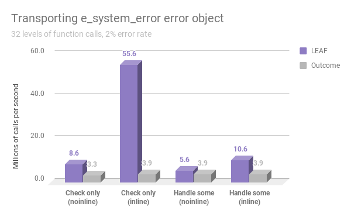
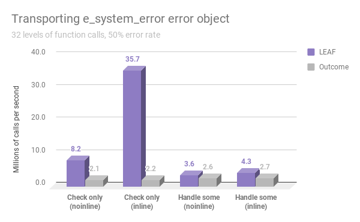
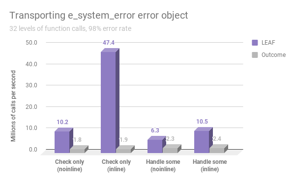
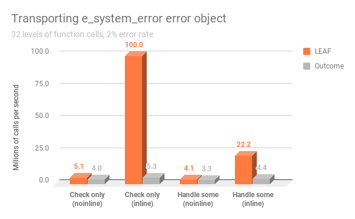
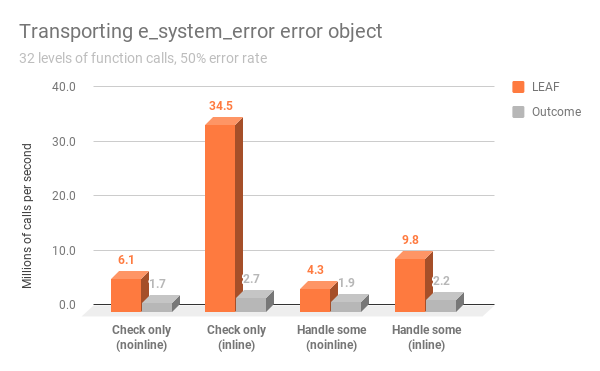
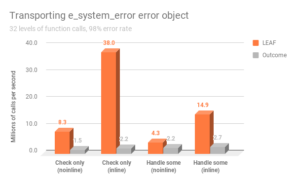

# Benchmark

The LEAF github repository contains two similar benchmarking programs, one using LEAF, the other using Boost Outcome, that simulate transporting error objects across 32 levels of function calls, measuring the performance of the two libraries.

Official library documentation:
* LEAF: https://zajo.github.io/leaf
* Boost Outcome: https://www.boost.org/doc/libs/release/libs/outcome/doc/html/index.html

## Library design considerations

It is important to understand that LEAF and Outcome serve similar purpose but follow very different design philosophy. The benchmarks are comparing apples and oranges.

The main design difference is that LEAF has a very strong bias towards the use case where, after a call to a function which may fail, any failures are not handled but instead forwarded to the caller. When we merely check "do we have a failure", LEAF does not bother to make available the error objects associated with the failure. This saves a lot of cycles.

In contrast, Outcome always delivers error objects to each level of function call, even when the user is not handling errors at that point, and therefore has no intention of accessing them.

This difference is reflected in how each library is used. The simple "check-only" case is nearly identical, e.g.:

```c++
// Outcome
{
	OUTCOME_TRY(v, f()); // Check for errors, forward failures to the caller
	// If control reaches here, v is the successful result (the call succeeded).
}
```

```c++
// LEAF
{
	LEAF_AUTO(v, f()); // Check for errors, forward failures to the caller
	// If control reaches here, v is the successful result (the call succeeded).
}
```

However, when we want to handle failures, in Outcome accessing the error object (which is always available in the returned object) is a simple continuation of the error check:

```c++
// Outcome
if( auto r = f() )
	return r.value()+1; // No error
else
{	// Error!
	switch( r.error() )
	{
		error_enum::error1: /* handle */ break;
		error_enum::error2: /* handle */ break;
		default: return r.as_failure();
	}
}
```

When using LEAF, we must explicitly state our intention to handle some errors, not just check for failures:

```c++
// LEAF
return leaf::try_handle_some(
	[]() -> leaf::result<T>
	{
		LEAF_AUTO(v, f());
		// No error, use v
	},
	[]( leaf::match<error_enum, error_enum::error1> )
	{
		/* handle */
	},
	[]( leaf::match<error_enum, error_enum::error2> )
	{
		/* handle */
	} );
```

The use of `try_handle_some` reserves storage on the stack for the error object types being handled (in this case, `error_enum`). If the failure is either `error_enum::error1` or `error_enum::error2`, the matching error handling lambda is invoked. Otherwise, the failure is automatically forwarded to the caller.

## Code generation considerations

Benchmarking C++ programs is tricky, because we want to prevent the compiler from optimizing out things it shouldn't normally be able to optimize in a real program, yet we don't want to interfere with "legitimate" optimizations.

The primary approach we use to prevent the compiler from optimizing everything out to nothing is to base all computations on a call to `std::rand()`. This adds cycles, but it also makes the benchmark more realistic, since functions which may legitimately fail should do _some_ real work.

When benchmarking error handling, it makes sense to measure the time it takes to return a result or error across multiple stack frames. This calls for disabling inlining. On the other hand, in C++ inlining is often possible, so that case must be measured as well.

The technique used to disable inlining in this benchmark is to mark functions as `__attribute__((noinline))` / `__declspec(noinline)`. This is imperfect, because optimizers can still peek into the body of the function and optimize things out, as is seen in this example:

```c++
__attribute__((noinline)) int val() {return 42;}

int main() {
    return val();
}
```

Which on clang 9 outputs:

```
val():
        mov     eax, 42
        ret
main:
        mov     eax, 42
        ret
```

It does not appear that anything like this is occurring in our case, but it is still a possibility.

> NOTES:
>
> - For benchmarking, both programs are compiled with exception handling disabled.
> - LEAF is able to work with external `result<>` types. The benchmark uses `leaf::result<T>`.

## Benchmark matrix dimensions

The benchmark matrix has 4 dimensions:

1. Check only vs. handle some errors:

	a. Each function calls the lower level function, does work on success, forwards errors to the caller, but does not handle them (the root of the call chain handles the error).

	b. Each fourth level of function call doesn't only check, but also handles some errors, forwarding other errors to the caller.

2. Error object type:

	a. The error object transported in case of a failure is of type `e_error_code`, which is a simple `enum`.

	b. The error object transported in case of a failure is of type `struct e_system_error { e_error_code value; std::string what; }`.

	c. The error object transported in case of a failure is of type `e_heavy_payload`, a `struct` of size 4096.

3. Error rate: 2%, 50%, 98%

4. Inline vs. noinline (32 levels of function calls).

## Source code

[deep_stack_leaf.cpp](deep_stack_leaf.cpp)

[deep_stack_outcome.cpp](deep_stack_outcome.cpp)

## Godbolt

LEAF provides a single header which makes it very easy to use online. To see the generated code for the benchmark program, you can copy and paste the following into Godbolt:

```c++
#include "https://raw.githubusercontent.com/zajo/leaf/master/include/boost/leaf/all.hpp"
#include "https://raw.githubusercontent.com/zajo/leaf/master/benchmark/deep_stack_leaf.cpp"
```

See https://godbolt.org/z/DTk4N4.

## Build options

To build both versions of the benchmark program, the compilers are invoked using the following command line options:

* `-std=c++17`: Required by Outcome (LEAF only requires C++11);
* `-fno-exceptions`: Disable exception handling;
* `-O3`: Maximum optimizations;
* `-DNDEBUG`: Disable asserts.

In addition, the LEAF version is compiled with:

* `-DLEAF_DIAGNOSTICS=0`: Disable diagnostic information for error objects not recognized by the program. This is a debugging feature, see [Configuration Macros](https://zajo.github.io/leaf/#_configuration_macros).

## Results

Below is the output the benchmark programs running on a MacBook Pro. The tables show the elapsed time for returning a result across 32 levels of function calls, depending on the error type, the action taken at each level, whether inlining is enabled, and the rate of failures. In addition, the programs generate a `benchmark.csv` file in the current working directory.


The following tables show elapsed time

#### 1000 iterations, call depth 32, sizeof(e_heavy_payload) = 4096 (clang, LEAF):

Error type      | At each level      | Inlining | Rate | μs
----------------|--------------------|----------|------:|-------:
e_error_code    | LEAF_AUTO          | Disabled |    2% |     124
e_error_code    | LEAF_AUTO          | Enabled  |    2% |      12
e_error_code    | try_handle_some    | Disabled |    2% |     180
e_error_code    | try_handle_some    | Enabled  |    2% |      95
e_error_code    | LEAF_AUTO          | Disabled |   50% |     125
e_error_code    | LEAF_AUTO          | Enabled  |   50% |      25
e_error_code    | try_handle_some    | Disabled |   50% |     198
e_error_code    | try_handle_some    | Enabled  |   50% |     120
e_error_code    | LEAF_AUTO          | Disabled |   98% |     129
e_error_code    | LEAF_AUTO          | Enabled  |   98% |      24
e_error_code    | try_handle_some    | Disabled |   98% |     208
e_error_code    | try_handle_some    | Enabled  |   98% |     131
e_system_error  | LEAF_AUTO          | Disabled |    2% |     116
e_system_error  | LEAF_AUTO          | Enabled  |    2% |      18
e_system_error  | try_handle_some    | Disabled |    2% |     178
e_system_error  | try_handle_some    | Enabled  |    2% |      94
e_system_error  | LEAF_AUTO          | Disabled |   50% |     122
e_system_error  | LEAF_AUTO          | Enabled  |   50% |      28
e_system_error  | try_handle_some    | Disabled |   50% |     278
e_system_error  | try_handle_some    | Enabled  |   50% |     232
e_system_error  | LEAF_AUTO          | Disabled |   98% |     148
e_system_error  | LEAF_AUTO          | Enabled  |   98% |      27
e_system_error  | try_handle_some    | Disabled |   98% |     209
e_system_error  | try_handle_some    | Enabled  |   98% |     142
e_heavy_payload | LEAF_AUTO          | Disabled |    2% |     145
e_heavy_payload | LEAF_AUTO          | Enabled  |    2% |      14
e_heavy_payload | try_handle_some    | Disabled |    2% |     185
e_heavy_payload | try_handle_some    | Enabled  |    2% |      95
e_heavy_payload | LEAF_AUTO          | Disabled |   50% |     186
e_heavy_payload | LEAF_AUTO          | Enabled  |   50% |      71
e_heavy_payload | try_handle_some    | Disabled |   50% |     247
e_heavy_payload | try_handle_some    | Enabled  |   50% |     181
e_heavy_payload | LEAF_AUTO          | Disabled |   98% |     225
e_heavy_payload | LEAF_AUTO          | Enabled  |   98% |     123
e_heavy_payload | try_handle_some    | Disabled |   98% |     537
e_heavy_payload | try_handle_some    | Enabled  |   98% |     269

#### 1000 iterations, call depth 32, sizeof(e_heavy_payload) = 4096 (clang, Outcome):

Error type      | At each level      | Inlining | Rate  | μs
----------------|--------------------|----------|------:|-------:
e_error_code    | OUTCOME_TRY        | Disabled |    2% |     239
e_error_code    | OUTCOME_TRY        | Enabled  |    2% |     226
e_error_code    | Handle some errors | Disabled |    2% |     230
e_error_code    | Handle some errors | Enabled  |    2% |     229
e_error_code    | OUTCOME_TRY        | Disabled |   50% |     453
e_error_code    | OUTCOME_TRY        | Enabled  |   50% |     456
e_error_code    | Handle some errors | Disabled |   50% |     321
e_error_code    | Handle some errors | Enabled  |   50% |     339
e_error_code    | OUTCOME_TRY        | Disabled |   98% |     631
e_error_code    | OUTCOME_TRY        | Enabled  |   98% |     676
e_error_code    | Handle some errors | Disabled |   98% |     449
e_error_code    | Handle some errors | Enabled  |   98% |     424
e_system_error  | OUTCOME_TRY        | Disabled |    2% |     302
e_system_error  | OUTCOME_TRY        | Enabled  |    2% |     259
e_system_error  | Handle some errors | Disabled |    2% |     259
e_system_error  | Handle some errors | Enabled  |    2% |     259
e_system_error  | OUTCOME_TRY        | Disabled |   50% |     470
e_system_error  | OUTCOME_TRY        | Enabled  |   50% |     458
e_system_error  | Handle some errors | Disabled |   50% |     389
e_system_error  | Handle some errors | Enabled  |   50% |     376
e_system_error  | OUTCOME_TRY        | Disabled |   98% |     724
e_system_error  | OUTCOME_TRY        | Enabled  |   98% |     672
e_system_error  | Handle some errors | Disabled |   98% |     486
e_system_error  | Handle some errors | Enabled  |   98% |     484
e_heavy_payload | OUTCOME_TRY        | Disabled |    2% |    3694
e_heavy_payload | OUTCOME_TRY        | Enabled  |    2% |    3690
e_heavy_payload | Handle some errors | Disabled |    2% |    3592
e_heavy_payload | Handle some errors | Enabled  |    2% |    3618
e_heavy_payload | OUTCOME_TRY        | Disabled |   50% |    6055
e_heavy_payload | OUTCOME_TRY        | Enabled  |   50% |    5612
e_heavy_payload | Handle some errors | Disabled |   50% |    5356
e_heavy_payload | Handle some errors | Enabled  |   50% |    5654
e_heavy_payload | OUTCOME_TRY        | Disabled |   98% |    7789
e_heavy_payload | OUTCOME_TRY        | Enabled  |   98% |    8406
e_heavy_payload | Handle some errors | Disabled |   98% |    7646
e_heavy_payload | Handle some errors | Enabled  |   98% |    7263

#### 1000 iterations, call depth 32, sizeof(e_heavy_payload) = 4096 (gcc, LEAF):

Error type      | At each level      | Inlining | Rate | μs
----------------|--------------------|----------|------:|-------:
e_error_code    | LEAF_AUTO          | Disabled |    2% |     260
e_error_code    | LEAF_AUTO          | Enabled  |    2% |       9
e_error_code    | try_handle_some    | Disabled |    2% |     252
e_error_code    | try_handle_some    | Enabled  |    2% |      48
e_error_code    | LEAF_AUTO          | Disabled |   50% |     164
e_error_code    | LEAF_AUTO          | Enabled  |   50% |      25
e_error_code    | try_handle_some    | Disabled |   50% |     254
e_error_code    | try_handle_some    | Enabled  |   50% |      67
e_error_code    | LEAF_AUTO          | Disabled |   98% |     157
e_error_code    | LEAF_AUTO          | Enabled  |   98% |      26
e_error_code    | try_handle_some    | Disabled |   98% |     234
e_error_code    | try_handle_some    | Enabled  |   98% |      75
e_system_error  | LEAF_AUTO          | Disabled |    2% |     195
e_system_error  | LEAF_AUTO          | Enabled  |    2% |      10
e_system_error  | try_handle_some    | Disabled |    2% |     244
e_system_error  | try_handle_some    | Enabled  |    2% |      45
e_system_error  | LEAF_AUTO          | Disabled |   50% |     164
e_system_error  | LEAF_AUTO          | Enabled  |   50% |      29
e_system_error  | try_handle_some    | Disabled |   50% |     232
e_system_error  | try_handle_some    | Enabled  |   50% |     102
e_system_error  | LEAF_AUTO          | Disabled |   98% |     142
e_system_error  | LEAF_AUTO          | Enabled  |   98% |      48
e_system_error  | try_handle_some    | Disabled |   98% |     206
e_system_error  | try_handle_some    | Enabled  |   98% |      79
e_heavy_payload | LEAF_AUTO          | Disabled |    2% |     210
e_heavy_payload | LEAF_AUTO          | Enabled  |    2% |      12
e_heavy_payload | try_handle_some    | Disabled |    2% |     234
e_heavy_payload | try_handle_some    | Enabled  |    2% |      51
e_heavy_payload | LEAF_AUTO          | Disabled |   50% |     205
e_heavy_payload | LEAF_AUTO          | Enabled  |   50% |      86
e_heavy_payload | try_handle_some    | Disabled |   50% |     268
e_heavy_payload | try_handle_some    | Enabled  |   50% |     125
e_heavy_payload | LEAF_AUTO          | Disabled |   98% |     210
e_heavy_payload | LEAF_AUTO          | Enabled  |   98% |     147
e_heavy_payload | try_handle_some    | Disabled |   98% |     301
e_heavy_payload | try_handle_some    | Enabled  |   98% |     191

#### 1000 iterations, call depth 32, sizeof(e_heavy_payload) = 4096 (gcc, Outcome):

Error type      | At each level      | Inlining | Rate  | μs
----------------|--------------------|----------|------:|-------:
e_error_code    | OUTCOME_TRY        | Disabled |    2% |     251
e_error_code    | OUTCOME_TRY        | Enabled  |    2% |     175
e_error_code    | Handle some errors | Disabled |    2% |     234
e_error_code    | Handle some errors | Enabled  |    2% |     177
e_error_code    | OUTCOME_TRY        | Disabled |   50% |     362
e_error_code    | OUTCOME_TRY        | Enabled  |   50% |     244
e_error_code    | Handle some errors | Disabled |   50% |     314
e_error_code    | Handle some errors | Enabled  |   50% |     228
e_error_code    | OUTCOME_TRY        | Disabled |   98% |     487
e_error_code    | OUTCOME_TRY        | Enabled  |   98% |     302
e_error_code    | Handle some errors | Disabled |   98% |     364
e_error_code    | Handle some errors | Enabled  |   98% |     275
e_system_error  | OUTCOME_TRY        | Disabled |    2% |     250
e_system_error  | OUTCOME_TRY        | Enabled  |    2% |     187
e_system_error  | Handle some errors | Disabled |    2% |     304
e_system_error  | Handle some errors | Enabled  |    2% |     225
e_system_error  | OUTCOME_TRY        | Disabled |   50% |     576
e_system_error  | OUTCOME_TRY        | Enabled  |   50% |     372
e_system_error  | Handle some errors | Disabled |   50% |     521
e_system_error  | Handle some errors | Enabled  |   50% |     449
e_system_error  | OUTCOME_TRY        | Disabled |   98% |     899
e_system_error  | OUTCOME_TRY        | Enabled  |   98% |     606
e_system_error  | Handle some errors | Disabled |   98% |     687
e_system_error  | Handle some errors | Enabled  |   98% |     511
e_heavy_payload | OUTCOME_TRY        | Disabled |    2% |    3637
e_heavy_payload | OUTCOME_TRY        | Enabled  |    2% |    1947
e_heavy_payload | Handle some errors | Disabled |    2% |    3105
e_heavy_payload | Handle some errors | Enabled  |    2% |    2497
e_heavy_payload | OUTCOME_TRY        | Disabled |   50% |    4896
e_heavy_payload | OUTCOME_TRY        | Enabled  |   50% |    3312
e_heavy_payload | Handle some errors | Disabled |   50% |    5333
e_heavy_payload | Handle some errors | Enabled  |   50% |    3290
e_heavy_payload | OUTCOME_TRY        | Disabled |   98% |    7088
e_heavy_payload | OUTCOME_TRY        | Enabled  |   98% |    4613
e_heavy_payload | Handle some errors | Disabled |   98% |    7675
e_heavy_payload | Handle some errors | Enabled  |   98% |    4766

## Charts

The charts below are generated from the results from the previous section, converted from elapsed time in microseconds to millions of calls per second (so, bigger is better). Outcome performance is plotted in grey, LEAF performance is plotted in purple for clang, orange for gcc.

| Error rate | `e_error_code` (clang) | `e_system_error` (clang) | `e_heavy_payload` (clang) |
|:---:|:---:|:---:|:---:|
| 2% |  |  |  |
| 50% |  |  |  |
| 98% |  |  |  |

| Error rate | `e_error_code` (gcc) | `e_system_error` (gcc) | `e_heavy_payload` (gcc) |
|:---:|:---:|:---:|:---:|
| 2% |  |  |  |
| 50% |  |  |  |
| 98% |  |  |  |
