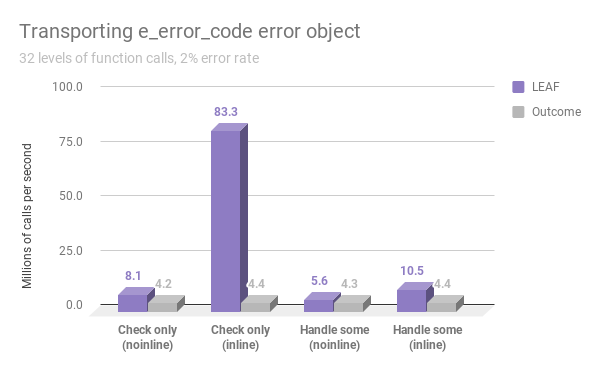
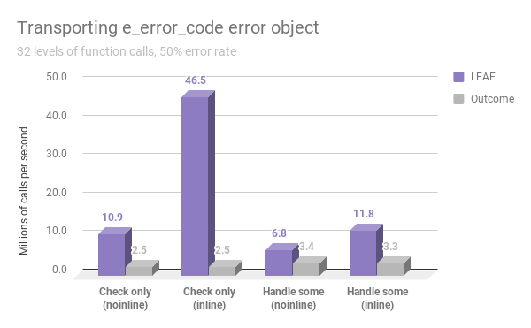
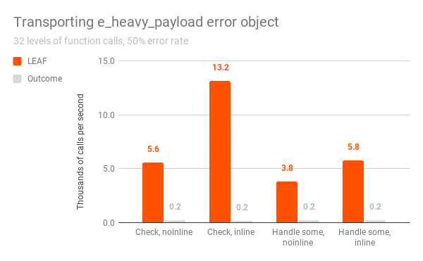
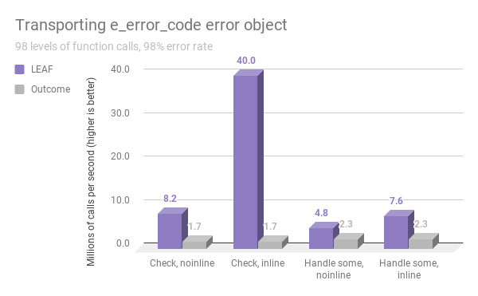
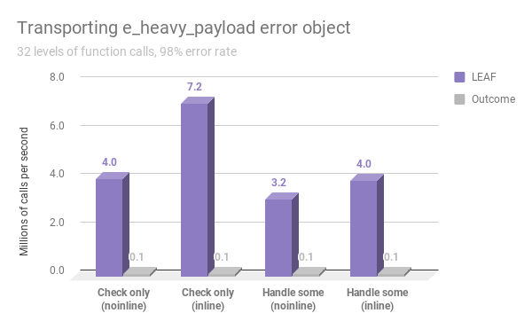
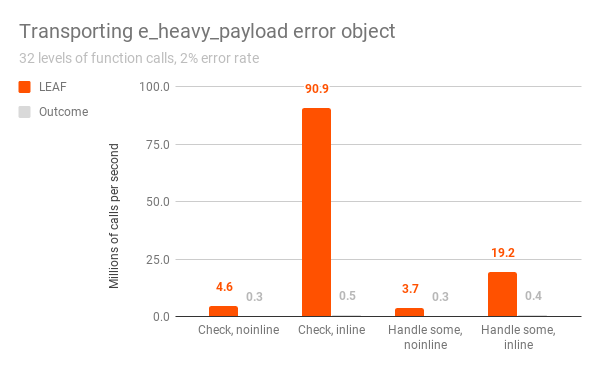
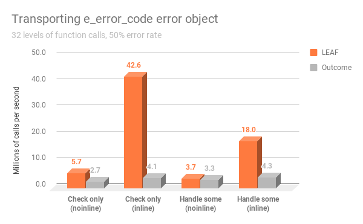
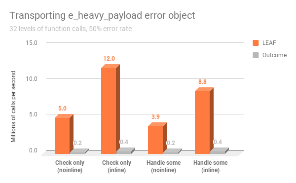
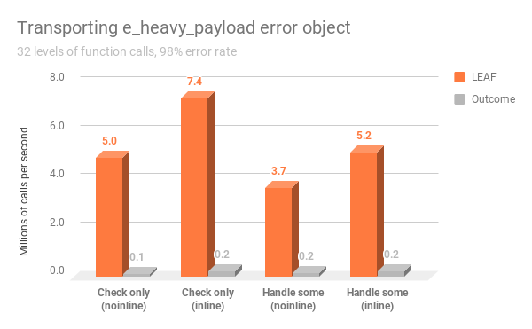

# Benchmark

The LEAF github repository contains two similar benchmarking programs, one using LEAF, the other using Boost Outcome, that simulate transporting error objects across 32 levels of function calls, measuring the performance of the two libraries.

## Library design considerations

It is important to understand that LEAF and Outcome serve similar purpose but follow very different design philosophy. The benchmarks are comparing apples and oranges.

The main design difference is that LEAF has a very strong bias towards the use case where, after a call to a function which may fail, any failures are not handled but instead forwarded to the caller. When we merely check "do we have a failure", LEAF does not bother to make available the error objects associated with the failure. This saves a lot of cycles.

In contrast, Outcome always delivers error objects to each level of function call, even when the user is not handling errors at that point, and therefore has no intention of accessing them.

This difference is reflected in how each library is used. The simple "check-only" case is nearly identical, e.g.:

```c++
// Outcome
{
	OUTCOME_TRY(v, f()); // Check for errors, forward failures to the caller
	// If control reaches here, v is the successful result (the call succeeded).
}
```

```c++
// LEAF
{
	LEAF_AUTO(v, f()); // Check for errors, forward failures to the caller
	// If control reaches here, v is the successful result (the call succeeded).
}
```

However, when we want to handle failures, in Outcome accessing the error object (which is always available in the returned object) is a simple continuation of the error check:

```c++
// Outcome
if( auto r = f() )
	return r.value()+1; // No error
else
{	// Error!
	switch( r.error() )
	{
		error_enum::error1: /* handle */ break;
		error_enum::error2: /* handle */ break;
		default: return r.as_failure();
	}
}
```

When using LEAF, we must explicitly state our intention to handle some errors, not just check for failures:

```c++
// LEAF
return leaf::try_handle_some(
	[]() -> leaf::result<T>
	{
		LEAF_AUTO(v, f());
		// No error, use v
	},
	[]( leaf::match<error_enum, error_enum::error1> )
	{
		/* handle */
	},
	[]( leaf::match<error_enum, error_enum::error2> )
	{
		/* handle */
	} );
```

The use of `try_handle_some` reserves storage on the stack for the error object types being handled (in this case, `error_enum`). If the failure is either `error_enum::error1` or `error_enum::error2`, the matching error handling lambda is invoked. Otherwise, the failure is automatically forwarded to the caller.

## Code generation considerations

Benchmarking C++ programs is tricky, because we want to prevent the compiler from optimizing out things it shouldn't normally be able to optimize in a real program, yet we don't want to interfere with "legitimate" optimizations.

The primary approach we use to prevent the compiler from optimizing everything out to nothing is to base all computations on a call to `std::rand()`. This adds cycles, but it also makes the benchmark more realistic, since functions which may legitimately fail should do _some_ real work.

When benchmarking error handling, it makes sense to measure the time it takes to return a result or error across multiple stack frames. This calls for disabling inlining. On the other hand, in C++ inlining is often possible, so that case must be measured as well.

The technique used to disable inlining in this benchmark is to mark functions as `__attribute__((noinline))` / `__declspec(noinline)`. This is imperfect, because optimizers can still peek into the body of the function and optimize things out, as is seen in this example:

```c++
__attribute__((noinline)) int val() {return 42;}

int main() {
    return val();
}
```

Which on clang 9 outputs:

```
val():
        mov     eax, 42
        ret
main:
        mov     eax, 42
        ret
```

It does not appear that anything like this is occurring in our case, but it is still a possibility.

> NOTES:
>
> - For benchmarking, both programs are compiled with exception handling disabled.
> - LEAF is able to work with external `result<>` types. The benchmark uses `leaf::result<T>`.

## Benchmark matrix dimensions

The benchmark matrix has 4 dimensions:

1. Check only vs. handle some errors:

	a. Each function calls the lower level function, does work on success, forwards errors to the caller, but does not handle them (the root of the call chain handles the error).

	b. Each fourth level of function call doesn't only check, but also handles some errors, forwarding other errors to the caller.

2. Error object type:

	a. The error object transported in case of a failure is of type `e_error_code`, which is a simple `enum`.

	b. The error object transported in case of a failure is of type `e_heavy_payload`, a `struct` of size 4096.

3. Error rate: 2%, 50%, 98%

4. Inline vs. noinline (32 levels of function calls).

## Source code

[deep_stack_leaf.cpp](deep_stack_leaf.cpp)

[deep_stack_outcome.cpp](deep_stack_outcome.cpp)

## Godbolt

LEAF provides a single header which makes it very easy to use online. To see the generated code for the benchmark program, copy and paste the following into Godbolt:

```C++
#include "https://raw.githubusercontent.com/zajo/leaf/master/include/boost/leaf/all.hpp"
#include "https://raw.githubusercontent.com/zajo/leaf/master/benchmark/deep_stack_leaf.cpp"

```

## Results

Below is the output the benchmark programs running on a MacBook Pro. The tables show the elapsed time for returning a result across 32 levels of function calls, depending on the error type, the action taken at each level, whether inlining is enabled, and the rate of failures (smaller numbers are better). In addition, the programs generate a `benchmark.csv` file in the current working directory.

The compilers are invoked using the following command line options: `-fno-exceptions -O3 -DNDEBUG`

#### 1000 iterations, call depth 32, sizeof(e_heavy_payload) = 4096 (clang, LEAF):

Error type      | At each level      | Inlining | Rate | (μs)
----------------|--------------------|:--------:|------:|-------:
e_error_code    | LEAF_AUTO          | Disabled |    2% |     127
e_error_code    | LEAF_AUTO          | Enabled  |    2% |      12
e_error_code    | try_handle_some    | Disabled |    2% |     179
e_error_code    | try_handle_some    | Enabled  |    2% |      95
e_error_code    | LEAF_AUTO          | Disabled |   50% |     129
e_error_code    | LEAF_AUTO          | Enabled  |   50% |      27
e_error_code    | try_handle_some    | Disabled |   50% |     201
e_error_code    | try_handle_some    | Enabled  |   50% |     122
e_error_code    | LEAF_AUTO          | Disabled |   98% |     122
e_error_code    | LEAF_AUTO          | Enabled  |   98% |      25
e_error_code    | try_handle_some    | Disabled |   98% |     209
e_error_code    | try_handle_some    | Enabled  |   98% |     132
e_heavy_payload | LEAF_AUTO          | Disabled |    2% |     159
e_heavy_payload | LEAF_AUTO          | Enabled  |    2% |      14
e_heavy_payload | try_handle_some    | Disabled |    2% |     230
e_heavy_payload | try_handle_some    | Enabled  |    2% |      92
e_heavy_payload | LEAF_AUTO          | Disabled |   50% |     175
e_heavy_payload | LEAF_AUTO          | Enabled  |   50% |      76
e_heavy_payload | try_handle_some    | Disabled |   50% |     249
e_heavy_payload | try_handle_some    | Enabled  |   50% |     168
e_heavy_payload | LEAF_AUTO          | Disabled |   98% |     247
e_heavy_payload | LEAF_AUTO          | Enabled  |   98% |     139
e_heavy_payload | try_handle_some    | Disabled |   98% |     310
e_heavy_payload | try_handle_some    | Enabled  |   98% |     250

#### 1000 iterations, call depth 32, sizeof(e_heavy_payload) = 4096 (clang, Outcome):

Error type      | At each level      | Inlining | Rate  | (μs)
----------------|--------------------|:--------:|------:|-------:
e_error_code    | OUTCOME_TRY        | Disabled |    2% |     244
e_error_code    | OUTCOME_TRY        | Enabled  |    2% |     234
e_error_code    | Handle some errors | Disabled |    2% |     238
e_error_code    | Handle some errors | Enabled  |    2% |     236
e_error_code    | OUTCOME_TRY        | Disabled |   50% |     445
e_error_code    | OUTCOME_TRY        | Enabled  |   50% |     433
e_error_code    | Handle some errors | Disabled |   50% |     342
e_error_code    | Handle some errors | Enabled  |   50% |     326
e_error_code    | OUTCOME_TRY        | Disabled |   98% |     606
e_error_code    | OUTCOME_TRY        | Enabled  |   98% |     603
e_error_code    | Handle some errors | Disabled |   98% |     430
e_error_code    | Handle some errors | Enabled  |   98% |     426
e_heavy_payload | OUTCOME_TRY        | Disabled |    2% |    3767
e_heavy_payload | OUTCOME_TRY        | Enabled  |    2% |    3474
e_heavy_payload | Handle some errors | Disabled |    2% |    3299
e_heavy_payload | Handle some errors | Enabled  |    2% |    3225
e_heavy_payload | OUTCOME_TRY        | Disabled |   50% |    5325
e_heavy_payload | OUTCOME_TRY        | Enabled  |   50% |    5276
e_heavy_payload | Handle some errors | Disabled |   50% |    5119
e_heavy_payload | Handle some errors | Enabled  |   50% |    5013
e_heavy_payload | OUTCOME_TRY        | Disabled |   98% |    7227
e_heavy_payload | OUTCOME_TRY        | Enabled  |   98% |    7042
e_heavy_payload | Handle some errors | Disabled |   98% |    7979
e_heavy_payload | Handle some errors | Enabled  |   98% |    7335

#### 1000 iterations, call depth 32, sizeof(e_heavy_payload) = 4096 (gcc, LEAF):

Error type      | At each level      | Inlining | Rate | (μs)
----------------|--------------------|:--------:|------:|-------:
e_error_code    | LEAF_AUTO          | Disabled |    2% |     252
e_error_code    | LEAF_AUTO          | Enabled  |    2% |       7
e_error_code    | try_handle_some    | Disabled |    2% |     236
e_error_code    | try_handle_some    | Enabled  |    2% |      40
e_error_code    | LEAF_AUTO          | Disabled |   50% |     156
e_error_code    | LEAF_AUTO          | Enabled  |   50% |      21
e_error_code    | try_handle_some    | Disabled |   50% |     256
e_error_code    | try_handle_some    | Enabled  |   50% |      63
e_error_code    | LEAF_AUTO          | Disabled |   98% |     124
e_error_code    | LEAF_AUTO          | Enabled  |   98% |      22
e_error_code    | try_handle_some    | Disabled |   98% |     231
e_error_code    | try_handle_some    | Enabled  |   98% |      66
e_heavy_payload | LEAF_AUTO          | Disabled |    2% |     182
e_heavy_payload | LEAF_AUTO          | Enabled  |    2% |      10
e_heavy_payload | try_handle_some    | Disabled |    2% |     255
e_heavy_payload | try_handle_some    | Enabled  |    2% |      47
e_heavy_payload | LEAF_AUTO          | Disabled |   50% |     210
e_heavy_payload | LEAF_AUTO          | Enabled  |   50% |      77
e_heavy_payload | try_handle_some    | Disabled |   50% |     265
e_heavy_payload | try_handle_some    | Enabled  |   50% |     127
e_heavy_payload | LEAF_AUTO          | Disabled |   98% |     202
e_heavy_payload | LEAF_AUTO          | Enabled  |   98% |     135
e_heavy_payload | try_handle_some    | Disabled |   98% |     270
e_heavy_payload | try_handle_some    | Enabled  |   98% |     194

#### 1000 iterations, call depth 32, sizeof(e_heavy_payload) = 4096 (gcc, Outcome):

Error type      | At each level      | Inlining | Rate  | (μs)
----------------|--------------------|:--------:|------:|-------:
e_error_code    | OUTCOME_TRY        | Disabled |    2% |     240
e_error_code    | OUTCOME_TRY        | Enabled  |    2% |     175
e_error_code    | Handle some errors | Disabled |    2% |     253
e_error_code    | Handle some errors | Enabled  |    2% |     187
e_error_code    | OUTCOME_TRY        | Disabled |   50% |     330
e_error_code    | OUTCOME_TRY        | Enabled  |   50% |     257
e_error_code    | Handle some errors | Disabled |   50% |     285
e_error_code    | Handle some errors | Enabled  |   50% |     239
e_error_code    | OUTCOME_TRY        | Disabled |   98% |     387
e_error_code    | OUTCOME_TRY        | Enabled  |   98% |     291
e_error_code    | Handle some errors | Disabled |   98% |     313
e_error_code    | Handle some errors | Enabled  |   98% |     262
e_heavy_payload | OUTCOME_TRY        | Disabled |    2% |    3189
e_heavy_payload | OUTCOME_TRY        | Enabled  |    2% |    1732
e_heavy_payload | Handle some errors | Disabled |    2% |    2999
e_heavy_payload | Handle some errors | Enabled  |    2% |    1947
e_heavy_payload | OUTCOME_TRY        | Disabled |   50% |    5052
e_heavy_payload | OUTCOME_TRY        | Enabled  |   50% |    2952
e_heavy_payload | Handle some errors | Disabled |   50% |    4585
e_heavy_payload | Handle some errors | Enabled  |   50% |    2995
e_heavy_payload | OUTCOME_TRY        | Disabled |   98% |    7508
e_heavy_payload | OUTCOME_TRY        | Enabled  |   98% |    4390
e_heavy_payload | Handle some errors | Disabled |   98% |    6398
e_heavy_payload | Handle some errors | Enabled  |   98% |    4185

## Charts

The charts below are generated from the results from the previous section, converted from elapsed time in microseconds to millions of calls per second (so, bigger is better). Outcome performance plotted in grey, LEAF performance is plotted in purple for clang, orange for gcc.

| Error rate | `e_error_code` (clang) | `e_heavy_payload` (clang) |
|:---:|:---:|:---:|
| 2% |  |  |
| 50% |  |  |
| 98% |  |  |

| Error rate | `e_error_code` (gcc) | `e_heavy_payload` (gcc) |
|:---:|:---:|:---:|
| 2% |  |  |
| 50% |  |  |
| 98% |  |  |
