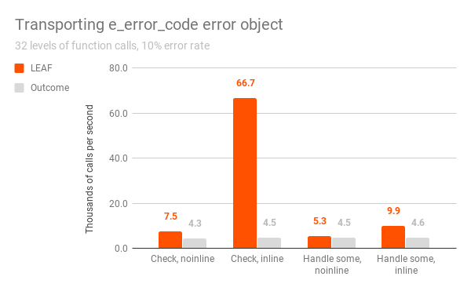
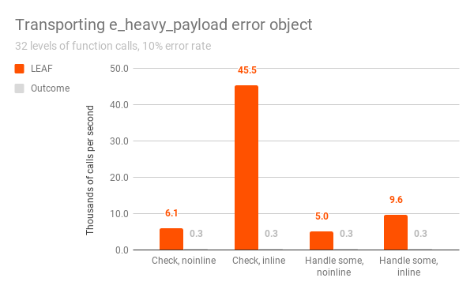
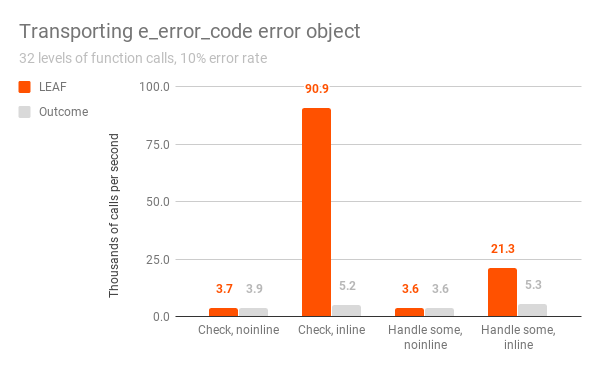
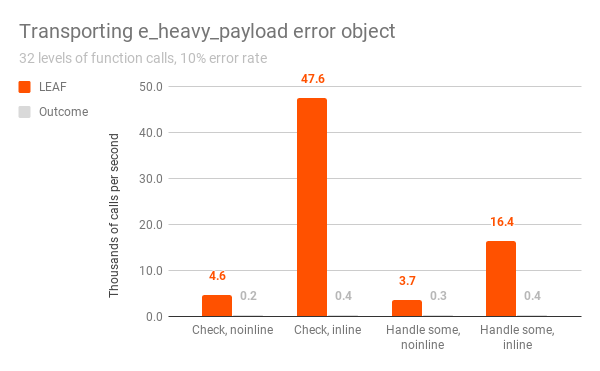

# Benchmark

The LEAF github repository contains two similar benchmarking programs, one using LEAF, the other using Boost Outcome, that simulate transporting error objects across 32 levels of function calls, measuring the performance of the two libraries.

It is important to understand that LEAF and Outcome serve similar purpose but follow very different design philosophy. The benchmarks are comparing apples and oranges.

The main design difference is that LEAF has a very strong bias towards the use case where, after a call to a function which may fail, any failures are not handled but instead forwarded to the caller. When we merely check "do we have a failure", LEAF does not bother to make the error objects associated with the failure available. This saves a lot of cycles.

In contrast, Outcome always delivers error objects to each level of function call, even when the user is not handling errors at that point, and therefore has no intention of accessing them.

## Benchmark dimensions

The benchmark matrix has 4 dimensions:

1. Check only vs. handle some errors:

	a. Each function calls the lower level function, does work on success, forwards errors to the caller, but does not handle them (the root of the call chain handles the error).

	b. Each fourth level of function call doesn't only check, but also handles some errors, forwarding other errors to the caller.

2. Error object type:

	a. The error object transported in case of a failure is of type `e_error_code`, which is a simple `enum`.

	b. The error object transported in case of a failure is of type `e_heavy_payload`, a `struct` of size 4096.

3. Error rate: 10%, 50%, 90% (only 10% and 50% charted below).

4. Inline vs. noinline (32 levels of function calls).

## Charts

The following charts compare the performance of LEAF and Outcome running on a Macbook Pro.

### clang

### gcc

