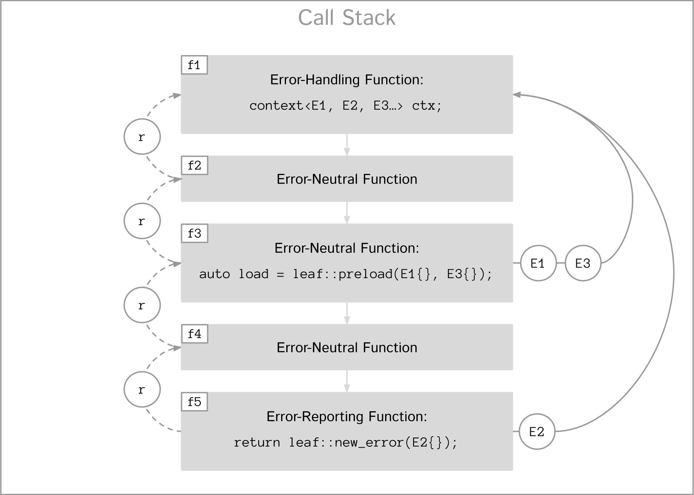
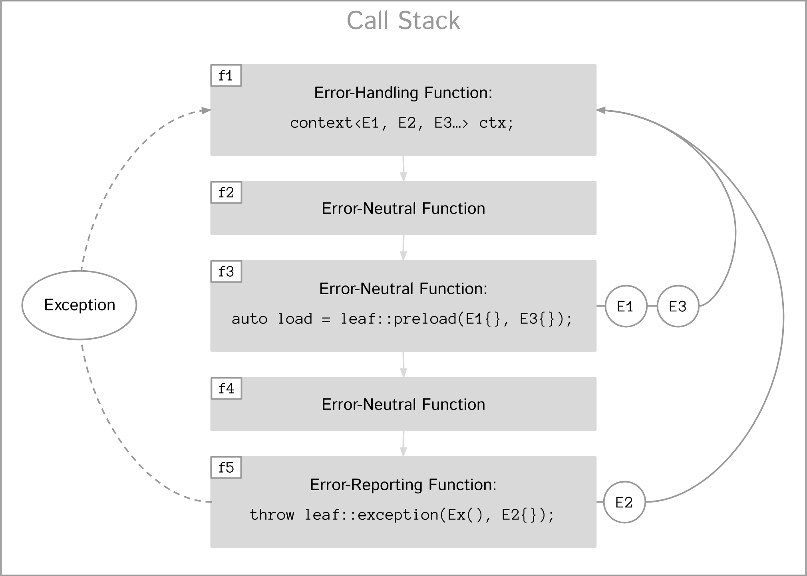

:last-update-label!:
:icons: font
:prewrap!:
:source-highlighter: coderay
:stylesheet: zajo.css
= LEAF
Lightweight Error Augmentation Framework
:toclevels: 3
:toc: left
:toc-title:

[.text-right]
https://github.com/zajo/leaf[GitHub] | https://travis-ci.org/zajo/leaf[Travis] | https://ci.appveyor.com/project/zajo/leaf[AppVeyor]

[abstract]
== Abstract

LEAF is a lightweight error handling library for {CPP}11. Features:

====
* Efficient delivery of arbitrary error objects to the correct error-handling scope.

* No dynamic memory allocations.

* Compatible with `std::error_code`, `errno` and any other error code type.

* Can be used with or without exception handling.

* Support for multi-thread programming.
====

[grid=none, frame=none]
|====
| <<introduction,Introduction>> \| <<tutorial>> \| <<synopsis>> \| <<rationale,Design Rationale>> \| https://github.com/zajo/leaf/blob/master/doc/whitepaper.md[Whitepaper] >| Reference: <<functions,Functions>> \| <<types,Types>> \| <<traits,Traits>> \| <<macros,Macros>>
|====

[[introduction]]
== Five Minute Introduction

We'll implement two versions of the same simple program: one using error codes to handle errors, and one using exception handling.

[[introduction-result]]
=== Using `result<T>`

We'll write a short but complete program that reads a text file in a buffer and prints it to `std::cout`, using LEAF to handle errors without exception handling.

Let's jump ahead and start with the `main` function: it will try several operations as needed and handle all the errors that occur. Did I say *all* the errors? I did, so we'll use `leaf::try_handle_all`. It has the following signature:

[source,c++]
----
template <class TryBlock, class... Handler>
<<deduced-type>> try_handle_all( TryBlock && try_block, Handler && ... handler );
----

`TryBlock` is a function type, almost always a lambda. It is required to return a `result<T>` type -- for example, `leaf::result<T>` -- that holds a value of type `T` or else it indicates a failure.

The first thing `try_handle_all` does is invoke the `try_block` function. If the returned object `r` indicates success, `try_handle_all` returns the contained `r.value()`; otherwise it calls the first suitable error handling function from the `handler...` list.

We'll see later just what kind of a `TryBlock` will our `main` function pass to `try_handle_all`, but first, let's look at the juicy error-handling part. LEAF will consider each of the `handler...` lambdas, in order, and call the first suitable match:

[source,c++]
----
int main( int argc, char const * argv[] )
{
  return leaf::try_handle_all(

    [&]() -> leaf::result<int>
    {
      // The TryBlock code goes here, we'll see it later
    },

    
    {
      std::cerr << "File not found: " << fn.value << std::endl;
      return 1;
    },

    
    {
      std::cerr << "Failed to open " << fn.value << ", errno=" << errn << std::endl;
      return 2;
    },

    
    {
      std::cerr << "Failed to access " << fn.value << ", errno=" << errn << std::endl;
      return 3;
    },

    
    {
      std::cerr << "Output error, errno=" << errn << std::endl;
      return 4;
    },

     <5>
    {
      std::cout << "Bad command line argument" << std::endl;
      return 5;
    },

     <6>
    {
      std::cerr <<
        "Unknown failure detected" << std::endl <<
        "Cryptic diagnostic information follows" << std::endl <<
        unmatched;
      return 6;
    }
  );
}
----

<1> This handler will be called if the detected error includes: +
pass:[•] an object of type `enum error_code` equal to the value `input_file_open_error`, and +
pass:[•] an object of type `leaf::e_errno` that has `.value` equal to `ENOENT`, and +
pass:[•] an object of type `leaf::e_file_name`.

<2> This handler will be called if the detected error includes: +
pass:[•] an object of type `enum error_code` equal to `input_file_open_error`, and +
pass:[•] an object of type `leaf::e_errno` (regardless of its `.value`), and +
pass:[•] an object of type `leaf::e_file_name`.

<3> This handler will be called if the detected error includes: +
pass:[•] an object of type `enum error_code` equal to any of `input_file_size_error`, `input_file_read_error`, `input_eof_error`, and +
pass:[•] an object of type `leaf::e_errno` (regardless of its `.value`), and +
pass:[•] an object of type `leaf::e_file_name`.

<4> This handler will be called if the detected error includes: +
pass:[•] an object of type `enum error_code` equal to `cout_error`, and +
pass:[•] an object of type `leaf::e_errno` (regardless of its `.value`),

<5> This handler will be called if the detected error includes an object of type `enum error_code` equal to `bad_command_line`.

<6> This last handler is a catch-all for any error, in case no other handler could be matched: it prints diagnostic information to help debug logic errors in the program, since it failed to match an appropriate error handler to the error condition it encountered.

Now, reading and printing a file may not seem like a complex job, but let's split it into several functions, each communicating failures using `leaf::result<T>`:

[source,c++]
----
//Parse the command line, return the file name.
leaf::result<char const *> parse_command_line( int argc, char const * argv[] );

//Open a file for reading.
leaf::result<std::shared_ptr<FILE>> file_open( char const * file_name );

//Return the size of the file.
leaf::result<int> file_size( FILE & f );

//Read size bytes from f into buf.
leaf::result<void> file_read( FILE & f, void * buf, int size );
----

For example, let's look at `file_open`:

[source,c++]
----
leaf::result<std::shared_ptr<FILE>> file_open( char const * file_name )
{
  if( FILE * f = fopen(file_name,"rb") )
    return std::shared_ptr<FILE>(f,&fclose);
  else
    return leaf::new_error( input_file_open_error, leaf::e_errno{errno} );
}
----

If `fopen` succeeds, we return a `shared_ptr` which will automatically call `fclose` as needed. If `fopen` fails, we report an error by calling `new_error`, which takes any number of error objects to load with the error. In this case we pass the system `errno` (LEAF defines `struct e_errno {int value;}`), and our own error code value, `input_file_open_error`.

Here is our complete error code `enum`:

[source,c++]
----
enum error_code
{
  bad_command_line = 1,
  input_file_open_error,
  input_file_size_error,
  input_file_read_error,
  input_eof_error,
  cout_error
};
----

Looks good, but how does LEAF know that this `enum` represents error codes and not, say, types of cold cuts sold at Bay Cities Italian Deli? It doesn't, unless we tell it:

[source,c++]
----
namespace boost { namespace leaf {

  template<> struct is_e_type<error_code>: std::true_type { };

} }
----

We're now ready to look at the `TryBlock` we'll pass to `try_handle_all`. It does all the work, bails out if it encounters an error:

[source,c++]
----
int main( int argc, char const * argv[] )
{
  return leaf::try_handle_all(

    [&]() -> leaf::result<int>
    {
      leaf::result<char const *> file_name = parse_command_line(argc,argv);
      if( !file_name )
        return file_name.error();
----

Wait, what's this, if "error" return "error"? There is a better way: we'll use `LEAF_AUTO`. It takes a `result<T>` and bails out in case of a failure (control leaves the calling function), otherwise defines a local variable to access the `T` value stored in the `result` object.

This is what our `TryBlock` really looks like:

[source,c++]
----
int main( int argc, char const * argv[] )
{
  return leaf::try_handle_all(

    [&]() -> leaf::result<int> <1>
    {
      LEAF_AUTO(file_name, parse_command_line(argc,argv)); <2>

      auto load = leaf::preload( leaf::e_file_name{file_name} ); <3>

      LEAF_AUTO(f, file_open(file_name)); <4>

      LEAF_AUTO(s, file_size(*f)); <4>

      std::string buffer( 1 + s, '\0' );
      LEAF_CHECK(file_read(*f, &buffer[0], buffer.size()-1)); <4>

      std::cout << buffer;
      std::cout.flush();
      if( std::cout.fail() ) <5>
        return leaf::new_error( cout_error, leaf::e_errno{errno} );

      return 0;
    },

    .... // The list of error handlers goes here

  ); <6>
}
----

<1> Our `TryBlock` returns a `result<int>`. In case of success, it will hold `0`, which will be returned from `main` to the OS.
<2> If `parse_command_line` returns an error, we forward that error to `try_handle_all` (which invoked us) verbatim. Otherwise, `LEAF_AUTO` gets us a local variable `file_name` to access the `char const *` result.
<3> From now on, all errors escaping this scope will automatically communicate the (now successfully parsed from the command line) file name (LEAF defines `struct e_file_name {std::string value;}`). It's as if every time one of the following functions wants to report an error, `preload` says "wait, associate this `e_file_name` object with the error, it's important!"
<4> Call more functions, forward each failure to the caller...
<5> ...but this is slightly different: we didn't get a failure via `result<T>` from another function, this is our own error we've detected! We return a `new_error`, passing the `cout_error` error code and the system `errno` (LEAF defines `struct e_errno {int value;}`).
<6> This concludes the `try_handle_all` arguments -- as well as our program!

Nice and simple! Writing the `TryBlock`, we focus on the "no errors" code path -- if we encounter any error we just return it to `try_handle_all` for processing. Well, that's if we're being good and using RAII for automatic clean-up -- which we are, `shared_ptr` will automatically close the file for us.

TIP: The complete program from this tutorial is available https://github.com/zajo/leaf/blob/master/examples/print_file_result.cpp?ts=4[here]. The https://github.com/zajo/leaf/blob/master/examples/print_file_eh.cpp?ts=4[other] version of the same program uses exception handling to report errors (see <<introduction-eh,below>>).

'''

[[introduction-eh]]
=== Using Exception Handling

And now, we'll write the same program that reads a text file in a buffer and prints it to `std::cout`, this time using exceptions to report errors. First, we need to define our exception class hierarchy:

[source,c++]
----
struct print_file_error : virtual std::exception { };
struct command_line_error : virtual print_file_error { };
struct bad_command_line : virtual command_line_error { };
struct input_error : virtual print_file_error { };
struct input_file_error : virtual input_error { };
struct input_file_open_error : virtual input_file_error { };
struct input_file_size_error : virtual input_file_error { };
struct input_file_read_error : virtual input_file_error { };
struct input_eof_error : virtual input_file_error { };
----

NOTE: To avoid ambiguities in the dynamic type conversion which occur when catching a base type, it is generally recommended to use virtual inheritance in exception type hierarchies.

Again, we'll split the job into several functions, this time communicating failures by throwing exceptions (and, therefore, we do not need to use a `result<T>` type):

[source,c++]
----
//Parse the command line, return the file name.
char const * parse_command_line( int argc, char const * argv[] );

//Open a file for reading.
std::shared_ptr<FILE> file_open( char const * file_name );

//Return the size of the file.
int file_size( FILE & f );

//Read size bytes from f into buf.
void file_read( FILE & f, void * buf, int size );
----

The `main` function brings everything together and handles all the exceptions that are thrown, but instead of using `try` and `catch`, it will use the function template `leaf::try_catch`, which has the following signature:

[source,c++]
----
template <class TryBlock, class... Handler>
<<deduced-type>> try_catch( TryBlock && try_block, Handler && ... handler );
----

`TryBlock` is a function type, almost always a lambda; `try_catch` simply returns the value returned by the `try_block`, catching any exception it throws, in which case it calls the first suitable error handling function from the `handler...` list.

Let's look at the `TryBlock` our `main` function passes to `try_catch`:

[source,c++]
----
int main( int argc, char const * argv[] )
{
  std::cout.exceptions(std::ostream::failbit | std::ostream::badbit); <1>

  return leaf::try_catch(

    [&] <2>
    {
      char const * file_name = parse_command_line(argc,argv); <3>

      auto load = leaf::preload( leaf::e_file_name{file_name} ); <4>

      std::shared_ptr<FILE> f = file_open( file_name ); <3>

      std::string buffer( 1+file_size(*f), '\0' ); <3>
      file_read(*f,&buffer[0],buffer.size()-1); <3>

      auto propagate2 = leaf::defer([] { return leaf::e_errno{errno}; } ); <5>
      std::cout << buffer;
      std::cout.flush();

      return 0;
    },

    .... <6>

  ); <7>
}
----

<1> Configure `std::cout` to throw on error.
<2> Except if it throws, our `TryBlock` returns `0`, which will be returned from `main` to the OS.
<3> If any of the functions we call throws, `try_catch` will find an appropriate handler to invoke. We'll look at that later.
<4> From now on, all exceptions escaping this scope will automatically communicate the (now successfully parsed from the command line) file name (LEAF defines `struct e_file_name {std::string value;}`). It's as if every time one of the following functions wants to throw an exception, `preload` says "wait, associate this `e_file_name` object with the exception, it's important!"
<5> `defer` is similar to `preload`, but instead of the error object, it takes a function that returns it. From this point on, if an exception escapes this scope, `defer` will call the passed function and load the returned `e_errno` with the exception (LEAF defines `struct e_errno {int value;}`).
<6> List of error handlers goes here. We'll see that later.
<7> This concludes the `try_catch` arguments -- as well as our program!

As it is always the case when using exception handling, as long as our `TryBlock` is exception-safe, we can focus on the "no errors" code path. Of course, our `TryBlock` is exception-safe, since `shared_ptr` will automatically close the file for us in case an exception is thrown.

Now let's look at the second part of the call to `try_catch`, which lists the error handlers:

[source,c++]
----
int main( int argc, char const * argv[] )
{
  std::cout.exceptions(std::ostream::failbit | std::ostream::badbit); <1>

  return leaf::try_catch(
    [&]
    {
      .... <2>
    },

    
    {
      std::cerr << "File not found: " << fn.value << std::endl;
      return 1;
    },

    
    {
      std::cerr << "Failed to open " << fn.value << ", errno=" << errn << std::endl;
      return 2;
    },

    
    {
      std::cerr << "Failed to access " << fn.value << ", errno=" << errn << std::endl;
      return 3;
    },

    
    {
      std::cerr << "Output error, errno=" << errn << std::endl;
      return 4;
    },

     <7>
    {
      std::cout << "Bad command line argument" << std::endl;
      return 5;
    },

     <8>
    {
      std::cerr <<
        "Unknown failure detected" << std::endl <<
        "Cryptic diagnostic information follows" << std::endl <<
        unmatched;
      return 6;
    } );
}
----

<1> Configure `std::cout` to throw on error.

<2> This is the `TryBlock` from the previous listing; if it throws, `try_catch` will catch the exception, then consider the error handlers that follow, in order, and it will call the first one that can deal with the error:

<3> This handler will be called if: +
pass:[•] an `input_file_open_error` exception was caught, with +
pass:[•] an object of type `leaf::e_errno` that has `.value` equal to `ENOENT`, and +
pass:[•] an object of type `leaf::e_file_name`.

<4> This handler will be called if: +
pass:[•] an `input_file_open_error` exception was caught, with +
pass:[•] an object of type `leaf::e_errno` (regardless of its `.value`), and +
pass:[•] an object of type `leaf::e_file_name`.

<5> This handler will be called if: +
pass:[•] an `input_error` exception was caught (which is a base type), with +
pass:[•] an object of type `leaf::e_errno` (regardless of its `.value`), and +
pass:[•] an object of type `leaf::e_file_name`.

<6> This handler will be called if: +
pass:[•] an `std::ostream::failure` exception was caught, with +
pass:[•] an object of type `leaf::e_errno` (regardless of its `.value`),

<7> This handler will be called if a `bad_command_line` exception was caught.

<8> If `try_catch` fails to find an appropriate handler, it will re-throw the exception. But this is the `main` function which should handle all exceptions, so this last handler matches any error and prints diagnostic information, to help debug logic errors.

To conclude this introduction, let's look at one of the error-reporting functions that our `TryBlock` calls, for example `file_open`:

[source,c++]
----
std::shared_ptr<FILE> file_open( char const * file_name )
{
  if( FILE * f = fopen(file_name,"rb") )
    return std::shared_ptr<FILE>(f,&fclose);
  else
    throw leaf::exception( input_file_open_error(), leaf::e_errno{errno} );
}
----

If `fopen` succeeds, it returns a `shared_ptr` which will automatically call `fclose` as needed. If `fopen` fails, we throw the exception object returned by `leaf::exception`, which takes as its first argument an exception object, followed by any number of error objects to load with it. In this case we pass the system `errno` (LEAF defines `struct e_errno {int value;}`). The returned object can be caught as `input_file_open_error`.

NOTE: `try_catch` works with any exception, not only exceptions thrown using `leaf::exception`.

TIP: The complete program from this tutorial is available https://github.com/zajo/leaf/blob/master/examples/print_file_eh.cpp?ts=4[here]. The https://github.com/zajo/leaf/blob/master/examples/print_file_result.cpp?ts=4[other] version of the same program does not use exception handling to report errors (see the <<introduction-result,previous introduction>>).

[[tutorial]]
== Tutorial

[[tutorial-definitions]]
=== Definitions

The following terms are used throughout this documentation:

Error types, or E-types: :: User-defined value types that describe or pertain to a failure. Objects of these types may carry `std::error_code`, error enums, relevant file names, and any other information that is required by an error-handling scope in case of a failure. E-types must define no-throw move, but need not be copyable.

error_id: :: This is a value type that acts as a program-wide unique identifier of a particular occurrence of a failure. The actual identifier is a simple `int`, but the `error_id` type derives from `std::error_code`. This enables LEAF error IDs to be communicated through any compatible API in plain `std::error_code` objects (sliced from an `error_id`), which LEAF recognizes by its own specific `std::error_category`.

context<E...>: :: A `context` is an associative container of E-types, which it stores statically in a `std::tuple`. A `context` object may store at most a single object of each of the `E...` types. When an E-object is stored in a `context`, it is always associated with a specific `error_id` value. Typically, `context` objects are local to the `try_handle_some`, `try_handle_all` or `try_catch` function invoked by an error-handling scope.

Error-initiating function: :: A function that detects and reports a new failure. Usually such functions call `new_error` to generate a new `error_id` for each error condition they encounter; typically, at least one E-object is associated with the new `error_id` at this point.

Error-neutral function: :: A function which, in case a lower level function fails, forwards the reported error to its caller, possibly associating additional E-objects with it.

Error-handling function: :: A function that recognizes and recovers from at least some errors reported by lower level functions. Error-handling functions typically call `try_handle_some`, `try_handle_all` or `try_catch`, passing a list of handlers.

Handler: :: A function (almost always a lambda), which is able to handle a specific error condition identified by its arguments (usually of E-types). In typical use, if a low-level function attempts to communicate an E-object, it is immediately discarded unless at least one error-handling scope up the call chain contains a handler that takes an argument of that E-type.
+
Scopes that handle errors require an error ID and a list of handlers, which they typically pass to `try_handle_some`, `try_handle_all` or `try_catch`. To handle an error, LEAF calls the first of the specified handlers whose arguments can be supplied by the E-objects loaded in a local `context` that are associated with the specified `error_id`.

'''

[[tutorial-model]]
=== Error Communication Model

==== Using `noexcept` Functionality

The following figure illustrates how error objects are transported when using LEAF without exception handling:

.LEAF noexcept Error Communication Model

The black arrows indicate the call stack order: higher level functions calling lower level functions.

Note the call to `preload` in `f3`: it caches the passed E-objects of types `E1` and `E3` in the returned object `load`, where they stay ready to be communicated in case any function downstream from `f3` reports an error. Presumably these objects are relevant to any such failure, but are conveniently accessible only in this scope.

_Figure 1_ depicts the condition where `f5` has detected an error. It calls `leaf::new_error` to create a new, unique `error_id`. The passed E-object of type `E2` is immediately loaded in the first active `context` object that provides static storage for it, found in any calling scope (in this case `f1`), and is associated with the newly-generated `error_id` (purple arrow);

The `error_id` itself is returned to the immediate caller `f4`, usually stored in a `result<T>` object `r`. That object takes the path shown in orange, as each error-neutral function, unable to handle the failure, forwards it to its immediate caller -- until an error-handling scope is reached.

When the destructor of the `load` object in `f3` executes, it detects that `new_error` was invoked after its initialization, loads the cached objects of types `E1` and `E3` in the first active `context` object that provides static storage for them, found in any calling scope (in this case `f1`), and associates them with the last generated `error_id` (purple arrow).

When the error-handling scope `f1` is reached, it probes `ctx` for any E-objects associated with the `error_id` it received from `f2`, and processes a list of user-provided error handlers (almost always lambda functions), in order, until it finds a handler with arguments that match the available E-objects. That handler is called to deal with the failure.

==== Using Exception Handling

The following figure illustrates the slightly different error communication model used when errors are reported by throwing exceptions:

.LEAF Error Communication Model Using Exception Handling

The main difference is that the call to `new_error` is implicit in the call to the function template `leaf::exception`, which takes an exception object (in this case of type `Ex`), and returns an exception object of unspecified type that derives publicly from `Ex` and from `error_id`.

TIP: In addition to the `error_id` being transported in the returned exception object, it is possible for error-neutral scopes to `catch(error_id const &)` if they need to intercept any LEAF-specific exception.

[[tutorial-interoperability]]
==== Interoperability

Ideally, when an error is detected, a program using LEAF would always call <<new_error>>, ensuring that each encountered error is definitely assigned a unique <<error_id>>, which then is reliably delivered, by an exception or by a `result<T>` object, to the appropriate error-handling scope.

Alas, this is not always possible.

For example, the error may need to be communicated through uncooperative 3rd-party interfaces. To facilitate this transmission, a error ID may be encoded in a `std::error_code`. As long as a 3rd-party interface understands `std::error_code`, it should be compatible with LEAF.

Further, it is sometimes necessary to communicate errors through an interface that does not even use `std::error_code`. An example of this is when an external lower-level library throws an exception, which is unlikely to be able to carry an `error_id`.

To support this tricky use case, various LEAF functions that require an `error_id` are able to work with the error ID returned by the <<next_error>> function, which offers a preview of the `error_id` value that will be returned by the next call (from this thread) to `new_error`. For example, this is the case when E-objects need to be associated with exceptions thrown by the {CPP} standard library, which obviously are unable to carry `error_id` values. In a way, we can pretend that we have called `new_error`, even though we could not do it at the point of the `throw`; it is usually okay to do it later.

[WARNING]
--
The implication of working with exceptions that do not carry `error_id` is that if some E-objects get associated with the `error_id` returned by `next_error`, then the exception object is caught in third-party code, then (possibly much later) a new exception reaches a scope where it is handled with <<try_catch>>, LEAF will erroneously assume that the E-objects belong to the new exception.

A possible workaround is to call <<new_error>> some time after the original exception was handled, if appropriate (LEAF does call `new_error` when it handles an exception that does not carry an `error_id`).
--

TIP: To avoid this ambiguity, whenever possible, use the <<exception>> function template when throwing exceptions to ensure that the exception object transports a unique `error_id`; better yet, use the <<LEAF_THROW>> macro, which in addition will capture `pass:[__FILE__]` and `pass:[__LINE__]`.

'''

[[E-types]]
[[tutorial-is_e_type]]
=== E-types

With LEAF, users can efficiently associate with errors or with exceptions any number of values that pertain to a failure. These values may be of any no-throw movable type `E` for which `<<is_e_type,is_e_type>><E>::value` is `true`. The expectation is that this template will be specialized as needed for e.g. all user-defined error code enums.

Formally, types `E` for which `is_e_type<E>::value` is `true` are called E-types. Objects of those types are called error objects or E-objects.

The main `is_e_type` template is defined so that `is_e_type<E>::value` is `true` when `E` is:

* any type which defines an accessible data member `value`.
* any type `E` for which `std::is_base_of<std::exception, E>::value` is `true`,
* `std::exception_ptr`,

Often, error values that need to be communicated are of generic types (e.g. `std::string`). Such values should be enclosed in a C-`struct` that acts as their compile-time identifier and gives them semantic meaning. Examples:

[source,c++]
----
struct e_input_name  { std::string value; };
struct e_output_name { std::string value; };

struct e_minimum_temperature { float value; };
struct e_maximum_temperature { float value; };
----

By convention, the enclosing C-`struct` names use the `e_` prefix.

'''

[[tutorial-context_deduction]]
=== Automatic Deduction of `context` Types

In LEAF, E-objects are always stored in `<<context,context>><E...>` objects, typically created in the local scope of an error handling function.

While it is possible to instantiate the `context` class template directly with a list of E-types, this is prone to errors. Consider that attempts to communicate an E-object of a type for which no active `context` provides storage lead to that object being discarded; therefore, it is critical that any E-type required by a handler in order to deal with a given failure participates in the instantiation of the `context` template.

The possibility of this mismatch can be eliminated by automatically deducing the `E...` types used to instantiate the `context` template from the list of handlers that actually recognize and recover from various error conditions. This, in fact, is how <<try_handle_all>>, <<try_handle_some>> and <<try_catch>> work. For example:

[source,c++]
----
leaf::try_handle_all(

  [&]
  {
    // Operations which may fail <1>
  },

   <2>
  {
    ...
  },

   <3>
  {
    ...
  },

  []
  {
    ...
  });
----
[.text-right]
<<try_handle_all>>

<1> The `try_handle_all` scope that invoked this lambda contains a local object of automatically deduced type `context<my_error_enum, read_file_error_enum, e_file_name>`. Reported E-objects of any other type are discarded, because they are not needed in order to recover from errors.
<2> Reported E-objects of type `my_error_enum` will be loaded in the `context` (rather than discarded), because they are needed by this handler.
<3> Reported E-objects of type `read_file_error_enum` or `e_file_name` will be loaded in the `context` (rather than discarded), because they are needed by this handler.

'''

[[tutorial-loading]]
=== Loading

When an E-object is loaded, it is immediately moved into an active <<context>> object, usually local to a <<try_handle_some>>, a <<try_handle_all>> or a <<try_catch>> scope in the calling thread, where it becomes uniquely associated with a specific <<error_id>> -- or discarded if storage is not available.

Various LEAF functions take a list of E-objects to load. As an example, if a function `copy_file` that takes the name of the input file and the name of the output file as its arguments detects a failure, it could communicate an error code `ec`, plus the two relevant file names using <<new_error>>:

[source,c++]
----
return leaf::new_error( ec, e_input_name{n1}, e_output_name{n2} );
----

Alternatively, E-objects may be loaded using a `result<T>` that is already communicating an error. This way they become associated with that error, rather than with a new error:

[source,c++]
----
leaf::result<int> f();

leaf::result<void> g( char const * fn )
{
  if( leaf::result<int> fr = f() )
  {
    // Use *fr, then...
    return { }; // ...indicate success.
  }
  else
  {
    // f() failed, associate an additional e_file_name with the failure.
    return fr.load( e_file_name{fn} );
  }
}
----

[.text-right]
<<result>> | <<result::load>>

'''

[[tutorial-accumulation]]
=== Accumulation

"Accumulating" an E-object is similar to "<<tutorial-loading,loading>>" it, but where loading takes an E-object, moves it to an active <<context>> and associates it with a particular <<error_id>>, accumulation takes a function and calls it with the E-object currently stored in the `context`, associated with the `error_id`. If no such E-object is available, a new one is default-initialized and then passed to the function.

For example, if an operation that involves many different files fails, a program may provide for collecting all relevant file names in a `e_relevant_file_names` object:

[source,c++]
----
struct e_relevant_file_names
{
  std::vector<std::string> value;
};

leaf::result<void> operation( char const * file_name )
{
  if( leaf::result<int> r = try_something() )
  {
    ....
    return { }; <1>
  }
  else
  {
    return r.accumulate( <2>
      [&]( e_relevant_file_names & e )
      {
        e.value.push_back(file_name);
      } );
  }
}
----
[.text-right]
<<result>> | <<result::accumulate>>

<1> Indicate success to the caller.
<2> `try_something` failed -- add `file_name` to the `e_relevant_file_names` object, associated with the `error_id` communicated in `r`.

As is always the case with LEAF, the accumulation (or loading) only takes place if a handler passed to <<try_handle_some>>, <<try_handle_all>> or <<try_catch>> takes an argument of type `e_relevant_file_names`; otherwise the active `context` would not provide storage for this type and the corresponding accumulation code would not be executed.

In other words, the accumulation of `e_relevant_file_names` will only occur if an error-handling caller function actually needs that information.

'''

[[tutorial-preload]]
=== Using `preload`

It is not typical for an error-initiating function to be able to supply all of the data needed by the error-handling function in order to recover from the failure. For example, a function that reports a `FILE` operation failure may not have access to the file name, yet an error handling function needs it in order to print a useful error message.

Of course the file name is typically readily available in the call stack leading to the failed `FILE` operation. In the example below, while `parse_info` can't report the file name, `parse_file` can and does:

[source,c++]
----
leaf::result<info> parse_info( FILE * f ) noexcept; <1>

leaf::result<info> parse_file( char const * file_name ) noexcept
{
  auto load = leaf::preload( leaf::e_file_name{file_name} ); <2>

  if( FILE * f = fopen(file_name,"r") )
  {
    auto r = parse_file(f);
    fclose(f);
    return r;
  }
  else
    return leaf::new_error( error_enum::file_open_error );
}
----

[.text-right]
<<result>> | <<preload>> | <<new_error>>

<1> `parse_info` parses `f`, communicating errors using `result<info>`.
<2> Using `preload` ensures that the file name is included with any error reported out of `parse_file`. All we need to do is hold on to the returned object `load`: when it expires, if an error is being reported, the passed `e_file_name` value will be automatically associated with it.

For `preload` to work, it must succeed in associating the passed E-objects with the correct `error_id`. The algorithm used to achieve this is intricate and imperfect:

* If the calling thread has invoked <<new_error>> since the call to `preload`, the E-objects are associated with the <<error_id>> returned by <<last_error>>. This association effectively targets the `error_id` value carried in the most recently created `result<T>` object *or* the exception object most recently returned by <<exception,`leaf::exception`>>.
* Else, if `std::uncaught_exception()` is `true`, the E-objects are associated with the `error_id` returned by <<next_error>>. This association targets exception objects that were not created using `leaf::exception` and therefore do not carry an `error_id` (see <<tutorial-interoperability>>).

[TIP]
--
Because `preload` does not interact with exception objects directly, the above logic does not work correctly with exceptions that _do_ carry an `error_id` but originate in a thread other than the calling thread, e.g. thrown by a call to `std::future::get`. The workaround is to use `try`/`catch` instead of relying on `preload`:

[source,c++]
----
try
{
  return fut.get(); <1>
}
catch( leaf::error_id const & err ) <2>
{
  err.load( leaf::e_file_name{file_name} ); <3>
  throw; <4>
}
----
<1> Call `std::future::get()`, which could throw;
<2> `catch` exception objects that carry `error_id`;
<3> associate an `e_file_name` with the correct `error_id`, effectively augmenting the caught exception;
<4> re-throw the exception object.

(This technique works even if the exception object originates in the calling thread, but of course in that case using `preload` is more elegant).
--

'''

[[tutorial-defer]]
=== Capturing `errno` with `defer`

Consider the following function:

[source,c++]
----
void read_file(FILE * f) {
  ....
  size_t nr=fread(buf,1,count,f);
  if( ferror(f) )
    throw leaf::exception( file_read_error(), e_errno{errno} );
  ....
}
----

[.text-right]
`<<exception,exception>>` | <<e_errno>>

It is pretty straight-forward, reporting `e_errno` as it detects a `ferror`. But what if it calls `fread` multiple times?

[source,c++]
----
void read_file(FILE * f) {
  ....
  size_t nr1=fread(buf1,1,count1,f);
  if( ferror(f) )
    throw leaf::exception( file_read_error(), e_errno{errno} );

  size_t nr2=fread(buf2,1,count2,f);
  if( ferror(f) )
    throw leaf::exception( file_read_error(), e_errno{errno} );

  size_t nr3=fread(buf3,1,count3,f);
  if( ferror(f) )
    throw leaf::exception( file_read_error(), e_errno{errno} );
  ....
}
----

Ideally, associating `e_errno` with each exception should be automated. One way to achieve this is to not call `fread` directly, but wrap it in another function which checks for `ferror` and associates the `e_errno` with the exception it throws.

<<tutorial-preload,Using `preload`>> we can  solve a very similar problem without a wrapper function, but that technique does not work for `e_errno` because `<<preload,preload>>` would capture `errno` before a `fread` call was attempted, at which point `errno` is probably `0` -- or, worse, leftover from a previous I/O failure.

The solution is to use `<<defer,defer>>`, so we don't have to remember to include `e_errno` with each exception; `errno` will be associated automatically with any exception that escapes `read_file`:

[source,c++]
----
void read_file(FILE * f) {

  auto load = leaf::defer([]{ return e_errno{errno}; });

  ....
  size_t nr1=fread(buf1,1,count1,f);
  if( ferror(f) )
    throw leaf::exception(file_read_error());

  size_t nr2=fread(buf2,1,count2,f);
  if( ferror(f) )
    throw leaf::exception(file_read_error());

  size_t nr3=fread(buf3,1,count3,f);
  if( ferror(f) )
    throw leaf::exception(file_read_error());
  ....
}
----

[.text-right]
<<defer>> | `<<exception,exception>>` | <<e_errno>>

This works similarly to `preload`, except that the capturing of the `errno` is deferred until the destructor of the `load` object is called, which calls the passed lambda function to obtain the `errno`.

NOTE: This technique works exactly the same way when errors are reported using `leaf::<<result,result>>` rather than by throwing exceptions.

WARNING: Keep in mind that the function passed to `defer`, if invoked, is being executed in the destructor of the `load` object; make sure it does not throw exceptions.

'''

[[tutorial-accumulate]]

=== Deferred `accumulate`

Let's say we want to build a record of file locations a given error passes through on its way to be handled. We couldn't do it with `preload`, because in this case we need to accumulate information, rather than store it.

One option would be to call the <<error_id>> member function <<error_id::accumulate>> or the <<result>> member function <<result::accumulate>>, but these are more convenient when we have a specific error object in our hands, rather than when we just want the information accumulated no matter what the error is.

Usually, the best option is to use <<accumulate>>, which works similarly to <<preload>>, but it uses the familiar accumulate interface instead:

[source,c++]
----
struct e_trace
{
  struct rec
  {
    char const * file;
    int line;
  };
  std::deque<rec> value;
};

leaf::result<int> f1();
leaf::result<int> f2();

leaf::result<int> sum()
{
  auto acc = leaf::accumulate(  <1>
  {
    x.push_back(e_trace::rec{__FILE__, __LINE__});
  } );

  LEAF_AUTO(a, f1()); <2>
  LEAF_AUTO(b, f2()); <3>
  return a + b; <4>
}
----

[.text-right]
<<result>> | <<accumulate>> | <<LEAF_AUTO>>

<1> This lambda will be called in case an error is communicated by either `f1` or `f2` (below), but only if the error handling scope needs an `e_trace`.
<2> Call `f1`, return error or get a value in `a`.
<3> Call `f2`, return error or get a value in `b`.
<4> Compute result.

WARNING: Keep in mind that the function passed to `accumulate`, if invoked, is being executed in the destructor of the `acc` object; make sure it does not throw exceptions.

'''

[[tutorial-remote_handlers]]
=== Working with Remote Handlers

Consider this snippet:

[source,c++]
----
leaf::try_handle_all(

  [&]
  {
    // Operations which may fail
  },

  
  {
    ...
  },

  
  {
    ...
  },

  []
  {
    ...
  });
----

[.text-right]
<<try_handle_all>> | <<e_file_name>>

Looks pretty simple and clean, but what if we need to attempt a different set of operations yet use the same handlers? We could repeat the same thing with a different lambda passed as `TryBlock` for `try_handle_all`:

[source,c++]
----
leaf::try_handle_all(

  [&]
  {
    // Different operations which may fail
  },

  
  {
    ...
  },

  
  {
    ...
  },

  []
  {
    ...
  });
----

That works, but LEAF also allows error handlers to be captured and reused. This API is actually very easy to use if a bit unintuitive. This is how a set of handlers can be captured:

[source,c++]
----
auto handle_error = 
{
  return leaf::remote_handle_all( error, <1>

    
    {
      ...
    },

    
    {
      ...
    },

    []
    {
      ...
    });
};
----

<1> The helper function `remote_handle_all`, as well as its alternatives `remote_handle_some` and `remote_handle_exception` have no purpose other than to enable capturing of remote handlers; do not call them in any other case.

The tricky bit is to keep in mind that the call to the helper function `leaf::remote_handle_all` does not occur at this time; all that happens is that its gnarly return type is captured by `auto`, enabling LEAF to later "know" what kind handlers the `handle_error` function invokes.

With this in place, reusing these so-called remote handlers is a simple matter of calling `remote_try_handle_all` instead of `try_handle_all`:

[source,c++]
----
leaf::remote_try_handle_all(
  [&]
  {
    // Operations which may fail <1>
  },
  [&]( leaf::error_info const & error )
  {
    return handle_error(error); <3>
  } );

leaf::remote_try_handle_all(
  [&]
  {
    // Different operations which may fail <2>
  },
  [&]( leaf::error_info const & error )
  {
    return handle_error(error); <3>
  } );
----
[.text-right]
<<remote_try_handle_all>> | <<error_info>>

<1> One set of operations which may fail...
<2> A different set of operations which may fail...
<3> ... both using the same `handle_error` capture we created earlier.

TIP: The captured lambda function must take at least one argument of type `leaf::error_info const &`, because LEAF invokes the error handling lambda function we pass to <<remote_try_handle_all>> with a `leaf::error_info`. Note however that LEAF does not call `handle_error` directly, which means that it can take any additional arguments it needs in order to deal with failures, as long as they can be supplied when it is invoked.

WARNING: LEAF provides three sets of "remote handler" APIs, "handle_all" (as presented above), "handle_some" and "handle_exception", and it is critical that they are not mixed up. Since in this example the `handle_error` lambda calls the helper function `remote_handle_all`, it can only be used in a call to <<remote_try_handle_all>>. If we needed a capture that can be used with e.g. <<remote_try_catch>>, it must be calling the `remote_handle_exception` helper function instead.

'''

[[tutorial-async]]
=== Transporting Error Objects Between Threads

`E-objects` use automatic storage duration, stored in an instance of the <<context>> template in the scope of e.g. <<try_handle_some>>, <<try_handle_all>> or <<try_catch>> functions. When using concurrency, we need a mechanism to collect E-objects in one thread, then use them to handle errors in another thread.

LEAF offers two interfaces for this purpose, one using `result<T>`, and another designed for programs that use exception handling.

[[tutorial-async_result]]
==== Using `result<T>`

Let's assume we have a `task` that we want to launch asynchronously, which produces a `task_result` but could also fail:

[source,c++]
----
leaf::result<task_result> task();
----

Because the task will run asynchronously, in case of a failure we need it to capture the relevant E-objects but not handle errors. To this end, in the main thread we first create a remote handler which we will later use to handle errors from each completed asynchronous task (see <<tutorial-remote_handlers>>):

[source,c++]
----
auto handle_error = 
{
  return leaf::remote_handle_some( error,

    
    {
      //Deal with E1, E2
      ....
      return { };
    },

    
    {
      //Deal with E3
      ....
      return { };
    } );
};
----

Why did we start with this step? Because we need to create a <<context>> object to collect the E-objects we need. We _could_ just instantiate the `context` template with `E1`, `E2` and `E3`, but that would be prone to errors, since it could get out of sync with the handlers we use. Thankfully LEAF can deduce the types we need automatically from the remote handler we created. To create our `context` object, we just call <<make_shared_context>>:

[source,c++]
----
std::shared_ptr<leaf::polymorphic_context> ctx = leaf::make_shared_context(&handle_error);
----

The `polymorphic_context` type is the non-template base class of all instances of the `context` class template. So in this case what we're holding in `ctx` is a `context<E1, E2, E3>`, which were deduced automatically from the type of the `handle_error` object we passed to `make_shared_context`.

We're now ready to launch our asynchronous task:

[source,c++]
----
std::future<leaf::result<task_result>> launch_task()
{
  return std::async(
    std::launch::async,
    [&]
    {
      std::shared_ptr<leaf::polymorphic_context> ctx = leaf::make_shared_context(&handle_error);
      return leaf::capture(ctx, &task);
    } );
}
----

[.text-right]
<<result>> | <<make_shared_context>> | <<capture>>

That's it! Later when we `get` the `std::future`, we can process the returned `result<task_result>` in a call to <<remote_try_handle_some>>, using the `handle_error` remote handler we created earlier, as if it was generated locally:

[source,c++]
----
//std::future<leaf::result<task_result>> fut;
fut.wait();

return leaf::remote_try_handle_some(

  [&]() -> leaf::result<void>
  {
    LEAF_AUTO(r, fut.get());
    //Success!
    return { }
  },

  [&]( leaf::error_info const & error )
  {
    return handle_error(error); //Invoke the remote handler we captured earlier.
  } );
----

[.text-right]
<<remote_try_handle_some>> | <<result>> | <<LEAF_AUTO>> | <<error_info>>

The reason this works is that in case it communicates a failure, `leaf::result<T>` is able to hold a `shared_ptr<polymorphic_context>` object. That is why earlier instead of calling `task()` directly, we called `leaf::capture`: it calls the passed function, and in case it fails it stores the `shared_ptr<polymorphic_context>` we created in the returned `result<T>`, which now doesn't just communicate the fact that an error has occurred, but also holds the `context` object that `remote_try_handle_some` needs in order to find a matching handler.

NOTE: Follow this link to see a complete example program: https://github.com/zajo/leaf/blob/master/examples/capture_in_result.cpp?ts=4[capture_in_result.cpp].

'''

[[tutorial-async_eh]]
==== Using Exception Handling

Let's assume we have a `task` which produces a `task_result` but could also throw:

[source,c++]
----
task_result task();
----

Just like we saw in <<tutorial-async_result>>, first we will create a remote handler:

[source,c++]
----
auto handle_error = 
{
  return leaf::remote_handle_exception( error,

    
    {
      //Deal with E1, E2
      ....
      return { };
    },

    
    {
      //Deal with E3
      ....
      return { };
    } );
};
----

WARNING: The handler looks almost the same as the one we created in <<tutorial-async_result>>, but note the difference that here we call the helper function `remote_handle_exception` rather than `remote_handle_some`. This is important, because we will later use `handle_error` with `remote_try_catch`, not with `remote_try_handle_some`.

Launching the task looks the same as before, except that we don't use `result<T>`:

[source,c++]
----
std::future<task_result> launch_task()
{
  return std::async(
    std::launch::async,
    [&]
    {
      std::shared_ptr<leaf::polymorphic_context> ctx = leaf::make_shared_context(&handle_error);
      return leaf::capture(ctx, &task);
    } );
}
----

[.text-right]
<<make_shared_context>> | <<capture>>

That's it! Later when we `get` the `std::future`, we can process the returned `task_result` in a call to <<remote_try_catch>>, using the `handle_error` remote handler we created earlier, as if it was generated locally:

[source,c++]
----
//std::future<task_result> fut;
fut.wait();

return leaf::remote_try_catch(

  [&]
  {
    task_result r = fut.get(); //Throws on error
    //Success!
  },

  [&]( leaf::error_info const & error )
  {
    return handle_error(error); //Invoke the remote handler we captured earlier.
  } );
----

[.text-right]
<<remote_try_catch>> | <<error_info>>

This works similarly to using `result<T>`, except that the `std::shared_ptr<polymorphic_context>` is transported in an exception object (of unspecified type which <<remote_try_catch>> recognizes and then automatically unwraps the original exception).

NOTE: Follow this link to see a complete example program: https://github.com/zajo/leaf/blob/master/examples/capture_in_exception.cpp?ts=4[capture_in_exception.cpp].

'''

[[tutorial-disparate_error_types]]
=== Working with Disparate Error Types

Because most libraries define their own mechanism for reporting errors, programmers often need to use multiple incompatible error-initiating interfaces in the same program. This led to the introduction of `boost::system::error_code` which later became `std::error_code`. Each `std::error_code` object is assigned an `error_category`. Libraries that communicate errors in terms of `std::error_code` define their own `error_category`. For libraries that do not, the user can "easily" define a custom `error_category` and still translate domain-specific error codes to `std::error_code`.

But let's take a step back and consider _why_ did we want to express every error in terms of the same static type, `std::error_code` in the first place? We need this translation because the {CPP} static type-checking system makes it difficult to write functions that may return error objects of the disparate static types used by different libraries. Outside of this limitation, it would be preferable to be able to write functions that can communicate errors in terms of arbitrary {CPP} types, as needed.

To drive this point further, consider the real world problem of mixing `boost::system::error_code` and `std::error_code` in the same program. In theory, both systems are designed to be able to express one error code in terms of the other. In practice, describing a _generic_ system for error categorization in terms of another _generic_ system for error categorization may not be trivial.

Ideally, functions should be able to communicate different error types without having to translate between them. Using LEAF, a scope that is able to handle either `std::error_code` or `boost::system::error_code` would look like this:

[source,c++]
----
return try_handle_some(

   -> leaf::result<T> <1>
  {
    // Call operations which may report std::error_code and boost::system::error_code.
  },

  
  {
    .... <2>
  },

  
  {
    .... <3>
  } );
----

[.text-right]
<<try_handle_some>> |  <<result>>

<1> Communicate errors via `result<T>`.
<2> Handle `std::error_code` errors.
<3> Handle `boost::system::error_code` errors.

And here is a function which, using LEAF, forwards either `std::error_code` or `boost::system::error_code` objects reported by lower level functions:

[source,c++]
----
leaf::result<void> f()
{
  if( std::error_code ec = g1() )
    return leaf::new_error(ec);

  if( boost::system::error_code ec = g2() )
    return leaf::new_error(ec);

  return {};
}
----

[.text-right]
<<result>> | <<new_error>>

'''

[[tutorial-exception_to_result]]
=== Converting Exceptions to `result<T>`

It is sometimes necessary to catch exceptions thrown by a lower-level library function, and report the error through different means, to a higher-level library which may not use exception handling.

Suppose we have an exception type hierarchy and a function `compute_answer_throws`:

[source,c++]
----
class error_base: public virtual std::exception { };
class error_a: public virtual error_base { };
class error_b: public virtual error_base { };
class error_c: public virtual error_base { };

int compute_answer_throws()
{
  switch( rand()%4 )
  {
    default: return 42;
    case 1: throw error_a();
    case 2: throw error_b();
    case 3: throw error_c();
  }
}
----

We can write a simple wrapper using `exception_to_result`, which calls `compute_answer_throws` and switches to `result<int>` for error handling:

[source,c++]
----
leaf::result<int> compute_answer() noexcept
{
  return leaf::exception_to_result<error_a, error_b>(
    []
    {
      return compute_answer_throws();
    } );
}
----

[.text-right]
<<result>> | <<exception_to_result>>

(As a demonstration, `compute_answer` specifically converts exceptions of type `error_a` or `error_b`, while it leaves `error_c` to be captured by `std::exception_ptr`).

Here is a simple function which prints successfully computed answers, forwarding any error (originally reported by throwing an exception) to its caller:

[source,c++]
----
leaf::result<void> print_answer() noexcept
{
  LEAF_AUTO(answer, compute_answer());
  std::cout << "Answer: " << answer << std::endl;
  return { };
}
----

[.text-right]
<<result>> | <<LEAF_AUTO>>

Finally, here is a scope that handles the errors (which used to be exception objects):

[source,c++]
----
leaf::try_handle_all(

   -> leaf::result<void>
  {
    LEAF_CHECK(print_answer());
    return { };
  },

  
  {
    std::cerr << "Error A!" << std::endl;
  },

  
  {
    std::cerr << "Error B!" << std::endl;
  },

  []
  {
    std::cerr << "Unknown error!" << std::endl;
  } );
----

[.text-right]
<<try_handle_all>> | <<result>> | <<LEAF_CHECK>>

NOTE: The complete program illustrating this technique is available https://github.com/zajo/leaf/blob/master/examples/exception_to_result.cpp?ts=4[here].

'''

[[tutorial-preload_in_c_callbacks]]
=== Using `next_error` in (Lua) C-callbacks

Communicating information pertaining to a failure detected in a C callback is tricky, because C callbacks are limited to a specific static signature, which may not use {CPP} types.

LEAF makes this easy. As an example, we'll write a program that uses Lua and reports a failure from a {CPP} function registered as a C callback, called from a Lua program. The failure will be propagated from {CPP}, through the Lua interpreter (written in C), back to the {CPP} function which called it.

C/{CPP} functions designed to be invoked from a Lua program must use the following signature:

[source,c]
----
int do_work( lua_State * L ) ;
----

Arguments are passed on the Lua stack (which is accessible through `L`). Results too are pushed onto the Lua stack.

First, let's initialize the Lua interpreter and register `do_work` as a C callback, available for Lua programs to call:

[source,c++]
----
std::shared_ptr<lua_State> init_lua_state() noexcept
{
  std::shared_ptr<lua_State> L(lua_open(),&lua_close); //<1>

  lua_register( &*L, "do_work", &do_work ); //<2>

  luaL_dostring( &*L, "\ //<3>
\n      function call_do_work()\
\n          return do_work()\
\n      end" );

  return L;
}
----
<1> Create a new `lua_State`. We'll use `std::shared_ptr` for automatic cleanup.
<2> Register the `do_work` {CPP} function as a C callback, under the global name `do_work`. With this, calls from Lua programs to `do_work` will land in the `do_work` {CPP} function.
<3> Pass some Lua code as a `C` string literal to Lua. This creates a global Lua function called `call_do_work`, which we will later ask Lua to execute.

Next, let's define our `enum` used to communicate `do_work` failures:

[source,c++]
----
enum do_work_error_code
{
  ec1=1,
  ec2
};

namespace boost { namespace leaf {

  template<> struct is_e_type<do_work_error_code>: std::true_type { };

} }
----
[.text-right]
<<is_e_type>>

We're now ready to define the `do_work` callback function:

[source,c++]
----
int do_work( lua_State * L ) noexcept
{
  bool success=rand()%2; //<1>
  if( success )
  {
    lua_pushnumber(L,42); //<2>
    return 1;
  }
  else
  {
    leaf::next_error().load(ec1); //<3>
    return luaL_error(L,"do_work_error"); //<4>
  }
}
----
[.text-right]
<<next_error>> | <<error_id::load>>

<1> "Sometimes" `do_work` fails.
<2> In case of success, push the result on the Lua stack, return back to Lua.
<3> Associate a `do_work_error_code` object with the *next* `leaf::error_id` object we will definitely return from the `call_lua` function...
<4> ...once control reaches it, after we tell the Lua interpreter to abort the Lua program.

Now we'll write the function that calls the Lua interpreter to execute the Lua function `call_do_work`, which in turn calls `do_work`. We'll return `<<result,result>><int>`, so that our caller can get the answer in case of success, or an error:

[source,c++]
----
leaf::result<int> call_lua( lua_State * L )
{
  lua_getfield( L, LUA_GLOBALSINDEX, "call_do_work" );
  if( int err=lua_pcall(L,0,1,0) ) //<1>
  {
    auto load = leaf::preload( e_lua_error_message{lua_tostring(L,1)} ); //<2>
    lua_pop(L,1);
    return leaf::new_error( e_lua_pcall_error{err} );
  }
  else
  {
    int answer=lua_tonumber(L,-1); //<3>
    lua_pop(L,1);
    return answer;
  }
}
----
[.text-right]
<<result>> | <<preload>> | <<new_error>>

<1> Ask the Lua interpreter to call the global Lua function `call_do_work`.
<2> Something went wrong with the call, so we'll return a <<new_error>>. If this is a `do_work` failure, the `do_work_error_code` object prepared in `do_work` will become associated with this `leaf::error_id`. If not, we will still need to communicate that the `lua_pcall` failed with an error code and an error message.
<3> Success! Just return the int answer.

Finally, here is the `main` function which exercises `call_lua`, each time handling any failure:

[source,c++]
----
int main() noexcept
{
  std::shared_ptr<lua_State> L=init_lua_state();

  for( int i=0; i!=10; ++i )
  {
    leaf::try_handle_all(

      [&]() -> leaf::result<void>
      {
        LEAF_AUTO(answer, call_lua(&*L));
        std::cout << "do_work succeeded, answer=" << answer << '\n'; <1>
        return { };
      },

       <2>
      {
        std::cout << "Got do_work_error_code = " << e <<  "!\n";
      },

       <3>
      {
        std::cout << "Got e_lua_pcall_error, Lua error code = " << err.value << ", " << msg.value << "\n";
      },

      
      {
        std::cerr <<
          "Unknown failure detected" << std::endl <<
          "Cryptic diagnostic information follows" << std::endl <<
          unmatched;
      } );
  }
----
[.text-right]
<<try_handle_all>> | <<result>> | <<LEAF_AUTO>> | <<error_info>>

<1> If the call to `call_lua` succeeded, just print the answer.
<2> Handle `do_work` failures.
<3> Handle all other `lua_pcall` failures.

[NOTE]
--
Follow this link to see the complete program: https://github.com/zajo/leaf/blob/master/examples/lua_callback_result.cpp?ts=4[lua_callback_result.cpp].

Remarkably, the Lua interpreter is {CPP} exception-safe, even though it is written in C. Here is the same program, this time using a {CPP} exception to report failures from `do_work`: https://github.com/zajo/leaf/blob/master/examples/lua_callback_eh.cpp?ts=4[lua_callback_eh.cpp].
--

'''

[[tutorial-diagnostic_information]]
=== Diagnostic Information

LEAF is able to automatically generate diagnostic messages that include information about all E-objects available to error handlers. For this purpose, it needs to be able to print objects of user-defined E-types.

To do this, LEAF attempts to bind an unqualified call to `operator<<`, passing a `std::ostream` and the E-object. If that fails, it will also attempt to bind `operator<<` that takes the `.value` of the E-object. If that also doesn't compile, the E-object value will not appear in diagnostic messages, though LEAF will still print its type.

Even with E-types that define a printable `.value`, the user may still want to overload `operator<<` for the enclosing `struct`, e.g.:

[source,c++]
----
struct e_errno
{
  int value;

  friend std::ostream & operator<<( std::ostream & os, e_errno const & e )
  {
    return os << "errno = " << e.value << ", \"" << strerror(e.value) << '"';
  }
};
----

The `e_errno` type above is designed to hold `errno` values. The defined `operator<<` overload will automatically include the output from `strerror` when `e_errno` values are printed (LEAF defines `e_errno` in `<boost/leaf/common.hpp>`, together with other commonly-used error types).

TIP: These automatically-generated diagnostic messages are developer-friendly, but not user-friendly. Therefore, `operator<<` overloads for E-types should only print technical information in English, and should not attempt to localize strings or to format a user-friendly message; this should be done in error-handling functions specifically designed for that purpose.

[[examples]]
== Examples

* https://github.com/zajo/leaf/blob/master/examples/print_file_result.cpp?ts=4[print_file_result.cpp]: The complete example from the Five Minute Introduction <<introduction-result>>.
* https://github.com/zajo/leaf/blob/master/examples/print_file_outcome_result.cpp?ts=4[print_file_outcome_result.cpp]: The complete example from the Five Minute Introduction, but using Boost `outcome::result<T>` instead of `leaf::<<result,result<T>>>`.
* https://github.com/zajo/leaf/blob/master/examples/print_file_eh.cpp?ts=4[print_file_eh.cpp]: The complete example from the Five Minute Introduction <<introduction-eh>>.
* https://github.com/zajo/leaf/blob/master/examples/capture_in_result.cpp?ts=4[capture_in_result.cpp]: Shows how to transport E-objects between threads in a `<<result,result>><T>` object.
* https://github.com/zajo/leaf/blob/master/examples/capture_in_exception.cpp?ts=4[capture_in_exception.cpp]: Shows how to transport E-objects between threads in an exception object.
* https://github.com/zajo/leaf/blob/master/examples/lua_callback_result.cpp?ts=4[lua_callback_result.cpp]: Transporting arbitrary E-objects through an uncooperative C API.
* https://github.com/zajo/leaf/blob/master/examples/lua_callback_eh.cpp?ts=4[lua_callback_eh.cpp]: Transporting arbitrary E-objects through an uncooperative exception-safe API.
* https://github.com/zajo/leaf/blob/master/examples/exception_to_result.cpp?ts=4[exception_to_result.cpp]: Demonstrates how to transport exceptions through a `noexcept` layer in the program.
* https://github.com/zajo/leaf/blob/master/examples/error_log.cpp?ts=4[exception_error_log.cpp]: Using `accumulate` to produce an error log.
* https://github.com/zajo/leaf/blob/master/examples/error_trace.cpp?ts=4[exception_error_trace.cpp]: Using `accumulate` to produce an error trace.
* https://github.com/zajo/leaf/blob/master/examples/print_half.cpp?ts=4[exception_print_half.cpp]: This is a Boost Outcome example translated to LEAF, demonstrating how easy it is to use <<try_handle_some>> to handle some errors, forwarding any other error to the caller.
* https://github.com/zajo/leaf/blob/master/examples/asio_beast_leaf_rpc.cpp?ts=4[asio_beast_leaf_rpc.cpp]: A simple RPC calculator implemented with Beast+ASIO+LEAF, based on https://github.com/boostorg/beast/blob/b02f59ff9126c5a17f816852efbbd0ed20305930/example/echo-op/echo_op.cpp[echo_op.cpp] and https://github.com/boostorg/beast/blob/b02f59ff9126c5a17f816852efbbd0ed20305930/example/advanced/server/advanced_server.cpp[advanced_server.cpp] (Beast examples).

[[synopsis]]
== Synopsis

This section lists each public header file in LEAF, documenting the definitions it provides.

LEAF headers are organized as to minimize coupling:

* Headers needed to report but not handle errors are lighter than headers providing error handling functionality.
* Headers that provide exception handling or throwing functionality are separate from headers that provide error-handling or reporting but do not use exceptions.

There is also a reference section split in four parts, the contents of each part organized alphabetically:

* <<functions>>
* <<types>>
* <<macros>>
* <<traits>>

'''

[[synopsis-reporting]]
=== Error Reporting

LEAF supports reporting errors via a `result<T>` type or by throwing exceptions. Functions that throw exceptions or use exception handling are defined in separate headers, so that client code that does not use exceptions is not coupled with them.

[[error.hpp]]
==== `error.hpp`

The header `<boost/leaf/error.hpp>` contains definitions needed by translation units that report errors but do not throw exceptions.

.#include <boost/leaf/error.hpp>
[source,c++]
----
namespace boost { namespace leaf {

  template <class T>
  struct is_e_type
  {
    static constexpr bool value = <<unspecified>>;
  };

  //////////////////////////////////////////

  class error_id: public std::error_code
  {
  public:

    error_id() noexcept = default;

    error_id( std::error_code const & ec ) noexcept;

    error_id( std::error_code && ec ) noexcept;

    template <class... E>
    error_id const & load( E && ... e ) const noexcept;

    template <class... F>
    error_id const & accumulate( F && ... f ) const noexcept;
  };

  bool is_error_id( std::error_code const & ec ) noexcept;

  template <class... E>
  error_id new_error( E && ... e ) noexcept;

  error_id next_error() noexcept;

  error_id last_error() noexcept;

  //////////////////////////////////////////

  class polymorphic_context
  {
  protected:

    polymorphic_context() noexcept;

  public:

    virtual ~polymorphic_context() noexcept = 0;

    virtual void activate() noexcept = 0;

    virtual void deactivate( bool propagate_errors ) noexcept = 0;

    virtual bool is_active() const noexcept = 0;

    virtual void print( std::ostream & ) const = 0;

    virtual std::thread::id const & thread_id() const noexcept = 0;
  };

  //////////////////////////////////////////

  enum class on_deactivation
  {
    propagate,
    propagate_if_uncaught_exception,
    capture_do_not_propagate
  };

  template <class Ctx = polymorphic_context>
  class context_activator
  {
    context_activator( context_activator const & ) = delete;
    context_activator & operator=( context_activator const & ) = delete;

  public:

    context_activator( polymorphic_context & ctx, on_deactivation on_deactivate ) noexcept;

    ~context_activator() noexcept;

    void set_on_deactivate( on_deactivation on_deactivate ) noexcept;
  };

} }

#define LEAF_NEW_ERROR(...) ....
#define LEAF_AUTO(v,r) ....
#define LEAF_CHECK(r) ....
----

[.text-right]
<<is_e_type>> | <<error_id>> | <<is_error_id>> | <<new_error>> | <<next_error>> | <<last_error>> | <<polymorphic_context>> | <<context_activator>> | <<LEAF_NEW_ERROR>> | <<LEAF_AUTO>> | <<LEAF_CHECK>>

'''

[[common.hpp]]
==== `common.hpp`

This header contains definitions of commonly-used E-types.

.#include <boost/leaf/common.hpp>
[source,c++]
----
namespace boost { namespace leaf {

  struct e_api_function    { .... };
  struct e_file_name       { .... };
  struct e_errno           { .... };
  struct e_at_line         { .... };
  struct e_type_info_name  { .... };
  struct e_source_location { .... };

  namespace windows
  {
    struct e_LastError  { .... };
  }

} }
----

[.text-right]
<<e_api_function>> | <<e_file_name>> | <<e_errno>> | <<e_at_line>> | <<e_type_info_name>> | <<e_source_location>> | <<e_LastError>>

'''

[[result.hpp]]
==== `result.hpp`

This header defines a lightweight `result<T>` template. Note that LEAF error-handling functions can work any external type that has the value-or-error variant semantics of `result<T>` for which the <<is_result_type>> template is specialized.

.#include <boost/leaf/result.hpp>
[source,c++]
----
namespace boost { namespace leaf {

  template <class T>
  class result
  {
  public:

    result() noexcept;
    result( T && v ) noexcept;
    result( T const & v );

    result( error_id const & err ) noexcept;
    result( std::error_code const & ec ) noexcept;
    result( std::shared_ptr<polymorphic_context> const & ctx ) noexcept;

    result( result && r ) noexcept;
    result( result const & r );

    template <class U>
    result( result<U> && r ) noexcept;

    template <class U>
    result( result<U> const & r )

    result & operator=( result && r ) noexcept;
    result & operator=( result const & r );

    template <class U>
    result & operator=( result<U> && r ) noexcept;

    template <class U>
    result & operator=( result<U> const & r );

    explicit operator bool() const noexcept;

    T const & value() const;
    T & value();

    T const & operator*() const;
    T & operator*();

    T const * operator->() const;
    T * operator->();

    error_id error() const noexcept;

    template <class... E>
    error_id load( E && ... e ) noexcept;

    template <class... F>
    error_id accumulate( F && ... f );
  };

  struct bad_result: std::exception { };

} }
----

[.text-right]
<<result>>

'''

[[preload.hpp]]
==== `preload.hpp`

This header defines functions for automatic inclusion of E-objects with any error exiting the scope in which they are invoked. See <<tutorial-preload>>, <<tutorial-defer>>, <<tutorial-accumulate>>.

[source,c++]
.#include <boost/leaf/preload.hpp>
----
namespace boost { namespace leaf {

  template <class... E>
  <<unspecified-type>> preload( E && ... e ) noexcept;

  template <class... F>
  <<unspecified-type>> defer( F && ... f ) noexcept;

  template <class... F>
  <<unspecified-type>> accumulate( F && ... f ) noexcept;

} }
----

[.text-right]
<<preload>> | <<defer>> | <<accumulate>>

'''

[[exception.hpp]]
==== `exception.hpp`

This header provides support for throwing exceptions.

.#include <boost/leaf/exception.hpp>
[source,c++]
----
#include <boost/leaf/error.hpp>

namespace boost { namespace leaf {

  template <class Ex, class... E>
  <<unspecified>> exception( Ex && ex, E && ... e ) noexcept;

} }

#define LEAF_EXCEPTION(...) ....

#define LEAF_THROW(...) ....
----

[.text-right]
<<exception>> | <<LEAF_EXCEPTION>> | <<LEAF_THROW>>

'''

==== `capture.hpp`

This header is used when transporting E-objects between threads, or to convert exceptions to `<<result,result>><T>`.

[source,c++]
.#include <boost/leaf/capture_exception.hpp>
----
namespace boost { namespace leaf {

  template <class F, class... A>
  decltype(std::declval<F>()(std::forward<A>(std::declval<A>())...))
  capture(std::shared_ptr<polymorphic_context> const & ctx, F && f, A... a);

  template <class... Ex, class F>
  <<result<T>-deduced>> exception_to_result( F && f ) noexcept;

} }
----

[.text-right]
<<capture>> | <<exception_to_result>>

'''

[[tutorial-handling]]

=== Error Handling

Error-handling headers are designed to minimize coupling:

* Translation units that work with `context` objects but do not handle errors should `#include <boost/leaf/context.hpp>`;
* Translation units that handle errors but *do not* catch exceptions should `#include <boost/leaf/handle_error.hpp>`;
* Translation units that *do* catch exceptions should `#include <boost/leaf/handle_exception.hpp>`.

Error-handling functions use the following conventions:

* Functions that *do not* use the `remote_` prefix take a list of error handlers; functions that *do*, take a single error-handling function, which internally captures the list of error handlers. See <<tutorial-remote_handlers>>.
* Functions that are designed to work with a `result<T>` type (see <<is_result_type>>) use the `_all` or `_some` suffix; the former require (at compile time) the user-supplied set of handlers to definitely handle any reported error, while the latter allow for handlers to recognize and handle some errors, forwarding others to the caller.
* An `pass:[_all]` or a `pass:[_some]` function does not catch or handle exceptions unless at least one of the user-supplied handlers uses the <<catch_>> template. All other error-handling functions catch or can handle exceptions.

Error-handling members of the `context` template match the error objects currently stored in `*this`, to one of the specified handlers:

.Error-Handling Functions, Members of the context Template:
[cols="<,^,^", stripes=none]
|====
| | Handles `result<T>` Errors | Handles Exceptions
| [`<<context::remote_handle_all,remote_>>`]<<context::handle_all>> | ✅ | ✱
| [`<<context::remote_handle_some,remote_>>`]<<context::handle_some>> | ✅ | ✱
| [`<<context::remote_handle_current_exception,remote_>>`]<<context::handle_current_exception>> | ❌ | ✅
| [`<<context::remote_handle_exception,remote_>>`]<<context::handle_exception>> | ❌ | ✅
|====

Namespace-scope error-handling functions contain the word `try_` in their name. These functions:

. Create an internal `context<E...>` object `ctx`, deducing the `E...` types automatically from the arguments of the supplied handlers;
. Attempt the set of operations contained in the passed `TryBlock` function;
. If that fails, they call a `ctx` member function (see above) to handle the error.

.Namespace-Scope Error-Handling Functions
[cols="<,^,^", stripes=none]
|====
| | Handles `result<T>` Errors | Handles Exceptions
| [`<<remote_try_handle_all,remote_>>`]<<try_handle_all>> | ✅ | ✱
| [`<<remote_try_handle_some,remote_>>`]<<try_handle_some>> | ✅ | ✱
| [`<<remote_try_catch,remote_>>`]<<try_catch>> | ❌ | ✅
|====

[.text-right]
✱ Handles exceptions iff at least one of the supplied handlers uses <<catch_>> +
(Dispatched statically; please `#include <boost/leaf/handle_exception.hpp>`)

'''

[[context.hpp]]
==== `context.hpp`

This header defines the `context` template, which is used in error-handling scopes to provide storage for the error objects needed by user-defined error-handling functions, and to handle errors.

.#include <boost/leaf/context.hpp>
[source,c++]
----
namespace boost { namespace leaf {

  template <class... E>
  class context: public polymorphic_context
  {
    context( context const & ) = delete;
    context & operator=( context const & ) = delete;

  public:

    context() noexcept;
    context( context && x ) noexcept;
    ~context() noexcept final override;

    void activate() noexcept final override;
    void deactivate( bool propagate_errors ) noexcept final override;
    bool is_active() const noexcept final override;
    std::thread::id const & thread_id() const noexcept final override;

    void print( std::ostream & os ) const final override;

    // Note: <boost/leaf/context.hpp> leaves the rest of the member functions undefined.

    // They are defined, as appropriate, in either:
    // <boost/leaf/handle_error.hpp> or
    // <boost_leaf/handle_exception.hpp>

    template <class R, class... H>
    typename std::decay<decltype(std::declval<R>().value())>::type
    handle_all( R const &, H && ... ) const;

    template <class R, class RemoteH>
    typename std::decay<decltype(std::declval<R>().value())>::type
    remote_handle_all( R const &, RemoteH && ) const;

    template <class R, class... H>
    R handle_some( R const &, H && ... ) const;

    template <class R, class RemoteH>
    R remote_handle_some( R const &, RemoteH && ) const;

    template <class R, class... H>
    R handle_current_exception( H && ... ) const;

    template <class R, class RemoteH>
    R remote_handle_current_exception( RemoteH && ) const;

    template <class R, class... H>
    R handle_exception( std::exception_ptr const &, H && ... ) const;

    template <class R, class RemoteH>
    R remote_handle_exception( std::exception_ptr const &, RemoteH &&  ) const;

  };

  //////////////////////////////////////////

  template <class RemoteH>
  using context_type_from_remote_handler = typename <<unspecified>>::type;

  template <class RemoteH>
  context_type_from_remote_handler<RemoteH> make_context( RemoteH const * = 0 );

  template <class RemoteH>
  std::shared_ptr<polymorphic_context> make_shared_context( RemoteH const * = 0 );

  template <class RemoteH, class Alloc>
  std::shared_ptr<polymorphic_context> allocate_shared_context( Alloc alloc, RemoteH const * = 0 );

} }
----

[.text-right]
<<context>> | <<context_type_from_remote_handler>> | <<make_context>> | <<make_shared_context>> | <<allocate_shared_context>>

'''

[[handle_error.hpp]]
==== `handle_error.hpp`

This header defines functions and types that can be used to handle errors but not catch exceptions. It also defines relevant member functions of the `context` template left undefined by <<context.hpp>>.

.#include <boost/leaf/handle_error.hpp>
[source,c++]
----
#include <boost/leaf/context.hpp>

namespace boost { namespace leaf {

  template <class TryBlock, class... H>
  typename std::decay<decltype(std::declval<TryBlock>()().value())>::type
  try_handle_all( TryBlock && try_block, H && ... h );

  template <class TryBlock, class... H>
  typename std::decay<decltype(std::declval<TryBlock>()())>::type
  try_handle_some( TryBlock && try_block, H && ... h );

  template <class TryBlock, class RemoteH>
  typename std::decay<decltype(std::declval<TryBlock>()().value())>::type
  remote_try_handle_all( TryBlock && try_block, RemoteH && h );

  template <class TryBlock, class RemoteH>
  typename std::decay<decltype(std::declval<TryBlock>()())>::type
  remote_try_handle_some( TryBlock && try_block, RemoteH && h );

  //////////////////////////////////////////

  template <class Enum>
  class match;

  template <class Enum, class ErrorConditionEnum = Enum>
  struct condition;

  //////////////////////////////////////////

  class error_info
  {
    //Constructors unspecified

  public:

    error_id const & error() const noexcept;

    bool exception_caught() const noexcept;
    std::exception const * exception() const noexcept;

    friend std::ostream & operator<<( std::ostream & os, error_info const & x );
  };

  class diagnostic_info: public error_info
  {
    //Constructors unspecified

    friend std::ostream & operator<<( std::ostream & os, diagnostic_info const & x );
  };

  class verbose_diagnostic_info: public error_info
  {
    //Constructors unspecified

    friend std::ostream & operator<<( std::ostream & os, diagnostic_info const & x );
  };

} }
----

[.text-right]
<<context.hpp>> | [<<remote_try_handle_all,`remote_`>>]<<try_handle_all>> | [<<remote_try_handle_some,`remote_`>>]<<try_handle_some>> | <<match>> | <<condition>> | <<error_info>> | <<diagnostic_info>> | <<verbose_diagnostic_info>>

'''

[[handle_exception.hpp]]
==== `handle_exception.hpp`

This header:

* Defines namespace-scope functions and types that can be used to catch exceptions.
* Provides definitions of all exception-handling member functions of the `context` template (they are left undefined by <<context.hpp>>).
* Enables all functions using the `_some` or `_all` suffix (defined in <<handle_error.hpp>>) to handle exceptions, not only failures communicated by `result<T>`.

.#include <boost/leaf/handle_exception.hpp>
[source,c++]
----
#include <boost/leaf/handle_error.hpp>

namespace boost { namespace leaf {

  template <class TryBlock, class... H>
  typename std::decay<decltype(std::declval<TryBlock>()())>::type
  try_catch( TryBlock && try_block, H && ... h );

  template <class TryBlock, class RemoteH>
  typename std::decay<decltype(std::declval<TryBlock>()())>::type
  remote_try_catch( TryBlock && try_block, RemoteH && h );

  //////////////////////////////////////////

  template <class... Ex>
  struct catch_;

} }
----

[.text-right]
<<handle_error.hpp>> | [<<remote_try_catch,`remote_`>>]<<try_catch>> | <<catch_>>

[[traits]]

== Reference: Traits

[[is_e_type]]
=== `is_e_type`

.#include <boost/leaf/error.hpp>
[source,c++]
----
namespace boost { namespace leaf {

  template <class E>
  struct is_e_type
  {
    static constexpr bool value = <<exact_definition_unspecified>>;
  };

} }
----

Users specialize the `is_e_type` template to register error types with LEAF; see <<E-types>>.

The default `is_e_type` template defines `value` as `true` for:

* Any type which defines an accessible data member `value`;
* Any type `E` for which `std::is_base_of<std::exception, E>::value` is `true` (see <<exception_to_result>>);
* `std::exception_ptr`.

'''

[[is_result_type]]

=== `is_result_type`

[source,c++]
.#include <boost/leaf/error.hpp>>
----
namespace boost { namespace leaf {

  template <class R>
  struct is_result_type: std::false_type
  {
  };

} }
----

The error-handling functionality provided by <<try_handle_some>>, <<try_handle_all>> and <<try_catch>> -- including the ability to <<tutorial-loading,load>> error objects of arbitrary types -- is compatible with any external  "`result<T>`"  type R, as long as it satisfies the following requirements:

* An object `r` of type `R` can be initialized with a value "`T`" to indicate success, or with a `std::error_code` to indicate a failure;
* `bool(r)` is `true` if `r` indicates success, which means that it is valid to call `r.value()` to recover the "`T`" value, and `false` otherwise, in which case it is valid to call `r.error()` to recover the `std::error_code`.

If possible, the `std::error_code` should be of type <<error_id>> (which derives publicly from `std::error_code`), however this is not a requirement.

To use a 3rd-party "`result<T>`"  type R, you must specialize the `is_result_type` template so that `is_result_type<R>::value` evaluates to `true`.

Naturally, the provided `leaf::<<result,result>><T>` class template satisfies these requirements. In addition, it allows error objects to be transported across thread boundaries, using a `std::shared_ptr<<<polymorphic_context,polymorphic_context>>>`.

[[functions]]

== Reference: Functions

TIP: The contents of each Reference section are organized alphabetically.

'''

[[accumulate]]
=== `accumulate`

.#include <boost/leaf/preload.hpp>
[source,c++]
----
namespace boost { namespace leaf {

  template <class... F>
  <<unspecified-type>> accumulate( F && ... f ) noexcept;

} }
----

Requirements: :: Each of `f~i~` in `f...` must be a function that does not throw exceptions and takes a single argument of type `E~i~` such that:
+
* `E~i~` defines an accessible no-throw default constructor, and
* `<<is_e_type,is_e_type>><E~i~>::value` is `true`.

Effects: :: All `f...` objects are forwarded and stored into the returned object of unspecified type, which should be captured by `auto` and kept alive in the calling scope. When that object is destroyed:
+
--
* If <<new_error>> was invoked (by the calling thread) since the object returned by `accumulate` was created, each of the stored `f...` is called with the corresponding E-object currently uniquely associated with <<last_error>>, or with a new default-initialized instance of that E-type if no such E-object currently exists;
* Otherwise, if `std::unhandled_exception()` returns `true`, each of the stored `f...` is called with the corresponding E-object currently uniquely associated with  <<next_error>>, or with a new default-initialized instance of that E-type if no such E-object currently exists.
--
+
The stored `f...` objects are discarded.

WARNING: It is critical that the passed functions do not throw exceptions: they are called from within a destructor.

CAUTION: Be extra careful, since <<tutorial-accumulation>> naturally may need to allocate memory. In this case consider using <<error_id::accumulate,`error_id::accumulate`>> or <<result::accumulate,`result::accumulate`>> instead, invoked *not* from a destructor, in which case throwing exceptions would be okay.

TIP: See also <<tutorial-accumulate>> from the Tutorial.

'''

[[allocate_shared_context]]
=== `allocate_shared_context`

.#include <boost/leaf/context.hpp>
[source,c++]
----
namespace boost { namespace leaf {

  template <class RemoteH, class Alloc>
  std::shared_ptr<polymorphic_context> allocate_shared_context( Alloc alloc, RemoteH const * = 0 )
  {
    return std::allocate_shared<context_type_from_remote_handler<RemoteH>>(alloc);
  }

} }
----

[.text-right]
<<context_type_from_remote_handler>>

'''

[[capture]]
=== `capture`

.#include <boost/leaf/capture_result.hpp>
[source,c++]
----
namespace boost { namespace leaf {

  template <class F, class... A>
  decltype(std::declval<F>()(std::forward<A>(std::declval<A>())...))
  capture(std::shared_ptr<polymorphic_context> const & ctx, F && f, A... a);

} }
----

This function can be used to capture E-objects stored in a <<context>> in one thread and transport them to a different thread for handling, either in a `<<result,result>><T>` object or in an exception.

Returns: :: The same type returned by `F`.

Effects: :: Uses an internal <<context_activator>> to <<context::activate>> `*ctx`, then invokes `std::forward<F>(f)(std::forward<A>(a)...)`. Then:
+
--
* If the returned value `r` is not a `result<T>` type (see <<is_result_type>>), it is forwarded to the caller.
* Otherwise:
** If `!r`, the return value of `capture` is initialized with `ctx`;
+
NOTE: An object of type `leaf::<<result,result>><T>` can be initialized with a `std::shared_ptr<leaf::polymorphic_context>`.
+
** otherwise, it is initialized with `r`.
--
+
In case `f` throws, `capture` catches the exception in a `std::exception_ptr`, and throws a different exception of unspecified type that transports both the `std::exception_ptr` as well as `ctx`. This exception type is recognized by <<try_catch>>, <<context::handle_exception>> and <<context::handle_current_exception>>, which automatically unpack the original exception and propagate the contents of `*ctx` (presumably, in a different thread).

TIP: See also <<tutorial-async>> from the Tutorial.

'''

[[context_type_from_remote_handler]]
=== `context_type_from_remote_handler`

.#include <boost/leaf/context.hpp>
[source,c++]
----
namespace boost { namespace leaf {

  template <class RemoteH>
  using context_type_from_remote_handler = typename <<unspecified>>::type;

} }
----

Example Usage: ::
+
[source,c++]
----
auto handle_error = 
{
  return leaf::handle_all( error,
    
    {
      ....
    },
    
    {
      ....
    },
    .... );
};

leaf::context_type_from_remote_handler<decltype(handle_error)> ctx;
----
+
[.text-right]
<<error_info>> | <<diagnostic_info>>
+
In the example above, `ctx` will be of type `context<e_this, e_that, leaf::diagnostic_info>`, deduced automatically from the handler list in `handle_error`. This guarantees that `ctx` provides storage for all E-types that are required by `handle_error` in order to handle errors.

TIP: Alternatively, a suitable context may be created by calling <<make_context>>, or allocated dynamically by calling <<make_shared_context>> or <<allocate_shared_context>>.

'''

[[defer]]
=== `defer`

.#include <boost/leaf/preload.hpp>
[source,c++]
----
namespace boost { namespace leaf {

  template <class... F>
  <<unspecified-type>> defer( F && ... f ) noexcept;

} }
----

Requirements: :: Each of `f~i~` in `f...` must be a function that does not throw exceptions, takes no arguments and returns an object of a no-throw movable type `E~i~` for which `<<is_e_type,is_e_type>><E~i~>::value` is `true`.

Effects: :: All `f...` objects are forwarded and stored into the returned object of unspecified type, which should be captured by `auto` and kept alive in the calling scope. When that object is destroyed:
+
--
* If <<new_error>> was invoked (by the calling thread) since the object returned by `defer` was created, each of the stored `f...` is called, and each returned object is <<tutorial-loading,loaded>> and uniquely associated with  <<last_error>>;
* Otherwise, if `std::unhandled_exception()` returns `true`, each of the stored `f...` is called, and each returned object is loaded and uniquely associated with  <<next_error>>.
--
+
The stored `f...` objects are discarded.

WARNING: It is critical that the passed functions do not throw exceptions: they are called from within a destructor.

TIP: See also <<tutorial-defer>> from the tutorial.

'''

[[exception]]
=== `exception`

[source,c++]
.#include <boost/leaf/exception.hpp>
----
namespace boost { namespace leaf {

  template <class Ex, class... E>
  <<unspecified>> exception( Ex && ex, E && ... e ) noexcept;

} }
----

Requirements: ::
* `Ex` must derive from `std::exception`.
* For each `E`~i~ in `E...`, `<<is_e_type,is_e_type>><E~i~>::value` is `true`.

Returns: :: An object of unspecified type which derives publicly from `Ex` *and* from class <<error_id>> such that:
* its `Ex` subobject is initialized by `std::forward<Ex>(ex)`;
* its `error_id` subobject is initialized by `<<new_error,new_error>>(std::forward<E>(e)...`).

TIP: If thrown, the returned object can be caught as `Ex &` or as `leaf::<<error_id,error_id>> &` or as `std::error_code &`.

NOTE: To automatically capture `pass:[__FILE__]`, `pass:[__LINE__]` and `pass:[__FUNCTION__]` with the returned object, use <<LEAF_EXCEPTION>> instead of `leaf::exception`.

'''

[[exception_to_result]]
=== `exception_to_result`

[source,c++]
.#include <boost/leaf/capture.hpp>
----
namespace boost { namespace leaf {

  template <class... Ex, class F>
  <<result<T>-deduced>> exception_to_result( F && f ) noexcept;

} }
----

This function can be used to catch exceptions from a lower-level library and convert them to `<<result,result>><T>`.

Returns: :: If `f` returns `T`, `exception_to_result` returns `result<T>`.

Effects: ::

. Catches all exceptions, then captures `std::current_exception` in a `std::exception_ptr` object, which is <<tutorial-loading,loaded>> with the returned `result<T>`.
. Attempts to convert the caught exception, using `dynamic_cast`, to each type `Ex~i~` in `Ex...`. If the cast to `Ex~i~` succeeds, the `Ex~i~` slice of the caught exception is loaded with the returned `result<T>`.

WARNING: Handlers passed to <<try_handle_some>> / <<try_handle_all>> should take the converted-to-result exception objects by `const &` (whereas, in case exceptions are handled directly by <<try_catch>> handlers, <<catch_>> should be used instead).

Example:

[source,c++]
----
int compute_answer_throws();

//Call compute_answer, convert exceptions to result<int>
leaf::result<int> compute_answer()
{
  return leaf::exception_to_result<ex_type1, ex_type2>(compute_answer_throws());
}
----

Later, what used to be the exception types `ex_type1` and `ex_type2` can be handled by <<try_handle_some>> / <<try_handle_all>>:

[source,c++]
----
return leaf::try_handle_some(

  [] -> leaf::result<void>
  {
    LEAF_AUTO(answer, compute_answer());
    //Use answer
    ....
    return { };
  },

  
  {
    //Handle ex_type1
    ....
    return { };
  },

  
  {
    //Handle ex_type2
    ....
    return { };
  },

  
  {
    //Handle any other exception from compute_answer.
    ....
    return { };
  } );
----

[.text-right]
<<try_handle_some>> | <<result>> | <<LEAF_AUTO>>

TIP: See also <<tutorial-exception_to_result>> from the tutorial.

'''

[[last_error]]
=== `last_error`

.#include <boost/leaf/error.hpp>
[source,c++]
----
namespace boost { namespace leaf {

  error_id last_error() noexcept;

} }
----

Returns: :: The `error_id` value returned the last time <<new_error>> was invoked from the calling thread.

TIP: See also <<preload>> / <<defer>> / <<accumulate>>.

'''

[[make_context]]
=== `make_context`

.#include <boost/leaf/context.hpp>
[source,c++]
----
namespace boost { namespace leaf {

  template <class RemoteH>
  context_type_from_remote_handler<RemoteH> make_context( RemoteH const * = 0 )
  {
    return { };
  }

} }
----

[.text-right]
<<context_type_from_remote_handler>>

'''

[[make_shared_context]]
=== `make_shared_context`

.#include <boost/leaf/context.hpp>
[source,c++]
----
namespace boost { namespace leaf {

  template <class RemoteH>
  std::shared_ptr<polymorphic_context> make_shared_context( RemoteH const * = 0 )
  {
    return std::make_shared<context_type_from_remote_handler<RemoteH>>();
  }

} }
----

[.text-right]
<<context_type_from_remote_handler>>

TIP: See also <<tutorial-async>> from the tutorial.

'''

[[new_error]]
=== `new_error`

.#include <boost/leaf/error.hpp>
[source,c++]
----
namespace boost { namespace leaf {

  template <class... E>
  error_id new_error( E && ... e ) noexcept;

} }
----

Requirements: :: `<<is_e_type,is_e_type>><E>::value` must be `true` for each `E`.

Effects: :: Each of the `e...` objects is <<tutorial-loading,loaded>> and uniquely associated with the returned value.

Returns: :: A new `error_id` value, which is unique across the entire program.

Ensures: :: `id.value()!=0`, where `id` is the returned `error_id`.

TIP: The <<error_id>> type derives from `std::error_code`.

'''

[[next_error]]
=== `next_error`

.#include <boost/leaf/error.hpp>
[source,c++]
----
namespace boost { namespace leaf {

  error_id next_error() noexcept;

} }
----

Returns: :: The `error_id` value which will be returned the next time <<new_error>> is invoked from the calling thread.

This function can be used to associate E-objects with the next `error_id` value to be reported. Use with caution, only when restricted to reporting errors via specific third-party types, incompatible with LEAF -- for example when reporting an error from a C callback. As soon as control exits this critical path, you should create a <<new_error>> (which will be equal to the `error_id` object returned by the earlier call to `next_error`).

TIP: See <<tutorial-interoperability>> from the Tutorial.

'''

[[preload]]
=== `preload`

.#include <boost/leaf/preload.hpp>
[source,c++]
----
namespace boost { namespace leaf {

  template <class... E>
  <<unspecified-type>> preload( E && ... e ) noexcept;

} }
----

Requirements: :: `<<is_e_type,is_e_type>><E>::value` must be `true` for each `E`.

Effects: :: All `e...` objects are forwarded and stored into the returned object of unspecified type, which should be captured by `auto` and kept alive in the calling scope. When that object is destroyed:
* If <<new_error>> was invoked (by the calling thread) since the object returned by `preload` was created, the stored `e...` objects are <<tutorial-loading,loaded>> and become uniquely associated with <<last_error>>;
* Otherwise, if `std::unhandled_exception()` returns `true`, the stored `e...` objects are loaded and become uniquely associated with <<next_error>>;
* Otherwise, the stored `e...` objects are discarded.

TIP: See <<tutorial-preload>> from the Tutorial.

'''

[[remote_try_catch]]
=== `remote_try_catch`

.#include <boost/leaf/handle_exception.hpp>
[source,c++]
----
namespace boost { namespace leaf {

  template <class TryBlock, class RemoteH>
  typename std::decay<decltype(std::declval<TryBlock>()())>::type
  remote_try_catch( TryBlock && try_block, RemoteH && h );

} }
----

This function works similarly to <<remote_try_handle_some>>, but handles exceptions rather than a `result<T>` result. Here is an example of how remote handlers should be captured so the captured function is compatible with  `remote_try_catch`:

[source,c++]
----
auto remote_handlers = 
{
  return leaf::remote_handle_exception( error,

    
    {
      ....
    },

    
    {
      ....
    } );
};
----

[.text-right]
<<error_info>> | <<e_file_name>>

To use the captured `remote_handlers`, we call `remote_try_catch` rather than <<try_catch>> (the latter requires the handlers to be passed inline):

[source,c++]
----
return leaf::remote_try_catch(
  []
  {
    // Code which may throw
  },
  [&]( leaf::error_info const & error )
  {
    return remote_handlers(error);
  } );
----

[.text-right]
<<error_info>>

TIP: See also <<tutorial-remote_handlers>> from the Tutorial.

'''

[[remote_try_handle_all]]
=== `remote_try_handle_all`

.#include <boost/leaf/handle_error.hpp>
[source,c++]
----
namespace boost { namespace leaf {

  template <class TryBlock, class RemoteH>
  typename std::decay<decltype(std::declval<TryBlock>()().value())>::type
  remote_try_handle_all( TryBlock && try_block, RemoteH && h );

} }
----

This function works similarly to <<remote_try_handle_some>>, but like other "`_all`" functions, it is required to handle any error (enforced at compile-time). Therefore, the captured `remote_handlers` must include a handler that matches any error:

[source,c++]
----
auto remote_handlers = 
{
  return leaf::remote_handle_all( error,

    
    {
      ....
    },

    
    {
      ....
    },

    [] //Matches any error
    {
      ....
    } );
};
----

[.text-right]
<<error_info>> | <<e_file_name>>

NOTE: For the capture (above) to be compatible with `remote_try_handle_all`, it must use the helper function `remote_handle_all`.

TIP: See also <<tutorial-remote_handlers>> from the Tutorial.

'''

[[remote_try_handle_some]]
=== `remote_try_handle_some`

.#include <boost/leaf/handle_error.hpp>
[source,c++]
----
namespace boost { namespace leaf {

  template <class TryBlock, class RemoteH>
  typename std::decay<decltype(std::declval<TryBlock>()())>::type
  remote_try_handle_some( TryBlock && try_block, RemoteH && h );

} }
----

This function works the same way as <<try_handle_some>> and has the same requirements, but rather than taking the handlers inline in a parameter pack, it takes a single function that captures the handlers, created like this:

[source,c++]
----
auto remote_handlers = 
{
  return leaf::remote_handle_some( error,

    
    {
      ....
    },

    
    {
      ....
    } );
};
----

[.text-right]
<<error_info>> | <<e_file_name>>

Above, the `remote_handlers` function object captures the two handlers passed to the helper function `remote_handle_some`. Note that the function itself or the handlers are *not* called at this point; the only effect is that we now have a function, which we can later invoke to handle errors, using `remote_try_handle_some`:

[source,c++]
----
return leaf::remote_try_handle_some(
  []
  {
    // Code which may fail
  },
  [&]( leaf::error_info const & error )
  {
    return remote_handlers(error);
  } );
----

[.text-right]
<<error_info>>

Like <<try_handle_some>>, the first thing `remote_try_handle_some` does is call the passed `try_block`. If it succeeds, the returned `result<T>` is forwarded to the caller. Otherwise, it calls `h` with the `leaf::error_info` object that represents the error being handled, where we call the `remote_handlers` function we captured earlier, which will attempt to find a matching handler, as usual.

TIP: <<remote_try_handle_some>> catches and handles exceptions iff at least one of the supplied remote handlers takes an argument of type that is an instance of the <<catch_>> template; otherwise it is exception-neutral.

Note that it is possible for `remote_handlers` to take additional arguments that it needs in order to handle errors:

[source,c++]
----
auto remote_handlers = 
{
  return leaf::remote_handle_some( error,

    [&]( my_error_code ec, leaf::e_file_name const & fn )
    {
      use(a);
      ....
    },

    
    {
      ....
    } );
};
----

[.text-right]
<<error_info>> | <<e_file_name>>

Of course, later it is our responsibility to pass the extra arguments:

[source,c++]
----
return leaf::remote_try_handle_some(
  []
  {
    // Code which may fail
  },
  [&]( leaf::error_info const & error )
  {
    return remote_handlers(error, 42); //Pass 42 for a
  } );
----

[.text-right]
<<error_info>>

TIP: See also <<tutorial-remote_handlers>> from the Tutorial.

'''

[[try_catch]]
=== `try_catch`

.#include <boost/leaf/handle_exception.hpp>
[source,c++]
----
#include <boost/leaf/handle_error.hpp>

namespace boost { namespace leaf {

  template <class TryBlock, class... H>
  typename std::decay<decltype(std::declval<TryBlock>()())>::type
  try_catch( TryBlock && try_block, H && ... h );

} }
----

The `try_catch` function works similarly to <<try_handle_some>>, except that it does not use or understand the semantics of `result<T>` types; instead:

* It assumes that the `try_block` throws to indicate a failure, in which case `try_catch` will attempt to find a matching handler among `h...`;
* If a suitable handler isn't found, the original exception is re-thrown using `throw;`.

TIP: See also Five Minute Introduction <<introduction-eh>>.

'''

[[try_handle_all]]
=== `try_handle_all`

.#include <boost/leaf/handle_error.hpp>
[source,c++]
----
namespace boost { namespace leaf {

  template <class TryBlock, class... H>
  typename std::decay<decltype(std::declval<TryBlock>()().value())>::type
  try_handle_all( TryBlock && try_block, H && ... h );

} }
----

The `try_handle_all` function works similarly to <<try_handle_some>>, except:

* In addition, it requires the passed handler pack to be able to handle any error, which is enforced at compile time, and
* because it is required to handle all errors, `try_handle_all` unpacks the `result<T>` object `r` returned by the `try_block`, returning `r.value()` instead of `r`.

TIP: See also Five Minute Introduction <<introduction-result>>.

'''

[[try_handle_some]]
=== `try_handle_some`

.#include <boost/leaf/handle_error.hpp>
[source,c++]
----
namespace boost { namespace leaf {

  template <class TryBlock, class... H>
  typename std::decay<decltype(std::declval<TryBlock>()())>::type
  try_handle_some( TryBlock && try_block, H && ... h );

} }
----

Requirements: ::
* `try_block` must return a `result<T>` object (see <<is_result_type>>). It is valid for the `try_block` to return `leaf::<<result,result>><T>`, however this is not a requirement.
* `h...` must satisfy the same requirements as the handlers passed to <<context::handle_some>>.

Effects: ::

* Creates a local <<context>> object `ctx` of type that is automatically deduced from the passed handler pack `h...`, which guarantees that it is able to store all of the types required to handle errors.
* Invokes the `try_block`; if the returned object `r` indicates success, it is forwarded to the caller. Otherwise, `try_handle_some` calls `ctx.<<context::handle_some,handle_some>>`, forwarding `r` and `h...`, to handle the error.
* If the call to `ctx.handle_some` indicates success, all error objects stored in `ctx` are discarded.

NOTE: `try_handle_some` will catch and handle exceptions iff the handler pack `h...` contains a handler that takes an argument of type that is an instance of the <<catch_>> template. This behavior is dispatched statically; please `#include <boost/leaf/handle_exception.hpp>`.

[[types]]

== Reference: Types

TIP: The contents of each Reference section are organized alphabetically.

'''

[[catch_]]
=== `catch_`

[source,c++]
----
namespace boost { namespace leaf {

  template <class... Ex>
  struct catch_
  {
    std::exception const & value;

    explicit catch_( std::exception const & ex ) noexcept;

    bool operator()() const noexcept;
  };

} }
----

NOTE: The `catch_` template is useful only as an argument to a handler function passed to a LEAF error-handling function.

Effects: ::

The `catch_` constructor initializes the `value` reference with `ex`.

The `catch_` template is a predicate function type: `operator()` returns `true` iff for at least one of `Ex`~i~ in `Ex...`, the expression `dynamic_cast<Ex~i~ const *>(&value) != 0` is `true`.

.Example:
[source,c++]
----
struct exception1: std::exception { };
struct exception2: std::exception { };
struct exception3: std::exception { };

exception2 x;

catch_<exception1> c1(x);
assert(!c1());

catch_<exception2> c2(x);
assert(c2());

catch_<exception1,exception2> c3(x);
assert(c3());

catch_<exception1,exception3> c4(x);
assert(!c4());
----

TIP: See Five Minute Introduction <<introduction-eh>>.

'''

[[condition]]
=== `condition`

[source,c++]
----
namespace boost { namespace leaf {

  template <class Enum, class ErrorConditionEnum = Enum>
  struct condition;

} }
----

NOTE: The `condition` template is useful only as argument to the <<match>> template, to match a specific `std::error_condition`.

.Example:
[source,c++]
----
enum class cond_x { x00, x11, x22, x33 };

namespace std { template <> struct is_error_condition_enum<cond_x>: true_type { }; };

std::error_code ec;
match<condition<cond_x, cond_x::x11>> m(ec);

// m() evaluates to true if ec is equivalent to the error condition cond_x::x11.
----

NOTE: See also <<match>>.

'''

[[context]]
=== `context`

.#include <boost/leaf/context.hpp>
[source,c++]
----
namespace boost { namespace leaf {

  template <class... E>
  class context: public polymorphic_context
  {
    context( context const & ) = delete;
    context & operator=( context const & ) = delete;

  public:

    context() noexcept;
    context( context && x ) noexcept;
    ~context() noexcept final override;

    void activate() noexcept final override;
    void deactivate( bool propagate_errors ) noexcept final override;
    virtual bool is_active() const noexcept = 0;
    std::thread::id const & thread_id() const noexcept;

    void print( std::ostream & os ) const final override;

    template <class R, class... H>
    typename std::decay<decltype(std::declval<R>().value())>::type
    handle_all( R const &, H && ... ) const;

    template <class R, class RemoteH>
    typename std::decay<decltype(std::declval<R>().value())>::type
    remote_handle_all( R const &, RemoteH && ) const;

    template <class R, class... H>
    R handle_some( R const &, H && ... ) const;

    template <class R, class RemoteH>
    R remote_handle_some( R const &, RemoteH && ) const;

    template <class R, class... H>
    R handle_current_exception( H && ... ) const;

    template <class R, class RemoteH>
    R remote_handle_current_exception( RemoteH && ) const;

    template <class R, class... H>
    R handle_exception( std::exception_ptr const &, H && ... ) const;

    template <class R, class RemoteH>
    R remote_handle_exception( std::exception_ptr const &, RemoteH &&  ) const;
  };

  template <class RemoteH>
  using context_type_from_remote_handler = typename <<unspecified>>::type;

} }
----
[.text-right]
<<context::context>> | <<context::activate>> | <<context::deactivate>> | <<context::is_active>> | <<context::thread_id>> | <<context::print>> | [<<context::remote_handle_all,`remote_`>>]<<context::handle_all>> | [<<context::remote_handle_some,`remote_`>>]<<context::handle_some>> | [<<context::remote_handle_current_exception,`remote_`>>]<<context::handle_current_exception>>  | [<<context::remote_handle_exception,`remote_`>>]<<context::handle_exception>> | <<context_type_from_remote_handler>>

The `context` class template provides storage for each of the specified E-types. Typically, `context` objects are not used directly, but are created local to the scope of <<try_handle_some>>, <<try_handle_all>> or <<try_catch>> functions, instantiated with E-types automatically deduced from the arguments of the passed handlers.

Independently, users can create `context` objects if they need to capture E-objects and then transport them, by moving the `context` object itself, or by holding a pointer to the base class <<polymorphic_context>>.

Even in that case it is recommended that users do not instantiate the `context` template by explicitly listing the E-types they want it to be able to store. Instead, use <<context_type_from_remote_handler>> or call the <<make_context>> function template, which deduce the correct E-types from a captured list of handler function objects.

To be able to load up error objects in a `context` object, it must be activated. Activating a `context` object `ctx` binds it to the calling thread, setting thread-local pointers of the stored `E...` types to point to the corresponding storage within `ctx`. It is possible, even likely, to have more than one active `context` in any given thread. In this case, activation/deactivation must happen in a LIFO manner. For this reason, it is best to use a <<context_activator>>, which relies on RAII to activate and deactivate a `context`.

To handle an error, call one of the error handling member functions, which match E-objects currently stored in `*this` to the user-supplied handler functions. See <<context::handle_some>> for a description of the handler matching procedure (this works regardless of whether or not the `context` is currently `active`).

When a `context` is deactivated, it detaches from the calling thread, restoring the thread-local pointers to their pre-`activate` values. Typically, at this point the stored E-objects, if any, are either moved to corresponding storage in other `context` objects active in the calling thread (if available) -- or discarded, depending on the `propagate_errors` argument passed to <<context::activate>>.

TIP: `context` objects can be moved, as long as they aren't active. Moving an active `context` results in undefined behavior.

'''

[[context::context]]
==== Constructors

.#include <boost/leaf/context.hpp>
[source,c++]
----
namespace boost { namespace leaf {

  template <class... E>
  context<E...>::context() noexcept;

  template <class... E>
  context<E...>::context( context && x ) noexcept;

} }
----

The default constructor initializes an empty `context` object: it provides storage for, but does not contain any E-objects.

The move constructor moves the stored E-objects from one `context` to the other.

WARNING: Moving an active `context` object results in undefined behavior. To avoid this situation it is recommended that the active state of a `context` object is managed by a <<context_activator>>, which relies on RAII instead of on calling <<context::activate>> and <<context::deactivate>> directly.

'''

[[context::activate]]
==== `activate`

.#include <boost/leaf/context.hpp>
[source,c++]
----
namespace boost { namespace leaf {

  template <class... E>
  void context<E...>::activate() noexcept final override;

} }
----

Preconditions: :: `!<<context::is_active,is_active>>()`.

Effects: :: Associates `*this` with the calling thread.

Ensures: ::

* `<<context::is_active,is_active>>()`;
* `<<context::thread_id,thread_id>>() == std::this_thread::get_id()`.

When a context is associated with a thread, thread-local pointers are set to point each E-type in its store, while the previous value of each such pointer is preserved in the `context` object, so that the effect of `activate` can be undone by calling `deactivate`.

When an E-object is <<tutorial-loading,loaded>>, it is moved in the last activated (in the calling thread) `context` object that provides storage for that E-type (note that this may or may not be the last activated `context` object). If no such storage is available, the E-object is discarded.

TIP: Because `activate` is a virtual function, it is possible to activate a `context` object through a pointer to its base class <<polymorphic_context>>.

'''

[[context::deactivate]]
==== `deactivate`

.#include <boost/leaf/context.hpp>
[source,c++]
----
namespace boost { namespace leaf {

  template <class... E>
  void context<E...>::deactivate( bool propagate_errors ) noexcept final override;

} }
----

Preconditions: ::
* `<<context::is_active,is_active>>()`;
* `*this` must be the last activated `context` object in the calling thread.

Effects: :: De-associates `*this` with the calling thread.

Ensures: :: * `!<<context::is_active,is_active>>()`.

When a context is deactivated, the thread-local pointers that currently point to each individual E-object storage in it are restored to their original value prior to calling <<context::activate>>.

What happens to the E-objects currently stored in `*this` depends on `propagate_errors`:

* If `propagate_errors` is `false`, any stored E-objects are discarded.
* If `propagate_errors` is `true`, each stored E-object is moved to the storage pointed by the restored corresponding thread-local pointer. If that pointer is `0`, the stored E-object is discarded.

TIP: Because `deactivate` is a virtual function, it is possible to deactivate a `context` object through a pointer to its base class <<polymorphic_context>>.

'''

[[context::is_active]]
==== `is_active`

[source,c++]
.#include <boost/leaf/handle_error.hpp>
----
namespace boost { namespace leaf {

  template <class... E>
  bool context<E...>::is_active() const noexcept;

} }
----

Returns: :: `true` if the `*this` is active in any thread, in which case it is valid to call <<context::thread_id>> to get that thread's ID; `false` otherwise.

'''

[[context::handle_all]]
==== `handle_all`

[source,c++]
.#include <boost/leaf/handle_error.hpp>
----
namespace boost { namespace leaf {

  template <class... E>
  template <class R, class... H>
  typename std::decay<decltype(std::declval<R>().value())>::type
  context<E...>::handle_all( R const & r, H && ... h ) const;

} }
----

Requirements: ::

`handle_all` has the same requirements as <<context::handle_some>>, with the following change:
+
--
* Each of the `h...` functions must return a type that can be used to initialize an object of type `T`, where `T` is the type returned by `r.value()`, passed through `std::decay`.
--
And the following addition:
* At least one handler function (usually the last) must match any error. This is enforced at compile-time.

Effects: :: `handle_all` is equivalent to `handle_some`, except that the handlers `h...` are not permitted to fail. Therefore, `handle_all` returns `T` rather than `result<T>`, and so each of the `h...` handlers is required to return an object that can be used to initialize a value of type `T`.

[NOTE]
--
* `handle_all` is exception-neutral: it does not throw exceptions, however the user-supplied handlers are permitted to throw.

* Handlers passed to `handle_all` may be matched to the current exception using <<catch_>>. In this case please also `#include <boost/leaf/handle_exception.hpp>`.
--

TIP: It is not typical to call `handle_all` directly; it is usually preferable to automate the instantiation of the <<context>> template, by using <<try_handle_all>> instead.

'''

[[context::handle_current_exception]]
==== `handle_current_exception`

.#include <boost/leaf/handle_exception.hpp>
[source,c++]
----
namespace boost { namespace leaf {

  template <class... E>
  template <class R, class... H>
  R context<E...>::handle_current_exception( H && ... h ) const;

} }
----

`handle_current_exception` is similar to <<context::handle_some>>, but instead of handling errors communicated by a `result<T>` object, it expects to be invoked from a `catch` block and works with the current exception. Note that the caller is required to provide the return type `R`, since it can not be inferred.

Requirements: ::

The requirements for the passed `h...` are same as in <<context::handle_some>>, except that the return type of each `h` must be suitable for initializing the specified return value `R`.

Handler Matching Procedure: ::

Because each E-object stored in `*this` is uniquely associated with a specific <<error_id>>, `handle_current_exception` needs to extract an `error_id` value from the current exception in order to access any E-object currently stored in `*this`.
+
When throwing, users are encouraged to pass the exception object through the <<exception>> function template -- and `throw` the object it returns. This guarantees that the thrown exception transports a unique `error_id` value, just like `<<result,result>><T>` does.
+
However, this isn't possible when we don't control the `throw` site, for example if the exception is thrown by a standard function. In this case, E-objects communicated to LEAF are associated with the `error_id` value returned by <<next_error>>, which is a preview of sorts, of the `error_id` value that would be returned by the next call to <<new_error>>.
+
To match that, if the current exception does not transports an `error_id` value, `handle_current_exception` looks up E-objects using the `error_id` value returned by <<next_error>>. If imperfect, this approach provides the needed association.
+
With the `error_id` value thus obtained, the `handler`-matching procedure works the same as in <<context::handle_some>>.

'''

[[context::handle_exception]]

==== `handle_exception`

.#include <boost/leaf/handle_exception.hpp>
[source,c++]
----
namespace boost { namespace leaf {

  template <class... E>
  template <class R, class... H>
  R context<E...>::handle_exception( std::exception_ptr const & ep, H && ... h ) const
  {
    try
    {
      std::rethrow_exception(ep);
    }
    catch(...)
    {
      return handle_current_exception<R>(std::forward<H>(h)...);
    }
  }

} }
----

[.text-right]
<<context::handle_current_exception>>

'''

[[context::handle_some]]
.#include <boost/leaf/handle_error.hpp>
==== `handle_some`

[source,c++]
----
namespace boost { namespace leaf {

  template <class... E>
  template <class R, class... H>
  R context<E...>::handle_some( R const & r, H && ... h ) const;

} }
----

The `handle_some` function template attempts to match the E-objects stored in `*this`, associated with the error reported by `r`, to a handler from the `h...` list.

TIP: It is not typical to call `handle_some` directly; it is usually preferable to automate the instantiation of the <<context>> template, by using <<try_handle_some>> instead.

Requirements: ::

* `<<is_result_type,is_result_type>><R>::value` must be `true`;
* Each of the `h...` functions:
** may take arguments of <<E-types>>, either by value or by `const &`, or as a `const *`;
** may take arguments, either by value or by `const &`, of the predicate type `<<match,match>><E, V...>`, where `E` is an E-type or an instance of the <<condition>> class template.
** may take arguments, either by value or by `const &`, of the predicate type `<<catch_,catch_>><Ex...>`, where each of the `Ex` types derives from `std::exception` (in this case, please also `#include <boost/leaf/handle_exception.hpp>`);
** may take an <<error_info>> argument by `const &`;
** may take a <<diagnostic_info>> argument by `const &`;
** may take a <<verbose_diagnostic_info>> argument by `const &`;
** may not take any other types of arguments.
** Must return a type that can be used to initialize an object of the type `R`; in case R is a `result<void>` (that is, in case of success it does not communicate a value), handlers that return `void` are permitted. If such a handler matches the failure, the `handle_some` return value is initialized by `{}`.

Effects: ::

`handle_some` considers each of the `h...` handlers, in order, until it finds one that matches the reported `r.error()`. The first matching handler is invoked and its return value is used to initialize the return value of `handle_some`, which can indicate success if the handler was able to handle the error, or failure if it was not.
+
If `handle_some` is unable to find a matching handler, it returns `r`.
+
NOTE: `handle_some` is exception-neutral: it does not throw exceptions, however the user-supplied handlers are permitted to throw.

Handler Matching Procedure: ::
+
A handler `h` matches the failure reported by `r` iff `handle_some` is able to produce values to pass as its arguments, using the E-types stored in `*this`, associated with the error ID returned by `r.error()`. As soon as it is determined that an argument value can not be produced, the current handler is dropped and the matching procedure continues with the next handler, if any.
+
TIP: If `R` is an instance of the `leaf::result` template, `r.error()` would return <<error_id>>. However, it is permissible for `r.error()` to return `std::error_code`, because that type can also communicate LEAF error IDs; see <<tutorial-interoperability>>.
+
NOTE: If `r.error().value()` is zero (which would be the case, for example, if `r` is in value state) then only handlers that match any error will be selected (if available).
+
If `err` is the error ID obtained from `r.error()`, each argument value `a`~i~ to be passed to the handler currently under consideration is produced as follows:
+
--
* If `a`~i~ is taken as `A`~i~ `const &` or by value:
** If an E-object of type `A`~i~, associated with `err`, is currently stored in `*this`, `a`~i~ is initialized with a reference to the stored object; otherwise the handler is dropped.
+
.Example:
[source,c++]
----
....
if( result<void> r = f() )
  return r;
else
{
  return ctx.handle_some(r,

     <1>
    {
      std::cerr << "File Name: \"" << fn.value << '"' << std::endl; <2>
    } );
}
----
+
[.text-right]
<<result>> | <<e_file_name>>
+
<1> This handler will match only if `ctx` stores an `e_file_name` associated with the error.
<2> Print the file name.
+
** If `A`~i~ is of the predicate type `<<match,match>><E,V...>`, if an object of type `E`, associated with `err`, is currently stored in `*this`, `a`~i~ is initialized with a reference to the stored object; otherwise the handler is dropped. The handler is also dropped if the expression `a`~i~`()` evaluates to `false`.
+
.Example:
[source,c++]
----
enum class errors
{
  ec1=1,
  ec2,
  ec3
};

....

if( result<void> r = f() )
  return r;
else
{
  return ctx.handle_some(r,

     <1>
    {
      ....
    },

     <2>
    {
      ....
    } );
}
----
+
[.text-right]
<<result>> | <<match>>
+
<1> This handler matches if the error includes an object of type `errors` with value `ec1`.
<2> This handler matches if the error includes an object of type `errors` regardless of its value.
+
In particular, the `E` type used to instantiate the `match` template may be an instance of the <<condition>> class template, which is used to match a `std::error_condition` enumerated value:
+
.Example:
[source,c++]
----
enum class cond_x { x00, x11, x22, x33 };

namespace std { template <> struct is_error_condition_enum<cond_x>: true_type { }; };

....

if( result<void> r = f() )
  return r;
else
{
  return ctx.handle_some(r,

    [&c]( leaf::match<leaf::condition<cond_x>, cond_x::x11> ) <1>
    {
      ....
    },

     <2>
    {
      ....
    } );
}
----
+
[.text-right]
<<result>> | <<match>> | <<condition>>
+
<1> This handler matches if the error includes an object of type `std::error_code` equivalent to the error condition `cond_x::x11`.
<2> This handler matches if the error includes any object of type `std::error_code`.
+
** If `A`~i~ is of the predicate type `<<catch_,catch_>><Ex...>`, `a`~i~ is initialized with the current `std::exception`. The handler is dropped if the expression `a`~i~`()` evaluates to `false`.
+
.Example:
[source,c++]
----
struct exception1: std::exception { };
struct exception2: std::exception { };
struct exception3: std::exception { };

....

if( result<void> r = f() )
  return r;
else
{
  return ctx.handle_some(r,

       <1>
      {
        ....
      },

       <2>
      {
        ....
      } );
}
----
+
[.text-right]
<<result>> | <<catch_>> | <<error_info>>
+
<1> This handler matches if the current exception is either of type `exception1` or `exception2`.
<2> This handler matches any error. Use `info.<<error_info,exception>>()` to access the caught `std::exception` object.
+
NOTE: Using <<catch_>> requires `#include <boost/leaf/handle_exception.hpp>`.
+
* If `a`~i~ is of type `A`~i~ `const pass:[*]`, `handle_some` is always able to produce it: first it attempts to match it as if it is taken by `const &`; if that fails, `a`~i~ is initialized with `0`.
+
.Example:
[source,c++]
----
....
if( result<void> r = f() )
  return r;
else
{
  return ctx.handle_some(r,

     -> leaf::result<void> <1>
    {
      if( fn ) <2>
        std::cerr << "File Name: \"" << fn->value << '"' << std::endl;
    } );
}
----
+
[.text-right]
<<result>> | <<e_file_name>>
+
<1> This handler matches any error, because it takes `e_file_name` as a `const *` (and nothing by `const &`).
<2> If an `e_file_name` is available with the current error, print it.
+
* If `a`~i~ is of type `error_info const &`,  `handle_some` is always able to produce it.
+
.Example:
[source,c++]
----
....
if( result<void> r = f() )
  return r;
else
{
  return ctx.handle_some(r,

     <1>
    {
      std::cerr << "leaf::error_info:" << std::endl << info; <2>
      return info.error(); <3>
    } );
}
----
+
[.text-right]
<<result>> | <<error_info>>
+
<1> This handler matches any error.
<2> Print error information.
<3> Return the original error, which will be returned out of `handle_some`.
+
* If `a`~i~ is of type `diagnostic_info const &`,  `handle_some` is always able to produce it.
+
.Example:
[source,c++]
----
....
if( result<void> r = f() )
  return r;
else
{
  return ctx.handle_some(r,

     <1>
    {
      std::cerr << "leaf::diagnostic_information:" << std::endl << info; <2>
      return info.error(); <3>
    } );
}
----
+
[.text-right]
<<result>> | <<diagnostic_info>>
+
<1> This handler matches any error.
<2> Print diagnostic information, including limited information about dropped error objects.
<3> Return the original error, which will be returned out of `handle_some`.
+
* If `a`~i~ is of type `verbose_diagnostic_info const &`,  `handle_some` is always able to produce it.
+
.Example:
[source,c++]
----
....
if( result<void> r = f() )
  return r;
else
{
  return ctx.handle_some(r,

     <1>
    {
      std::cerr << "leaf::verbose_diagnostic_information:" << std::endl << info; <2>
      return info.error(); <3>
    } );
}
----
+
[.text-right]
<<result>> | <<verbose_diagnostic_info>>
+
<1> This handler matches any error.
<2> Print verbose diagnostic information, including values of dropped error objects.
<3> Return the original error, which will be returned out of `handle_some`.
--

'''

[[context::print]]
==== `print`

.#include <boost/leaf/context.hpp>
[source,c++]
----
namespace boost { namespace leaf {

  template <class... E>
  void context<E...>::print( std::ostream & os ) const final override;

} }
----

Effects: :: Prints all E-objects currently stored in `*this`, together with the unique error ID each individual E-object is associated with.

TIP: This is a virtual function, so it can be used with a <<polymorphic_context>>, which is the base type for all instances of the `context` template.

'''

[[context::remote_handle_all]]

==== `remote_handle_all`

[source,c++]
----
namespace boost { namespace leaf {

  template <class... E>
  template <class R, class RemoteH>
  typename std::decay<decltype(std::declval<R>().value())>::type
  context<E...>::remote_handle_all( R const & r, RemoteH && h ) const;

} }
----

Effects: :: This member function is similar to <<context::handle_all>>, but instead of taking a list of handlers, it takes a single function which internally captures the list of handlers, using the following procedure.
+
First, we create a handler capture (see the tutorial on <<tutorial-remote_handlers>>):
+
[source,c++]
----
auto handle_error = 
{
  return leaf::remote_handle_all( error,
    ....handlers.... );
};
----
+
[.text-right]
<<error_info>>
+
Above, the namespace-scope function `remote_handle_all` invoked from the user-defined `handle_error` is a helper function which serves no purpose other than to make `context::remote_handle_all` (or <<remote_try_handle_all>>) work.
+
The return value of `leaf::remote_handle_all` (and, consequently, the return value of `handle_error` above) is of unspecified type; `handle_error` should be called from inside the lambda function passed to `context::remote_handle_all` (or `remote_try_handle_all`), which is required to forward the return value to its caller, e.g.:
+
[source,c++]
----
ctx.remote_handle_all(r,
  [&]( leaf::error_info const & error )
  {
    return handle_error(error);
  } );
----
+
[.text-right]
<<error_info>>
+
Which works similarly to:
+
[source,c++]
----
ctx.handle_all(r,
  ....handlers.... );
----

[.text-right]
<<context::handle_all>>

Returns: :: `r.value()` if `r` indicates success; otherwise returns the value returned by the matching handler from the list of handlers used in the handler capture.

CAUTION: It is critical that the lambda passed to `context::remote_handle_all` returns the value returned by the handler capture function (in this case, `handle_error`), even if the error handlers it contains return `void`.

TIP: Because LEAF does not invoke the user-defined `handle_error` function directly, it can take any number of arguments in addition to the required argument of type `leaf::error_info const &`.

'''

[[context::remote_handle_current_exception]]

==== `remote_handle_current_exception`

[source,c++]
----
namespace boost { namespace leaf {

  template <class... E>
  template <class R, class RemoteH>
  R context<E...>::remote_handle_current_exception( RemoteH && h ) const;

} }
----

Effects: :: This function is similar to <<context::handle_current_exception>>, but instead of taking a list of handlers, it takes a single function which internally captures the list of handlers, using the following procedure.
+
First, we create a handler capture (see the tutorial on <<tutorial-remote_handlers>>):
+
[source,c++]
----
auto handle_error = 
{
  return leaf::remote_handle_exception( error,
    ....handlers.... );
};
----
+
[.text-right]
<<error_info>>
+
Above, the namespace-scope function `remote_handle_exception` invoked from the user-defined `handle_error` is a helper function which serves no purpose other than to make `context::remote_handle_current_exception` (or `remote_try_catch`) work.
+
The return value of `leaf::remote_handle_exception` (and, consequently, the return value of `handle_error` above) is of unspecified type; `handle_error` should be called from inside the lambda function passed to `context::remote_handle_current_exception` (or `remote_try_catch`), which is required to forward the return value to its caller, e.g.:
+
[source,c++]
----
ctx.remote_handle_current_exception(
  [&]( leaf::error_info const & error )
  {
    return handle_error(error);
  } );
----
+
Which works similarly to:
+
[source,c++]
----
ctx.handle_current_exception(
  ....handlers.... );
----

[.text-right]
<<context::handle_current_exception>>

CAUTION: It is critical that the lambda passed to `context::remote_handle_current_exception` returns the value returned by the handler capture function (in this case, `handle_error`), even if the error handlers it contains return `void`.

TIP: Because LEAF does not invoke the user-defined `handle_error` function directly, it can take any number of arguments in addition to the required argument of type `leaf::error_info const &`.

'''

[[context::remote_handle_exception]]

==== `remote_handle_exception`

[source,c++]
----
namespace boost { namespace leaf {

  template <class... E>
  template <class R, class RemoteH>
  R context<E...>::remote_handle_exception( std::exception_ptr const & ep, RemoteH && h ) const;

} }
----

Effects: :: As if:
+
[source,c++]
----
try
{
  std::rethrow_exception(ep);
}
catch(...)
{
  return this->remote_handle_current_exception(std::forward<RemoteH>(h));
}
----
+
[.text-right]
<<context::remote_handle_current_exception>>

'''

[[context::remote_handle_some]]

==== `remote_handle_some`

[source,c++]
----
namespace boost { namespace leaf {

  template <class... E>
  template <class R, class RemoteH>
  R context<E...>::remote_handle_some( R const & r, RemoteH && h ) const;

} }
----

Effects: :: This member function is similar to <<context::handle_some>>, but instead of taking a list of handlers, it takes a single function which internally captures the list of handlers, using the following procedure.
+
First, we create a handler capture (see the tutorial on <<tutorial-remote_handlers>>):
+
[source,c++]
----
auto handle_error = 
{
  return leaf::remote_handle_some( error,
    ....handlers.... );
};
----
+
[.text-right]
<<error_info>>
+
Above, the namespace-scope function `remote_handle_some` invoked from the user-defined `handle_error` is a helper function which serves no purpose other than to make `context::remote_handle_some` (or <<remote_try_handle_some>>) work.
+
The return value of `leaf::remote_handle_some` (and, consequently, the return value of `handle_error` above) is of unspecified type; `handle_error` should be called from inside the lambda function passed to `context::remote_handle_some` (or `remote_try_handle_some`), which is required to forward the return value to its caller, e.g.:
+
[source,c++]
----
ctx.remote_handle_some(r,
  [&]( leaf::error_info const & error )
  {
    return handle_error(error);
  } );
----
+
[.text-right]
<<error_info>>
+
Which works similarly to:
+
[source,c++]
----
ctx.handle_some(r,
  ....handlers.... );
----

[.text-right]
<<context::handle_some>>

Returns: :: If `r` indicates success, returns `r`. Otherwise returns the value returned by the matching handler from the list of handlers used in the handler capture.

CAUTION: It is critical that the lambda passed to `context::remote_handle_some` returns the value returned by the handler capture function (in this case, `handle_error`).

TIP: Because LEAF does not invoke the user-defined `handle_error` function directly, it can take any number of arguments in addition to the required argument of type `leaf::error_info const &`.

'''

[[context::thread_id]]
==== `thread_id`

.#include <boost/leaf/context.hpp>
[source,c++]
----
namespace boost { namespace leaf {

  template <class... E>
  std::thread::id context<E...>::thread_id const noexcept final override;

} }
----

Preconditions: :: `<<context::is_active,is_active>>()`.

Returns: :: The `std::thread::id` of the thread `*this` is currently associated with.

'''

[[context_activator]]
=== `context_activator`
.#include <boost/leaf/context.hpp>
[source,c++]
----
namespace boost { namespace leaf {

  enum class on_deactivation
  {
    propagate,
    propagate_if_uncaught_exception,
    capture_do_not_propagate
  };

  template <class Ctx = polymorphic_context>
  class context_activator
  {
    context_activator( context_activator const & ) = delete;
    context_activator & operator=( context_activator const & ) = delete;

  public:

    context_activator( polymorphic_context & ctx, on_deactivation on_deactivate ) noexcept;

    ~context_activator() noexcept;

    void set_on_deactivate( on_deactivation on_deactivate ) noexcept;
  };

} }
----

`context_activator` is a simple class that activates and deactivates a <<context>> using RAII:

* The constructor stores a reference to `ctx` and calls <<context::activate>>.
* The destructor behavior depends on the `on_deactivation` state:
** `on_deactivation::propagate` instructs `~context_activator` to call <<context::deactivate>> with `true`;
** `on_deactivation::propagate_if_uncaught_exception` instructs `~context_activator` to call `deactivate` with the value returned from `std::uncaught_exception()`;
** `on_deactivation::capture_do_not_propagate` instructs `~context_activator` to call `deactivate` with `false`.

NOTE: If `Ctx` is `polymorphic_context`, the calls to <<context::activate>> and <<context::deactivate>> are virtual, which allows for the exact context type to be erased. To avoid the overhead of these virtual function calls, instantiate the `context_activator` class template with a specific instance of the <<context>> class template.

'''

[[diagnostic_info]]
=== `diagnostic_info`

[source,c++]
----
namespace boost { namespace leaf {

  class diagnostic_info: public error_info
  {
    //Constructors unspecified

    friend std::ostream & operator<<( std::ostream & os, diagnostic_info const & x );
  };

} }
----

Handlers passed to <<try_handle_some>>, <<try_handle_all>> or <<try_catch>> may take an argument of type `diagnostic_info const &` if they need to print diagnostic information about the error.

The message printed by `operator<<` includes the message printed by `error_info`, followed by basic information about E-objects that were communicated to LEAF (to be associated with the error) for which there was no storage available in any active <<context>> (these E-objects were discarded by LEAF, because no handler needed them).

The additional information is limited to the type name of the first such E-object, as well as their total count.

NOTE: If the configuration macro `LEAF_DISCARD_UNEXPECTED` is defined, most of the `diagnostic_info` and <<verbose_diagnostic_info>> functionality is disabled, which could improve performance of the error path in some programs.

'''

[[error_id]]
=== `error_id`

.#include <boost/leaf/error.hpp>
[source,c++]
----
namespace boost { namespace leaf {

  class error_id: public std::error_code
  {
  public:

    error_id() noexcept = default;

    error_id( std::error_code const & ec ) noexcept;

    error_id( std::error_code && ec ) noexcept;

    template <class... E>
    error_id const & load( E && ... e ) const noexcept;

    template <class... F>
    error_id const & accumulate( F && ... f ) const noexcept;
  };

  bool is_error_id( std::error_code const & ec ) noexcept;

  template <class... E>
  error_id new_error( E && ... e ) noexcept;

  error_id next_error() noexcept;

  error_id last_error() noexcept;

} }
----

[.text-right]
<<error_id::error_id>> | <<error_id::load>> | <<error_id::accumulate>> | <<is_error_id>> | <<new_error>> | <<next_error>> | <<last_error>>

The `error_id` type derives publicly from `std::error_code`.  It does not add any data members, so objects of type `error_id` are as efficient as objects of type `std::error_code`.

Values of type `error_id` identify a specific occurrence of an error condition across the entire program. They can be copied, moved, assigned to, and compared to other `error_id` or `std::error_code` objects.

'''

[[error_id::error_id]]
==== Constructors

.#include <boost/leaf/error.hpp>
[source,c++]
----
namespace boost { namespace leaf {

  error_id::error_id() noexcept = default;

  error_id::error_id( std::error_code const & ec ) noexcept;

  error_id::error_id( std::error_code && ec ) noexcept;

} }
----

A default-initialized `error_id` object does not represent an error condition. It compares equal to any other default-initialized `error_id` or default-initialized `std::error_code` object.

All other `error_id` objects use a `std::error_category` of unspecified type. All such objects -- as well as their `std::error_code` slice -- have special semantics  recognized by error handling functions such as <<try_handle_all>>, <<try_handle_some>> or <<try_catch>>.

TIP: The special `error_id` semantics are encoded in the `std::error_code` value. To check if a given `std::error_code` has these semantics, use <<is_error_id>>. The purpose of the `error_id` type is to reflect these semantics in the {CPP} type system.

Typically, users create new `error_id` objects by invoking <<new_error>>. The constructors that take `std::error_code` have the following effects:

* If `ec.value()` is `0`, the `std::error_code` subobject of `*this` is default-initialized;
* Otherwise, if `<<is_error_id,is_error_id>>(ec)` is `true`, the `std::error_code` subobject of `*this` is initialized by copying or moving from `ec`;
* Otherwise, `*this` is initialized by the value returned by <<new_error>>, while `ec` is passed to `load`, enclosed in an unspecified E-type, which enables handlers used with `try_handle_some`, `try_handle_all` or `try_catch` to receive it as an argument of type `std::error_code` (or `<<match,match>><<<condition,condition>>>`).

'''

[[error_id::load]]
==== `load`

.#include <boost/leaf/error.hpp>
[source,c++]
----
namespace boost { namespace leaf {

  template <class... E>
  error_id error_id::load( E && ... e ) const noexcept;

} }
----

Effects: ::
* If `value()!=0`, each of the `e...` objects is <<tutorial-loading,loaded>> and uniquely associated with `*this`.
* Otherwise all `e...` objects are discarded.

Returns: :: `*this`.

'''

[[error_id::accumulate]]
==== `accumulate`

.#include <boost/leaf/error.hpp>
[source,c++]
----
namespace boost { namespace leaf {

  template <class... F>
  error_id const & error_id::accumulate( F && ... f ) const noexcept;

} }
----

Requirements: :: Each `f` must be a function type that takes a single E-type argument by l-value reference.

Effects: :: Similar to <<error_id::load>>, but rather than <<tutorial-loading,loading>> E-types, it calls each `f~i~` with the matching E-type object currently stored in an active <<context>>; see <<tutorial-accumulation>>.

Returns: :: `*this`.

'''

[[is_error_id]]
==== `is_error_id`

.#include <boost/leaf/error.hpp>
[source,c++]
----
namespace boost { namespace leaf {

  bool is_error_id( std::error_code const & ec ) noexcept;

} }
----

Returns: :: `true` if `ec` uses the LEAF-specific `std::error_category` that identifies it as carrying an error ID rather than error code; otherwise returns `false`.

TIP: Any `std::error_code` `ec` can be used to initialize an object of type `error_id`: if `is_error_id(ec)` is `true`, it will be used verbatim to initialize the `std::error_code` subobject of the `error_id` object; otherwise the `error_id` is initialized with a `new_error`. See <<error_id::error_id>>.

'''

[[e_api_function]]
=== `e_api_function`

[source,c++]
----
namespace boost { namespace leaf {

  struct e_api_function {char const * value;};

} }
----

The `e_api_function` type is designed to capture the name of the API function that failed. For example, if you're reporting an error from `fread`, you could use `leaf::e_api_function {"fread"}`.

WARNING: The passed value is stored as a C string (`char const *`), so `value` should only be initialized with a string literal.

'''

[[e_at_line]]
=== `e_at_line`

[source,c++]
----
namespace boost { namespace leaf {

  struct e_at_line { int value; };

} }
----

`e_at_line` can be used to communicate the line number when reporting errors (for example parse errors) about a text file.

'''

[[e_errno]]
=== `e_errno`

[source,c++]
----
namespace boost { namespace leaf {

  struct e_errno
  {
    int value;
    friend std::ostream & operator<<( std::ostream & os, e_errno const & err );
  };

} }
----

To capture `errno`, use `e_errno`. When printed in automatically-generated diagnostic messages, `e_errno` objects use `strerror` to convert the `errno` code to string.

'''

[[e_file_name]]
=== `e_file_name`

[source,c++]
----
namespace boost { namespace leaf {

  struct e_file_name {std::string value;};

} }
----

When a file operation fails, you could use `e_file_name` to store the name of the file.

'''

[[e_LastError]]
=== `e_LastError`

[source,c++]
----
namespace boost { namespace leaf {

  namespace windows
  {
    struct e_LastError
    {
      unsigned value;
      friend std::ostream & operator<<( std::ostream & os, e_LastError const & err );
    };
  }

} }
----

`e_LastError` is designed to communicate `GetLastError()` values on Windows.

'''

[[e_source_location]]
=== `e_source_location`

[source,c++]
----
namespace boost { namespace leaf {

  struct e_source_location
  {
    char const * const file;
    int const line;
    char const * const function;

    friend std::ostream & operator<<( std::ostream & os, e_source_location const & x );
  };

} }
----

The <<LEAF_NEW_ERROR>>, <<LEAF_EXCEPTION>> and <<LEAF_THROW>> macros capture `pass:[__FILE__]`, `pass:[__LINE__]` and `pass:[__FUNCTION__]` into a `e_source_location` object.

'''

[[e_type_info_name]]
=== `e_type_info_name`

[source,c++]
----
namespace boost { namespace leaf {

  struct e_type_info_name { char const * value; };

} }
----

`e_type_info_name` is designed to store the return value of `std::type_info::name`.

'''

[[error_info]]
=== `error_info`

[source,c++]
----
namespace boost { namespace leaf {

  class error_info
  {
    //Constructors unspecified

  public:

    error_id const & error() const noexcept;

    bool exception_caught() const noexcept;
    std::exception const * exception() const noexcept;

    friend std::ostream & operator<<( std::ostream & os, error_info const & x );
  };

} }
----

Handlers passed to error-handling functions such as <<try_handle_some>>, <<try_handle_all>> or <<try_catch>> may take an argument of type `error_info const &` to receive information about the error.

The `error` member function returns the program-wide unique <<error_id>> of the error.

The `exception_caught` member function returns `true` if the handler that received `*this` is being invoked to handle an exception, `false` otherwise.

If handling an exception, the `exception` member function returns a pointer to the `std::exception` subobject of the caught exception, or `0` if that exception could not be converted to `std::exception`. It is illegal to call `exception` unless `exception_caught()` is `true`.

The `operator<<` overload prints diagnostic information about each E-object currently stored in the <<context>> local to the <<try_handle_some>>, <<try_handle_all>> or <<try_catch>> scope that invoked the handler, but only if it is associated with the <<error_id>> returned by `error()`.

'''

[[match]]
=== `match`

[source,c++]
----
namespace boost { namespace leaf {

  template <class E, typename deduced-type<E>::type... V>
  class match
  {
  public:

    using type = typename unspecified-deduction<E>::type;

    explicit match( type const * value ) noexcept;

    explicit bool operator()() const noexcept;

    type const & value() const noexcept;
  };

} }
----

Effects: ::

* If `E` is an instance of the <<condition>> template:
** The type of the parameter pack `V...` is deduced as the type of the error condition enum used with `condition`;
** `match<E>::type` is deduced as `std::error_code`;
** The boolean conversion operator evaluates to `true` iff the `std::error_code` pointer passed to the constructor is not `0` and matches one of the error condition enum values used with `condition`.
* Otherwise, if `E` defines an accessible data member `value`:
** The type of the parameter pack `V...` and `match<E>::type` are deduced as `decltype(std::declval<E>().value)`;
** The boolean conversion operator evaluates to `true` iff the `value` passed to the constructor is not `0` and is equal to one of `V...`.
* Otherwise:
** The type of the parameter pack `V...` and `match<E>::type` are deduced as `E`;
** The boolean conversion operator evaluates to `true` iff the `value` passed to the constructor is not `0` and is equal to one of `V...`.

NOTE: The examples below demonstrate how `match` works in isolation, but it is designed to be used as argument to a handler function passed to an error-handling function such as <<try_handle_some>>, <<try_handle_all>>, <<try_catch>>. See Five Minute Introduction <<introduction-result>> for a more practical example.

.Example 1:
[source,c++]
----
struct error_code { int value; };

error_code e = {42};

match<error_code, 1> m1(e);
assert(!m1());

match<error_code, 42> m2(e);
assert(m2());

match<error_code, 1, 5, 42, 7> m3(e);
assert(m3());

match<error_code, 1, 3, -42> m4(e);
assert(!m4());
----

.Example 2:
[source,c++]
----
enum error_code { e1=1, e2, e3 };

error_code e = e2;

match<error_code, e1> m1(e);
assert(!m1());

match<error_code, e2> m2(e);
assert(m2());

match<error_code, e1, e2> m3(e);
assert(m3());

match<error_code, e1, e3> m4(e);
assert(!m4());
----

'''

[[polymorphic_context]]
=== `polymorphic_context`

.#include <boost/leaf/context.hpp>
[source,c++]
----
namespace boost { namespace leaf {

  class polymorphic_context
  {
  protected:

    polymorphic_context() noexcept;

  public:

    virtual ~polymorphic_context() noexcept = 0;

    virtual void activate() noexcept = 0;

    virtual void deactivate( bool propagate_errors ) noexcept = 0;

    virtual bool is_active() const noexcept = 0;

    virtual void print( std::ostream & ) const = 0;
  };

} }
----

The `polymorphic_context` class serves as the base class for the <<context>> class template. It provides limited type-erased access to a `context` object.

TIP: The interface provided by the `polymorphic_context` type can not be used to handle errors, but it can be used with a <<context_activator>> and to gather error objects in `*this`.

'''

[[result]]
=== `result`

.#include <boost/leaf/result.hpp>
[source,c++]
----
namespace boost { namespace leaf {

  template <class T>
  class result
  {
  public:

    result() noexcept;
    result( T && v ) noexcept;
    result( T const & v );

    result( error_id const & err ) noexcept;
    result( std::error_code const & ec ) noexcept;
    result( std::shared_ptr<polymorphic_context> const & ctx ) noexcept;

    result( result && r ) noexcept;
    result( result const & r );

    template <class U>
    result( result<U> && r ) noexcept;

    template <class U>
    result( result<U> const & r )

    result & operator=( result && r ) noexcept;
    result & operator=( result const & r );

    template <class U>
    result & operator=( result<U> && r ) noexcept;

    template <class U>
    result & operator=( result<U> const & r );

    explicit operator bool() const noexcept;

    T const & value() const;
    T & value();

    T const & operator*() const;
    T & operator*();

    T const * operator->() const;
    T * operator->();

    error_id error() const noexcept;

    template <class... E>
    error_id load( E && ... e ) noexcept;

    template <class... F>
    error_id accumulate( F && ... f );
  };

  struct bad_result: std::exception { };

} }
----

The `result<T>` type can be returned by functions which produce a value of type `T` but may fail doing so.

Requirements: :: `T` must be movable, and its move constructor may not throw.

Invariant: :: A `result<T>` object is in one of three states:
* Value state, in which case it contains an object of type `T`, and `<<result::value,value>>`/`<<result::value,operator*>>`/`<<result::value,operatorpass:[->]>>` can be used to access the contained value.
* Error state, in which case it contains an error ID, and calling `<<result::value,value>>`/`<<result::value,operator*>>`/`<<result::value,operatorpass:[->]>>` throws `leaf::bad_result`.
* Error-capture state, which is the same as the Error state, but in addition to the error ID, it holds a `std::shared_ptr<<<polymorphic_context,polymorphic_context>>>`.

'''

[[result::result]]
==== Constructors

.#include <boost/leaf/result.hpp>
[source,c++]
----
namespace boost { namespace leaf {

  template <class T>
  result<T>::result() noexcept;

  template <class T>
  result<T>::result( T && v ) noexcept;

  template <class T>
  result<T>::result( T const & v );

  template <class T>
  result<T>::result( leaf::error_id const & err ) noexcept;

  template <class T>
  result<T>::result( std::error_code const & ec ) noexcept;

  template <class T>
  result<T>::result( std::shared_ptr<polymorphic_context> const & ctx ) noexcept;

  template <class T>
  result<T>::result( result && ) noexcept;

  template <class T>
  result<T>::result( result const & );

  template <class T>
  template <class U>
  result<T>::result( result<U> && ) noexcept;

  template <class T>
  template <class U>
  result<T>::result( result<U> const & );

} }
----

Requirements: :: `T` must be movable, and its move constructor may not throw.

Effects: ::

Establishes the `result<T>` invariant:
+
--
* To get a `result<T>` in <<result,Value state>>, initialize it with an object of type `T` or use the default constructor.
* To get a `result<T>` in <<result,Error state>>, initialize it with an <<error_id>> object or with  a `std::error_code`.
* To get a `result<T>` in <<result,Error-capture state>>, initialize it with a `std::shared_ptr<<<polymorphic_context,polymorphic_context>>>` (which can be obtained by calling e.g. <<make_shared_context>>).
--
+
When a `result` object is initialized with a `std::error_code` object `ec`, it is used to initialize a <<new_error>> ID, which is stored in `*this`.

Throws: ::
* Initializing the `result<T>` in Value state may throw, depending on which constructor of `T` is invoked;
* Copying a `result<T>` in Value state throws any exceptions thrown by the `T` copy constructor;
* Other constructors do not throw.

TIP: A `result` that is in value state converts to `true` in boolean contexts. A `result` that is not in value state converts to `false` in boolean contexts.

'''

[[result::accumulate]]
==== `accumulate`

.#include <boost/leaf/result.hpp>
[source,c++]
----
namespace boost { namespace leaf {

  template <class T>
  template <class... F>
  error_id result<T>::accumulate( F && ... f );

} }
----

This member function is designed for use in `return` statements in functions that return `result<T>` to forward accumulated E-objects to the caller.

Effects: :: As if `thispass:[->]error().accumulate(std::forward<F>(f)...)`.

Returns: :: `*this`.

'''

[[result::error]]
==== `error`

.#include <boost/leaf/result.hpp>
[source,c++]
----
namespace boost { namespace leaf {

  template <class... E>
  error_id result<T>::error() noexcept;

} }
----

Returns: ::
* If `*this` is in <<result,Value state>>, returns a default-initialized <<error_id>> object.
* If `*this` is in <<result,Error-capture state>>, all captured E-objects are <<tutorial-loading,loaded>> in the calling thread, `*this` is converted to Error state, and then
* If `*this` is in <<result,Error state>>, returns the stored `error_id`.

'''

[[result::load]]
==== `load`

.#include <boost/leaf/result.hpp>
[source,c++]
----
namespace boost { namespace leaf {

  template <class T>
  template <class... E>
  error_id result<T>::load( E && ... e ) noexcept;

} }
----

This member function is designed for use in `return` statements in functions that return `result<T>` to forward additional E-objects to the caller.

Effects: :: As if `thispass:[->]error().load(std::forward<E>(e)...)`.

Returns: :: `*this`.

'''

[[result::operator_eq]]
==== `operator=`

.#include <boost/leaf/result.hpp>
[source,c++]
----
namespace boost { namespace leaf {

  template <class T>
  result<T> & result<T>::operator=( result && ) noexcept;

  template <class T>
  result<T> & result<T>::operator=( result const & );

  template <class T>
  template <class U>
  result<T> & result<T>::operator=( result<U> && ) noexcept;

  template <class T>
  template <class U>
  result<T> & result<T>::operator=( result<U> const & );

} }
----

Effects: :: Destroys `*this`, then re-initializes it as if using the appropriate `result<T>` constructor. Basic exception-safety guarantee.

'''

[[result::operator_bool]]
==== `operator bool`

.#include <boost/leaf/result.hpp>
[source,c++]
----
namespace boost { namespace leaf {

  template <class T>
  result<T>::operator bool() const noexcept;

} }
----

Returns: :: If `*this` is in <<result,value state>>, returns `true`, otherwise returns `false`.

'''

[[result::value]]
==== `value` / `operator*` / `operatorpass:[->]`

.#include <boost/leaf/result.hpp>
[source,c++]
----
namespace boost { namespace leaf {

  template <class T>
  T const & result<T>::value() const;

  template <class T>
  T & result<T>::value();

  template <class T>
  T const & result<T>::operator*() const;

  template <class T>
  T & result<T>::operator*();

  template <class T>
  T const * result<T>::operator->() const;

  template <class T>
  T * result<T>::operator->();

  struct bad_result: std::exception { };

} }
----

[[result::bad_result]]
Effects: :: If `*this` is in <<result,value state>>, returns a reference (or pointer) to the stored value, otherwise throws `bad_result`.

'''

[[verbose_diagnostic_info]]
=== `verbose_diagnostic_info`

[source,c++]
----
namespace boost { namespace leaf {

  class verbose_diagnostic_info: public error_info
  {
    //Constructors unspecified

    friend std::ostream & operator<<( std::ostream & os, verbose_diagnostic_info const & x );
  };

} }
----

Handlers passed to error-handling functions such as <<try_handle_some>>, <<try_handle_all>> or <<try_catch>> may take an argument of type `verbose_diagnostic_info const &` if they need to print diagnostic information about the error.

The message printed by `operator<<` includes the message printed by `error_info`, followed by information about E-objects that were communicated to LEAF (to be associated with the error) for which there was no storage available in any active <<context>> (these E-objects were discarded by LEAF, because no handler needed them).

The additional information includes the types and the values of all such E-objects.

WARNING: Using `verbose_diagnostic_info` will likely allocate memory dynamically.

NOTE: If the configuration macro `LEAF_DISCARD_UNEXPECTED` is defined, most of the <<diagnostic_info>> and `verbose_diagnostic_info` functionality is disabled, which could improve performance of the error path in some programs.

[[macros]]
== Reference: Macros

TIP: The contents of each Reference section are organized alphabetically.

'''

[[LEAF_AUTO]]
=== `LEAF_AUTO`

.#include <boost/leaf/result.hpp>
[source,c++]
----
#define LEAF_AUTO(v,r)\
  auto _r_##v = r;\
  if( !_r_##v )\
    return _r_##v.error();\
  auto & v = _r_##v.value()
----

`LEAF_AUTO` is useful when calling a function that returns `result<T>` (other than `result<void>`), if the desired behavior is to forward any errors to the caller verbatim.

Example:

.Compute two int values, return their sum as a float, using LEAF_AUTO:
[source,c++]
----
leaf::result<int> compute_value();

leaf::result<float> add_values()
{
  LEAF_AUTO(v1, compute_value());
  LEAF_AUTO(v2, compute_value());
  return v1 + v2;
}
----

[.text-right]
<<result>>

Of course, we could write `add_value` without using `LEAF_AUTO`. This is equivalent:

.Compute two int values, return their sum as a float, without LEAF_AUTO:
----
leaf::result<float> add_values()
{
  auto v1 = compute_value();
  if( !v1 )
    return v1.error();

  auto v2 = compute_value();
  if( !v2 )
    return v2.error();

  return v1.value() + v2.value();
}
----

'''

[[LEAF_CHECK]]
=== `LEAF_CHECK`

.#include <boost/leaf/result.hpp>
[source,c++]
----
#define LEAF_CHECK(r)\
  {\
    auto _r = r;\
    if(!_r)\
      return _r.error();\
  }
----

`LEAF_CHECK` is useful when calling a function that returns `result<void>`, if the desired behavior is to forward any errors to the caller verbatim.

Example:

.Try to send a message, then compute a value, report errors using LEAF_CHECK:
[source,c++]
----
leaf::result<void> send_message( char const * msg );

leaf::result<int> compute_value();

leaf::result<int> say_hello_and_compute_value()
{
  LEAF_CHECK(send_message("Hello!"));
  return compute_value();
}
----

[.text-right]
<<result>>

Equivalent implementation without `LEAF_CHECK`:

.Try to send a message, then compute a value, report errors without LEAF_CHECK:
----
leaf::result<float> add_values()
{
  auto r = send_message("Hello!");
  if( !r )
    return r.error();

  return compute_value();
}
----

'''

[[LEAF_NEW_ERROR]]
=== `LEAF_NEW_ERROR`

.#include <boost/leaf/result.hpp>
[source,c++]
----
#define LEAF_NEW_ERROR(...) <<unspecified>>
----

Effects: :: `LEAF_NEW_ERROR(e...)` is equivalent to `leaf::<<new_error,new_error>>(e...)`, except the current source location is automatically passed to `new_error` in a `<<common,e_source_location>>` object (in addition to all `e...` objects).

'''

[[LEAF_EXCEPTION]]
=== `LEAF_EXCEPTION`

[source,c++]
.#include <boost/leaf/exception.hpp>
----
#define LEAF_EXCEPTION(...) <<unspecified>>
----

Effects: :: This is a variadic macro which forwards its arguments to the function template <<exception>>, in addition capturing `pass:[__FILE__]`, `pass:[__LINE__]` and `pass:[__FUNCTION__]`, in a `<<common,e_source_location>>` object.

'''

[[LEAF_THROW]]
=== `LEAF_THROW`

[source,c++]
.#include <boost/leaf/exception.hpp>
----
#define LEAF_THROW(...) throw LEAF_EXCEPTION(__VA_ARGS__)
----

Effects: :: Throws the exception object returned by <<LEAF_EXCEPTION>>.

[[rationale]]
== Design

=== Rationale

Definition: :: Objects that carry information about error conditions are called error objects. For example, objects of type `std::error_code` are error objects.

NOTE: The following reasoning is independent of the mechanism used to transport error objects, whether it is exception handling or anything else.

Definition: :: Depending on their interaction with error objects, functions can be classified as follows:
* *Error-initiating*: functions that initiate error conditions by creating new error objects.
* *Error-neutral*: functions that forward to the caller error objects communicated by lower-level functions they call.
* *Error-handling*: functions that dispose of error objects they have received, recovering normal program operation.

A crucial observation is that _error-initiating_ functions are typically low-level functions that lack any context and can not determine, much less dictate, the correct program behavior in response to the errors they may initiate. Error conditions which (correctly) lead to termination in some programs may (correctly) be ignored in others; yet other programs may recover from them and resume normal operation.

The same reasoning applies to _error-neutral_ functions, but in this case there is the additional issue that the errors they need to communicate, in general, are initiated by functions multiple levels removed from them in the call chain, functions which usually are -- and should be treated as -- implementation details. An _error-neutral_ function should not be coupled with error object types communicated by _error-initiating_ functions, for the same reason it should not be coupled with any other aspect of their interface.

Finally, _error-handling_ functions, by definition, have the full context they need to deal with at least some, if not all, failures. In their scope it is an absolute necessity that the author knows exactly what information must be communicated by lower level functions in order to recover from each error condition. Specifically, none of this necessary information can be treated as implementation details; in this case, the coupling which is to be avoided in _error-neutral_ functions is in fact desirable.

We're now ready to define our

Design goals: ::
* *Error-initiating* functions should be able to communicate all information available to them that is relevant to the failure being reported.
* *Error-neutral* functions should not be coupled with error types communicated by lower-level _error-initiating_ functions. They should be able to augment any failure with additional relevant information available to them.
* *Error-handling* functions should be able to access all the information communicated by _error-initiating_ or _error-neutral_ functions that is needed in order to deal with failures.

The design goal that _error-neutral_ functions are not coupled with the static type of error objects that pass through them seems to require dynamic polymorphism and therefore dynamic memory allocations (the Boost Exception library meets this design goal at the cost of dynamic memory allocation).

As it turns out, dynamic memory allocation is not necessary due to the following

Fact: ::
* *Error-handling* functions "know" which of the information _error-initiating_ and _error-neutral_ functions are [.underline]#able# to communicate is [.underline]#actually needed# in order to deal with failures in a particular program. Ideally, no resources should be [.line-through]#used# wasted storing or communicating information which is not currently needed to handle errors, [.underline]#even if it is relevant to the failure#.

For example, if a library function is able to communicate an error code but the program does not need to know the exact error code, then that information may be ignored at the time the library function attempts to communicate it. On the other hand, if an _error-handling_ function needs that information, the memory needed to store it can be reserved statically in its scope.

The LEAF functions <<try_handle_some>>, <<try_handle_all>> and <<try_catch>> implement this idea. Users provide error-handling lambda functions, each taking arguments of the types it needs in order to recover from a particular error condition. LEAF simply provides the space needed to store these types (in the form of a `std::tuple`, using automatic storage duration) until they are passed to a matching handler.

At the time this space is reserved in the scope of an error-handling function, `thread_local` pointers of the required error types are set to point to the corresponding objects within it. Later on, _error-initiating_ or _error-neutral_ functions wanting to communicate an error object of a given type `E` use the corresponding `thread_local` pointer to detect if there is currently storage available for this type:

* If the pointer is not null, storage is available and the object is moved into the pointed storage, exactly once -- regardless of how many levels of function calls must unwind before an _error-handling_ function is reached.
* If the pointer is null, storage is not available and the error object is discarded, since no error-handling function makes any use of it in this program -- saving resources.

This almost works, except we need to make sure that _error-handling_ functions are protected from accessing stale error objects stored in response to previous failures, which would be a serious logic error. To this end, each occurrence of an error is assigned a unique <<error_id>>. Each of the `E...` objects stored in error-handling scopes is assigned an `error_id` as well, permanently associating it with a particular failure.

Thus, to handle a failure we simply match the available error objects (associated with its unique `error_id`) with the argument types required by each user-provided error-handling function. In terms of {CPP} exception handling, it is as if we could write something like:

[source,c++]
----
try
{
  auto r = process_file();

  //Success, use r:
  ....
}

catch( file_read_error const &, e_file_name const & fn, e_errno const & err )
{
  std::cerr <<
    "Could not read " << fn << ", errno=" << err << std::endl;
}

catch( file_read_error const &, e_errno const & err )
{
  std::cerr <<
    "File read error, errno=" << err << std::endl;
}

catch( file_read_error const & )
{
  std::cerr << "File read error!" << std::endl;
}
----

Of course this syntax is not valid, so LEAF uses lambda functions to express the same idea:

[source,c++]
----
leaf::try_catch(

  []
  {
    auto r = process_file(); //Throws in case of failure, E-objects stored inside the try_catch scope

    //Success, use r:
    ....
  }

  
  {
    std::cerr <<
      "Could not read " << fn << ", errno=" << err << std::endl;
  },

  
  {
    std::cerr <<
      "File read error, errno=" << err << std::endl;
  },

  
  {
    std::cerr << "File read error!" << std::endl;
  } );
----

[.text-right]
<<try_catch>> | <<catch_>> | <<e_file_name>> | <<e_errno>>

Similar syntax works without exception handling as well. Below is the same snippet, written using `<<result,result>><T>`:

[source,c++]
----
return leaf::try_handle_some(

   -> leaf::result<void>
  {
    LEAF_AUTO(r, process_file()); //In case of errors, E-objects are stored inside the try_handle_some scope

    //Success, use r:
    ....

    return { };
  }

  
  {
    std::cerr <<
      "Could not read " << fn << ", errno=" << err << std::endl;
  },

  
  {
    std::cerr <<
      "File read error, errno=" << err << std::endl;
  },

  
  {
    std::cerr << "File read error!" << std::endl;
  } );
----

[.text-right]
<<result>> | <<try_handle_some>> | <<match>> | <<e_file_name>> | <<e_errno>>

NOTE: Please post questions and feedback on the Boost Developers Mailing List (LEAF is not part of Boost).

'''

[[exception_specifications]]
=== Critique 1: Error Types Do Not Participate in Function Signatures

A knee-jerk critique of the LEAF design is that it does not statically enforce that each possible error condition is recognized and handled by the program. One idea I've heard from multiple sources is to add `E...` parameter pack to `result<T>`, essentially turning it into `expected<T,E...>`, so we could write something along these lines:

[source,c++]
----
expected<T, E1, E2, E3> f() noexcept; <1>

expected<T, E1, E3> g() noexcept <2>
{
  if( expected<T, E1, E2, E3> r = f() )
  {
    return r; //Success, return the T
  }
  else
  {
    return r.handle_error<E2>( [] ( .... ) <3>
      {
        ....
      } );
  }
}
----
<1> `f` may only return error objects of type `E1`, `E2`, `E3`.
<2> `g` narrows that to only `E1` and `E3`.
<3> Because `g` may only return error objects of type `E1` and `E3`, it uses `handle_error` to deal with `E2`. In case `r` contains `E1` or `E3`, `handle_error` simply returns `r`, narrowing the error type parameter pack from `E1, E2, E3` down to `E1, E3`. If `r` contains an `E2`, `handle_error` calls the supplied lambda, which is required to return one of `E1`, `E3` (or a valid `T`).

The motivation here is to help avoid bugs in functions that handle errors that pop out of `g`: as long as the programmer deals with `E1` and `E3`, he can rest assured that no error is left unhandled.

Congratulations, we've just discovered exception specifications. The difference is that exception specifications, before being removed from {CPP}, were enforced dynamically, while this idea is equivalent to statically-enforced exception specifications, like they are in Java.

Why not statically enforce exception specifications?

"The short answer is that nobody knows how to fix exception specifications in any language, because the dynamic enforcement {CPP} chose has only different (not greater or fewer) problems than the static enforcement Java chose. ... When you go down the Java path, people love exception specifications until they find themselves all too often encouraged, or even forced, to add `throws Exception`, which immediately renders the exception specification entirely meaningless. (Example: Imagine writing a Java generic that manipulates an arbitrary type `T`).footnote:[https://herbsutter.com/2007/01/24/questions-about-exception-specifications/]"
-- Herb Sutter

Consider again the example above: assuming we don't want important error-related information to be lost, values of type `E1` and/or `E3` must be able to encode any `E2` value dynamically. But like Sutter points out, in generic contexts we don't know what errors may result in calling a user-supplied function. The only way around that is to specify a single type (e.g. `std::error_code`) that can communicate any and all errors, which ultimately defeats the idea of using static type checking to enforce correct error handling.

That said, in every program there are certain _error-handling_ functions (e.g. `main`) which are required to handle any error, and it is highly desirable to be able to enforce this requirement at compile-time. In LEAF, the `try_handle_all` function implements this idea: if the user fails to supply at least one handler that will match any error, the result is a compile error. This guarantees that the scope invoking `try_handle_all` is prepared to recover from any failure.

'''

[[translation]]
=== Critique 2: LEAF Does Not Facilitate Mapping Between Different Error Types

Most {CPP} programs use multiple C and {CPP} libraries, and each library may provide its own system of error codes. But because it is difficult to define static interfaces that can communicate arbitrary error code types, a popular idea is to map each library-specific error code to a common program-wide enum.

For example, if we have --

[cols="1a,1a",stripes=none,frame="none",grid="none",width=1%]
|====
|
[source,c++,options="nowrap"]
----
namespace lib_a
{
  enum error
  {
    ok,
    ec1,
    ec2,
    ....
  };
}
----
|
[source,c++,options="nowrap"]
----
namespace lib_b
{
  enum error
  {
    ok,
    ec1,
    ec2,
    ....
  };
}
----
|====

-- we could define:

[source,c++]
----
namespace program
{
  enum error
  {
    ok,
    lib_a_ec1,
    lib_a_ec2,
    ....
    lib_b_ec1,
    lib_b_ec2,
    ....
  };
}
----

An error-handling library could provide conversion API that uses the {CPP} static type system to automate the mapping between the different error enums. For example, it may define a class template `result<T,E>` with value-or-error variant semantics, so that:

* `lib_a` errors are transported in `result<T,lib_a::error>`,
* `lib_b` errors are transported in `result<T,lib_b::error>`,
* then both are automatically mapped to `result<T,program::error>` once control reaches the appropriate scope.

There are several problems with this idea:

* It is prone to errors, both during the initial implementation as well as under maintenance.

* It does not compose well. For example, if both of `lib_a` and `lib_b` use `lib_c`, errors that originate in `lib_c` would be obfuscated by the different APIs exposed by each of `lib_a` and `lib_b`.

* It presumes that all errors in the program can be specified by exactly one error code, which is false.

To elaborate on the last point, consider a program that attempts to read a configuration file from three different locations: in case all of the attempts fail, it should communicate each of the failures. In theory `result<T,E>` handles this case well:

[source,c++]
----
struct attempted_location
{
  std::string path;
  error ec;
};

struct config_error
{
  attempted_location current_dir, user_dir, app_dir;
};

result<config,config_error> read_config();
----

This looks nice, until we realize what the `config_error` type means for the automatic mapping API we wanted to define: an `enum` can not represent a `struct`. It is a fact that we can not assume that all error conditions can be fully specified by an `enum`; an error handling library must be able to transport arbitrary static types efficiently.

Conclusion: :: Transporting error objects in return values works great if the failure is handled by the immediate caller of the function that reports it, but most error objects must be communicated across multiple layers of function calls and APIs, which would lead to excessive physical coupling between these interfaces.

NOTE: While the `leaf::<<result,result>><T>` class template does have value-or-error semantics, it does not carry the actual error objects. Instead, they are forwarded directly to the appropriate error-handling scope and their types do not participate in function signatures.

[[errors_are_not_implementation_details]]
=== Critique 3: LEAF Does Not Treat Low Level Error Types as Implementation Details

This critique is a combination of <<exception_specifications,Critique 1>> and <<translation,Critique 2>>, but it deserves special attention. Let's consider this example using LEAF:

[source,c++]
----
leaf::result<std::string> read_line( reader & r );

leaf::result<parsed_line> parse_line( std::string const & line );

leaf::result<parsed_line> read_and_parse_line( reader & r )
{
  LEAF_AUTO(line, read_line(r)); <1>
  LEAF_AUTO(parsed, parse_line(line)); <2>
  return parsed;
}
----
[.text-right]
<<result>> | <<LEAF_AUTO>>

<1> Read a line, forward errors to the caller.
<2> Parse the line, forward errors to the caller.

The objection is that LEAF will forward verbatim the errors that are detected in `read_line` or `parse_line` to the caller of  `read_and_parse_line`. The premise of this objection is that such low-level errors are implementation details and should be treated as such. Under this premise, `read_and_parse_line` should act as a translator of sorts, in both directions:

* When called, it should translate its own arguments to call `read_line` and `parse_line`;
* If an error is detected, it should translate the errors from the error types returned by `read_line` and `parse_line` to a higher-level type.

The motivation is to isolate the caller of `read_and_parse_line` from its implementation details `read_line` and `parse_line`.

There are two possible ways to implement this translation:

*1)* `read_and_parse_line` understands the semantics of *all possible failures* that may be reported by both `read_line` and `parse_line`, implementing a non-trivial mapping which both _erases_ information that is considered not relevant to its caller, as well as encodes _different_ semantics in the error it reports. In this case `read_and_parse_line` assumes full responsibility for describing precisely what went wrong, using its own type specifically designed for the job.

*2)* `read_and_parse_line` returns an error object that essentially indicates which of the two inner functions failed, and also transports the original error object without understanding its semantics and without any loss of information, wrapping it in a new error type.

The problem with *1)* is that typically the caller of `read_and_parse_line` is not going to handle the error, but it does need to forward it to its caller. In our attempt to protect the *one* error-handling function from "implementation details", we've coupled the interface of *all* intermediate error-neutral functions with the static types of errors they do not understand and do not handle.

Consider the case where `read_line` communicates `errno` in its errors. What is `read_and_parse_line` supposed to do with e.g. `EACCESS`? Turn it into `READ_AND_PARSE_LINE_EACCESS`? To what end, other than to obfuscate the original (already complex and platform-specific) semantics of `errno`?

And what if the call to `read` is polymorphic, which is also typical? What if it involves a user-supplied function object? What kinds of errors does it return and why should `read_and_parse_line` care?

Therefore, we're left with *2)*. There's almost nothing wrong with this option, since it passes any and all error-related information from lower level functions without any loss. However, using a wrapper type to grant (presumably dynamic) access to any lower-level error type it may be transporting is cumbersome and (like Niall Douglas <<interoperability,explains>>) in general probably requires dynamic allocations. It is better to use independent error types that communicate the additional information not available in the original error object, while error handlers rely on LEAF to provide efficient access to any and all low-level error types, as needed.

== Alternatives to LEAF

* https://www.boost.org/doc/libs/release/libs/exception/doc/boost-exception.html[Boost Exception]
* https://ned14.github.io/outcome[Boost Outcome]
* https://github.com/pdimov/variant2[variant2 / `expected<T,E...>`]
* https://zajo.github.io/boost-noexcept[Noexcept]

Below we offer a comparison of LEAF to Boost Exception and to Boost Outcome.

[[boost_exception]]
=== Comparison to Boost Exception

While LEAF can be used without exception handling, in the use case when errors are communicated by throwing exceptions, it can be viewed as a better, more efficient alternative to Boost Exception. LEAF has the following advantages over Boost Exception:

* LEAF does not allocate memory dynamically;
* LEAF does not waste system resources communicating error objects not used by specific error handling functions;
* LEAF does not store the error objects in the exception object, and therefore it is able to augment exceptions thrown by external libraries (Boost Exception can only augment exceptions of types that derive from `boost::exception`).

The following tables outline the differences between the two libraries which should be considered when code that uses Boost Exception is refactored to use LEAF instead:

.Defining a custom type for transporting values of type T
[cols="1a,1a",options="header",stripes=none]
|====
| Boost Exception | LEAF
|
[source,c++,options="nowrap"]
----
typedef error_info<struct my_info_,T> my_info;
----
[.text-right]
https://www.boost.org/doc/libs/release/libs/exception/doc/error_info.html[`boost::error_info`]
|
[source,c++,options="nowrap"]
----
struct my_info { T value; };
----
|====

.Passing arbitrary info at the point of the throw
[cols="1a,1a",options="header",stripes=none]
|====
| Boost Exception | LEAF
|
[source,c++,options="nowrap"]
----
throw my_exception() <<
  my_info(x) <<
  my_info(y);
----
[.text-right]
https://www.boost.org/doc/libs/release/libs/exception/doc/exception_operator_shl.html[`operator<<`]
|
[source,c++,options="nowrap"]
----
throw leaf::exception( my_exception(),
  my_info{x},
  my_info{y} );
----
[.text-right]
<<exception>>
|====

.Augmenting exceptions in error-neutral contexts
[cols="1a,1a",options="header",stripes=none]
|====
| Boost Exception | LEAF
|
[source,c++,options="nowrap"]
----
try
{
  f();
}
catch( boost::exception & e )
{
  e << my_info(x);
  throw;
}
----
[.text-right]
https://www.boost.org/doc/libs/release/libs/exception/doc/exception.html[`boost::exception`] \| https://www.boost.org/doc/libs/release/libs/exception/doc/exception_operator_shl.html[`operator<<`]
|
[source,c++,options="nowrap"]
----
auto load = leaf::preload( my_info{x} );

f();
----
[.text-right]
<<preload>>
|====

.Obtaining arbitrary info at the point of the catch
[cols="1a,1a",options="header",stripes=none]
|====
| Boost Exception | LEAF
|
[source,c++,options="nowrap"]
----
try
{
  f();
}
catch( my_exception & e )
{
  if( T * v = get_error_info<my_info>(e) )
  {
    //my_info is available in e.
  }
}
----
[.text-right]
https://www.boost.org/doc/libs/release/libs/exception/doc/get_error_info.html[`boost::get_error_info`]
|
[source,c++,options="nowrap"]
----
leaf::try_catch(
  []
  {
    f();
  }
  
  {
    //my_info is available with
    //the caught exception.
  } );
----
[.text-right]
<<try_catch>> | <<catch_>>
|====

.Transporting of E-objects
[cols="1a,1a",options="header",stripes=none]
|====
| Boost Exception | LEAF
| All supplied https://www.boost.org/doc/libs/release/libs/exception/doc/error_info.html[`boost::error_info`] objects are allocated dynamically and stored in the https://www.boost.org/doc/libs/release/libs/exception/doc/exception.html[`boost::exception`] subobject of exception objects.
|  User-defined error objects are stored statically in the scope of <<try_catch>>, but only if their types are needed to handle errors; otherwise they are discarded.
|====

.Transporting of E-objects across thread boundaries
[cols="1a,1a",options="header",stripes=none]
|====
| Boost Exception | LEAF
| https://www.boost.org/doc/libs/release/libs/exception/doc/exception_ptr.html[`boost::exception_ptr`] automatically captures https://www.boost.org/doc/libs/release/libs/exception/doc/error_info.html[`boost::error_info`] objects stored in a `boost::exception` and can transport them across thread boundaries.
| Transporting error objects across thread boundaries requires the use of <<capture>>.
|====

.Printing of error objects in automatically-generated diagnostic information messages
[cols="1a,1a",options="header",stripes=none]
|====
| Boost Exception | LEAF
| `boost::error_info` types may define conversion to `std::string` by providing `to_string` overloads *or* by overloading `operator<<` for `std::ostream`.
| LEAF does not use `to_string`. Error types may define `operator<<` overloads for `std::ostream`.
|====

[WARNING]
====
The fact that Boost Exception stores all supplied `boost::error_info` objects -- while LEAF discards them if they aren't needed -- affects the completeness of the message we get when we print `leaf::<<diagnostic_info,diagnostic_info>>` objects, compared to the string returned by https://www.boost.org/doc/libs/release/libs/exception/doc/diagnostic_information.html[`boost::diagnostic_information`].

If the user requires a complete diagnostic message, the solution is to use `leaf::<<verbose_diagnostic_info,verbose_diagnostic_info>>`. In this case, before unused error objects are discarded by LEAF, they are converted to string and printed. Note that this allocates memory dynamically.
====

'''

[[boost_outcome]]
=== Comparison to Boost Outcome

==== Design Differences

Like LEAF, the https://ned14.github.io/outcome[Boost Outcome] library is designed to work in low latency environments. It provides two class templates, `result<>` and `outcome<>`:

* `result<T,EC,NVP>` can be used as the return type in `noexcept` functions which may fail, where `T` specifies the type of the return value in case of success, while `EC` is an "error code" type. Semantically, `result<T,EC>` is similar to `std::variant<T,EC>`. Naturally, `EC` defaults to `std::error_code`.
* `outcome<T,EC,EP,NVP>` is similar to `result<>`, but in case of failure, in addition to the "error code" type `EC` it can hold a "pointer" object of type `EP`, which defaults to `std::exception_ptr`.

NOTE: `NVP` is a policy type used to customize the behavior of `.value()` when the `result<>` or the `outcome<>` object contains an error.

The idea is to use `result<>` to communicate failures which can be fully specified by an "error code", and `outcome<>` to communicate failures that require additional information.

Another way to describe this design is that `result<>` is used when it suffices to return an error object of some static type `EC`, while `outcome<>` can also transport a polymorphic error object, using the pointer type `EP`.

NOTE: In the default configuration of `outcome<T>` the additional information -- or the additional polymorphic object -- is an exception object held by `std::exception_ptr`. This targets the use case when an exception thrown by a lower-level library function needs to be transported through some intermediate contexts that are not exception-safe, to a higher-level context able to handle it. LEAF directly supports this use as well, see <<exception_to_result>>.

Similar reasoning drives the design of LEAF as well. The difference is that while both libraries recognize the need to transport "something else" in addition to an "error code", LEAF provides an efficient solution to this problem, while Outcome shifts this burden to the user.

The `leaf::result<>` template deletes both `EC` and `EP`, which decouples it from the type of the error objects that are transported in case of a failure. This enables lower-level functions to freely communicate anything and everything they "know" about the failure: error code, even multiple error codes, file names, request IDs, etc. At the same time, the higher-level error-handling functions control which of this information is needed in a specific client program and which is not. This is ideal, because:

* Authors of lower-level library functions lack context to determine which of the information that is both relevant to the error _and_ naturally available to them needs to be communicated in order for a particular client program to recover from that error;
* Authors of higher-level error-handling functions can easily and confidently make this determination, which they communicate naturally to LEAF, by simply writing the different error handlers. LEAF automatically and efficiently transports the needed E-objects while discarding the ones handlers don't use, saving resources.

TIP: The LEAF examples include an adaptation of the program from the https://ned14.github.io/outcome/tutorial/essential/result/[Boost Outcome `result<>` tutorial]. You can https://github.com/zajo/leaf/blob/master/examples/print_half.cpp?ts=4[view it on GitHub].

NOTE: Programs using LEAF for error-handling are not required to use `leaf::result<T>`; for example, it is possible to use `outcome::result<T>` with LEAF.

[[interoperability]]
==== The Interoperability Problem

The Boost Outcome documentation discusses the important problem of bringing together multiple libraries -- each using its own error reporting mechanism -- and incorporating them in a robust error handling infrastructure in a client program.

Users are advised that whenever possible they should use a common error handling system throughout their entire codebase, but because this is not practical, both the `result<>` and the `outcome<>` templates can carry user-defined "payloads".

The following analysis is from the Boost Outcome documentation:
====
If library A uses `result<T, libraryA::failure_info>`, and library B uses `result<T, libraryB::error_info>` and so on, there becomes a problem for the application writer who is bringing in these third party dependencies and tying them together into an application. As a general rule, each third party library author will not have built in explicit interoperation support for unknown other third party libraries. The problem therefore lands with the application writer.

The application writer has one of three choices:

. In the application, the form of result used is `result<T, std::variant<E1, E2, ...>>` where `E1, E2 …` are the failure types for every third party library in use in the application. This has the advantage of preserving the original information exactly, but comes with a certain amount of use inconvenience and maybe excessive coupling between high level layers and implementation detail.

. One can translate/map the third party’s failure type into the application’s failure type at the point of the failure exiting the third party library and entering the application. One might do this, say, with a C preprocessor macro wrapping every invocation of the third party API from the application. This approach may lose the original failure detail, or mis-map under certain circumstances if the mapping between the two systems is not one-one.

. One can type erase the third party’s failure type into some application failure type, which can later be reconstituted if necessary. *This is the cleanest solution with the least coupling issues and no problems with mis-mapping*, but it almost certainly requires the use of `malloc` which the previous two did not.
====

The analysis above (emphasis added) is clear and precise, but LEAF and Boost Outcome tackle the interoperability problem differently:

* The Boost Outcome design asserts that the "cleanest" solution based on type-erasure is suboptimal ("almost certainly requires the use of `malloc`pass:[]"), and instead provides a system for injecting custom converters into the `outcome::convert` namespace, used to translate between library-specific and program-wide error types, even though this approach "may lose the original failure detail".

* The LEAF design asserts that coupling the signatures of <<rationale,error-neutral>> functions with the static types of the error objects they need to forward to the caller <<translation,does not scale>>, and instead transports error objects directly to error-handling scopes where they are stored statically, effectively implementing the third choice outlined above (without the use of `malloc`).

Further, consider that Outcome aims to hopefully become _the_ one error-handling API all libraries would use, and in theory everyone would benefit from uniformity and standardization. But the reality is that this is wishful thinking. In fact, that reality is reflected in the design of `outcome::result<>`, in its failure to commit to using `std::error_code` for its intended purpose: to become _the_ standard type for transporting error codes. The fact is that `std::error_code` became _yet another_ error code type programmers need to understand and support.

In contrast, the design of LEAF acknowledges that {CPP} programmers don't even agree on what a string is. If your project uses 10 different libraries, this probably means 15 different ways to report errors, sometimes across uncooperative interfaces (e.g. C APIs). LEAF helps you get the job done elegantly and efficiently.

[[distribution]]
== Distribution

The source code is https://github.com/zajo/leaf[available] on GitHub.

Copyright (c) 2018-2019 Emil Dotchevski. Distributed under the http://www.boost.org/LICENSE_1_0.txt[Boost Software License, Version 1.0].

Please post questions and feedback on the Boost Developers Mailing List (LEAF is not part of Boost).

[[portability]]
== Portability

LEAF requires a {CPP}11 compiler.

See unit test matrix at https://travis-ci.org/zajo/leaf[Travis-CI] and https://ci.appveyor.com/project/zajo/leaf[AppVeyor].

[[building]]
== Building

LEAF is a header-only library and it requires no building. It does not depend on Boost or on any other library.

The unit tests can be run with Boost Build or with https://mesonbuild.com[Meson Build]. To run the unit tests:

. If using Boost Build:
.. Clone LEAF under your `boost/libs` directory.
.. Execute:
+
[source,sh]
----
cd leaf/test
../../../b2
----
. If using Meson Build:
.. Clone LEAF into any local directory.
.. Execute:
+
[source,sh]
----
cd leaf
meson bld/debug
cd bld/debug
meson test
----

== Configuration Macros

The following configuration macros are recognized:

* `LEAF_DISCARD_UNEXPECTED`: Defining this macro disables most of the <<diagnostic_info>> and <<verbose_diagnostic_info>> functionality, which could improve the performance of the error path.
* `LEAF_NO_EXCEPTIONS`: Disable all exception handling support.
* `LEAF_NO_THREADS`: Disable all multi-thread support.

It is possible to request that `LEAF_NO_EXCEPTIONS` and `LEAF_NO_THREADS` are deduced automatically. To do this, leave both `LEAF_NO_EXCEPTIONS` and `LEAF_NO_THREADS` undefined and instead define `LEAF_USE_BOOST_CONFIG` before including any LEAF headers. This relies on LEAF being able to `#include <boost/config.hpp>`:

* `LEAF_NO_EXCEPTIONS` will be defined if https://www.boost.org/doc/libs/release/libs/config/doc/html/boost_config/boost_macro_reference.html[`BOOST_NO_EXCEPTIONS`] is defined (e.g. `-fno-exceptions`).
* `LEAF_NO_THREADS` will be defined if https://www.boost.org/doc/libs/release/libs/config/doc/html/boost_config/boost_macro_reference.html[`BOOST_HAS_THREADS`] is _not_ defined. Note that `BOOST_HAS_THREADS` does not necessarily reflect a command line request to turn multi-thread support on or off.

NOTE: `LEAF_USE_BOOST_CONFIG` must be specifically requested because otherwise LEAF does not depend on Boost or any other library.

== Acknowledgements

Special thanks to Peter Dimov and Sorin Fetche.

Ivo Belchev, Sean Palmer, Jason King, Vinnie Falco, Glen Fernandes, Nir Friedman, Augustín Bergé -- thanks for the valuable feedback.
